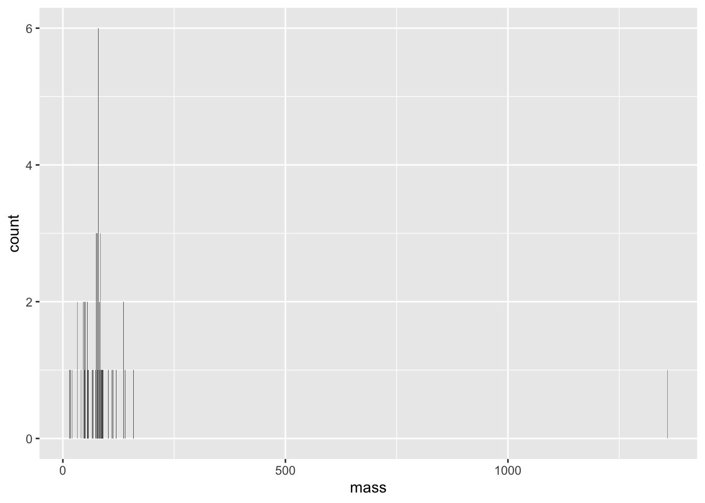
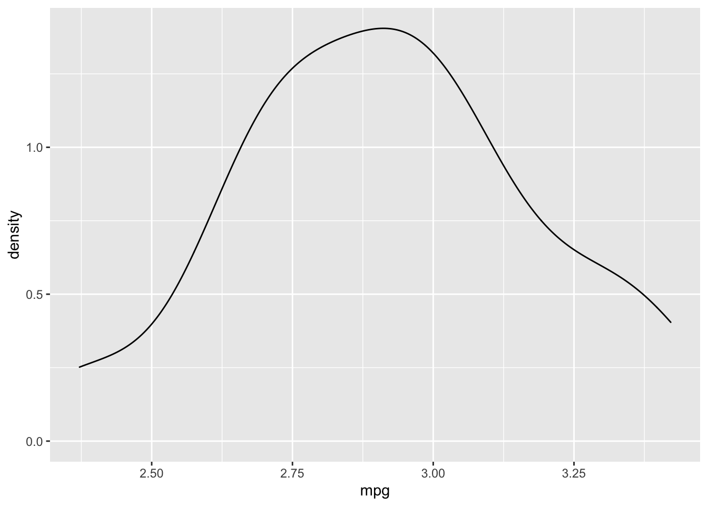
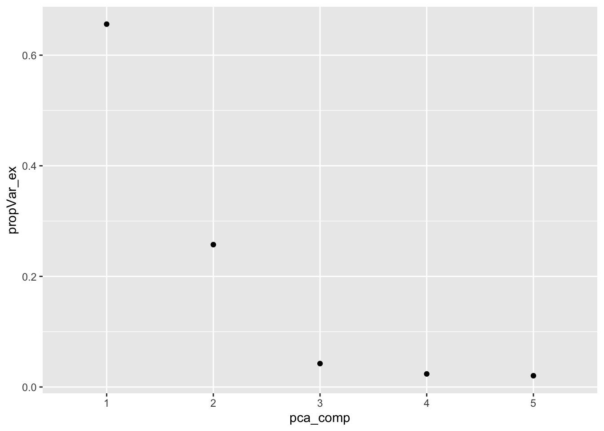
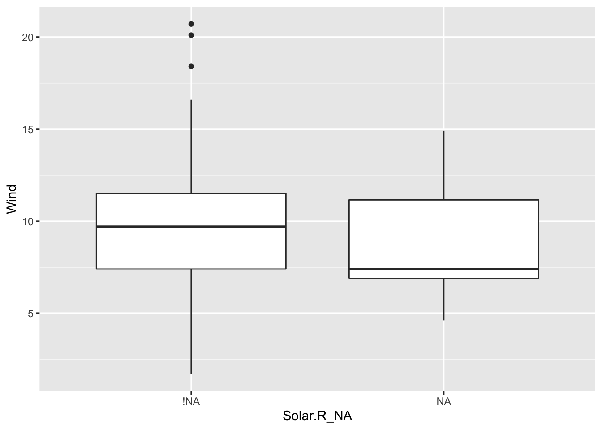
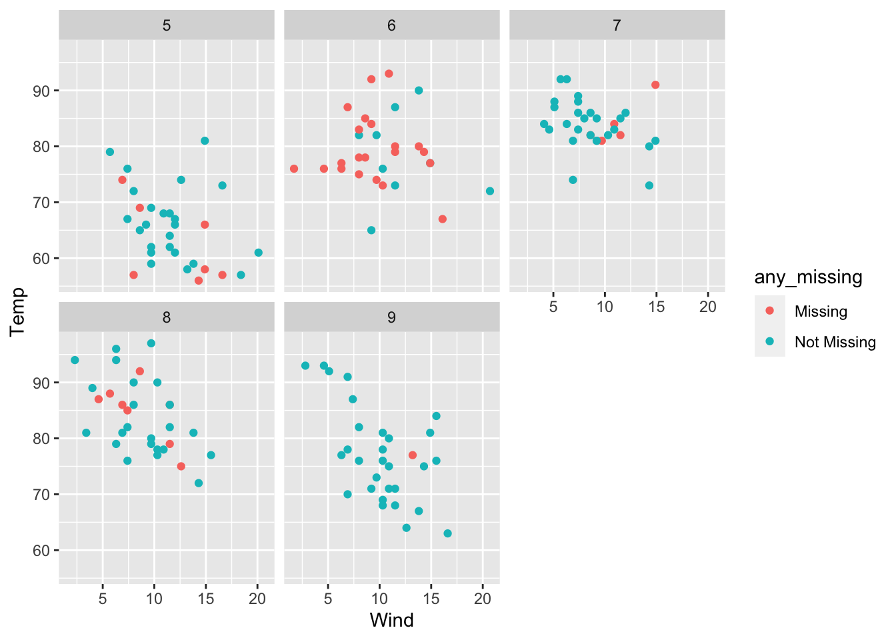
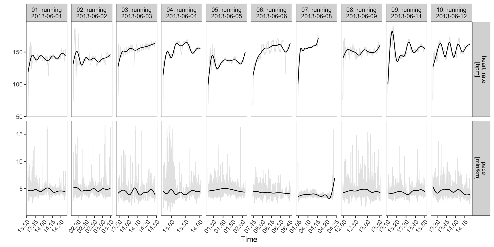

--- 
title: "Codes for STEM"
author: "Noushin Nabavi"
date: "2020-09-27"
site: bookdown::bookdown_site
documentclass: book
always_allow_html: yes
description: "This is a collection of codes for analytics projects from import, wrangling, analyzing, visualizing, to reporting"
---

# Coding for STEM 
> Tools and capabilities of data science is changing everyday!    

This is how I understand it today: 

**Data can:** 
* Describe the current state of an organization or process   
* Detec anomalous events  
* Diagnose the causes of events and behaviors  
* Predict future events  

**Data Science workflows can be developed for: **  
* Data collection and management  
* Exploration and visualization  
* Experimentation and prediction  

**Applications of data science can include: **  
* Traditional machine learning: e.g. finding probabilities of events, labeled data, and algorithms    
* Deep learning: neurons work together for image and natural language recognition but requires more training data  
* Internet of things (IOT): e.g. smart watch algorithms to detect and analyze motion sensors  

**Data science teams can consist of:**
* Data engineers: SQL, Java, Scala, Python  
* Data analysts: Dashboards, hypothesis tests and visualization using spreadsheets, SQL, BI (Tableau, power BI, looker)  
* Machine learning scientists: predictions and extrapolations, classification, etc. and use R or python  * Data employees can be isolated, embedded, or hybrid   

Data use can come with risks of identification of personal information. Policies for personally identifiable information may need to consider:  
* sensitivity and caution    
* pseudonymization and anonymization    

Preferences can be stated or revealed through the data so questions need to be specific, avoid loaded language, calibrate, require actionable results.   

**Data storage and retrieval may include:    **
* parallel storage solutions (e.g. cluster or server)  
* cloud storage (google, amazon, azure)  
* types of data: 1) unstructured (email, text, video, audio, web, and social media = document database); 2) structured = relational databases  
* Data querying: NoSQL and SQL  

**Communication of data can include: **  
* Dashboards  
* Markdowns  
* BI tools  
* rshiny or d3.js  

**Team management around data can use:   **
* Trello, slack, rocket chat, or JIRA to communicate due data and priority  

**A/B Testing:   **
* Control and Variation in samples  
* 4 steps in A/B testing: pick metric to track, calculate sample size, run the experiment, and check significance 

Machine learning (ML) can be used for time series forecasting (investigate seasonality on any time scale), natural language processing (word count, word embeddings to create features that group similar words), neural networks, deep learning, and AI.    
**Learning can be classified into:  ** 
_Supervised_: labels and features/ Model evaluation on test and train data  with applications in:
* recommendation systems  
* subscription predictions  
* email subject optimization  
_Unsupervised_: unlabeled data with only features  
* clustering  

**Deep learning and AI requirements:   **
* prediction is more feasible than explanations  
* lots of very large amount of training data  


<!--chapter:end:index.Rmd-->

# Introduction 

This is an introduction

<!--chapter:end:01-intro.Rmd-->

# Importing data into R

working with excel, csv, txt, and tsv files in R


```r
library(readr) 
library(data.table)
library(readxl)
library(gdata)
library(httr)
library(rvest)
library(xml2)
library(rlist)
library(jsonlite)
library(dplyr)
```

Importing csv file: 
pools <- read.csv("swimming_pools.csv", stringsAsFactors = FALSE)

With stringsAsFactors, you can tell R whether it should convert strings in the flat file to factors.

Import txt file with read.delim: 
hotdogs <- read.delim("hotdogs.txt", header = FALSE)


Import txt file with read.table: 
hotdogs <- read.table(path, 
                      sep = "\t", 
                      col.names = c("type", "calories", "sodium"))

Import with readr functions: 
- read_csv, read_tsv, and read_delim are part of this package

Can specify column names before import:
properties <- c("area", "temp", "size", "storage", "method",
                "texture", "flavor", "moistness")

Import potatoes.txt: 
potatoes <- read_tsv("potatoes.txt", col_names = properties)

Import potatoes.txt using read_delim(): 
potatoes <- read_delim("potatoes.txt", delim = "\t", col_names = properties)


Import 5 observations from potatoes.txt: 
potatoes_fragment <- read_tsv("potatoes.txt", skip = 6, n_max = 5, col_names = properties)

Import all data, but force all columns to be character: potatoes_char
potatoes_char <- read_tsv("potatoes.txt", col_types = "cccccccc", col_names = properties)

Import without col_types
hotdogs <- read_tsv("hotdogs.txt", col_names = c("type", "calories", "sodium"))

The collectors you will need to import the data
fac <- col_factor(levels = c("Beef", "Meat", "Poultry"))
int <- col_integer()

Edit the col_types argument to import the data correctly: 
hotdogs_factor <- read_tsv("hotdogs.txt",
                           col_names = c("type", "calories", "sodium"),
                           col_types = list(fac, int, int))


Import potatoes.csv with fread() from data.table: 
potatoes <- fread("potatoes.csv")

Import columns 6 and 8 of potatoes.csv: 
potatoes <- fread("potatoes.csv", select = c(6, 8))

Plot texture (x) and moistness (y) of potatoes:
plot(potatoes$texture, potatoes$moistness)


Print the names of all worksheets using readxl library:
excel_sheets("urbanpop.xlsx")

Read the sheets, one by one
pop_1 <- read_excel("urbanpop.xlsx", sheet = 1)
pop_2 <- read_excel("urbanpop.xlsx", sheet = 2)
pop_3 <- read_excel("urbanpop.xlsx", sheet = 3)

Put pop_1, pop_2 and pop_3 in a list: 
pop_list <- list(pop_1, pop_2, pop_3)


Read all Excel sheets with lapply(): 
pop_list <- lapply(excel_sheets("urbanpop.xlsx"), read_excel, path = "urbanpop.xlsx")

Import the first Excel sheet of urbanpop_nonames.xlsx (R gives names): 
pop_a <- read_excel("urbanpop_nonames.xlsx", col_names = FALSE)

Import the first Excel sheet of urbanpop_nonames.xlsx (specify col_names): 
cols <- c("country", paste0("year_", 1960:1966))
pop_b <- read_excel("urbanpop_nonames.xlsx", col_names = cols)

Import the second sheet of urbanpop.xlsx, skipping the first 21 rows: 
urbanpop_sel <- read_excel("urbanpop.xlsx", sheet = 2, col_names = FALSE, skip = 21)

Print out the first observation from urbanpop_sel
urbanpop_sel[1,]


Import a local file
Similar to the readxl package, you can import single Excel sheets from Excel sheets to start your analysis in R.

Import the second sheet of urbanpop.xls: 
urban_pop <- read.xls("urbanpop.xls", sheet = "1967-1974")

Print the first 11 observations using head()
head(urban_pop, n = 11)

Column names for urban_pop
columns <- c("country", paste0("year_", 1967:1974))

Finish the read.xls call
urban_pop <- read.xls("urbanpop.xls", sheet = 2,
                      skip = 50, header = FALSE, stringsAsFactors = FALSE,
                      col.names = columns)

Import all sheets from urbanpop.xls
path <- "urbanpop.xls"
urban_sheet1 <- read.xls(path, sheet = 1, stringsAsFactors = FALSE)
urban_sheet2 <- read.xls(path, sheet = 2, stringsAsFactors = FALSE)
urban_sheet3 <- read.xls(path, sheet = 3, stringsAsFactors = FALSE)

Extend the cbind() call to include urban_sheet3: urban_all
urban <- cbind(urban_sheet1, urban_sheet2[-1], urban_sheet3[-1])

Remove all rows with NAs from urban: urban_clean
urban_clean <- na.omit(urban)

Print out a summary of urban_clean
summary(urban_clean)


When working with XLConnect, the first step will be to load a workbook in your R session with loadWorkbook(); this function will build a "bridge" between your Excel file and your R session:
Here using the XLConnect package

Build connection to urbanpop.xlsx: 
my_book <- loadWorkbook("urbanpop.xlsx")

List the sheets in my_book
getSheets(my_book)

Import the second sheet in my_book
readWorksheet(my_book, sheet = 2)


Import columns 3, 4, and 5 from second sheet in my_book: urbanpop_sel
urbanpop_sel <- readWorksheet(my_book, sheet = 2, startCol = 3, endCol = 5)

Import first column from second sheet in my_book: countries
countries <- readWorksheet(my_book, sheet = 2, startCol = 1, endCol = 1)

cbind() urbanpop_sel and countries together: selection
selection <- cbind(countries, urbanpop_sel)

Add a worksheet to my_book, named "data_summary"
createSheet(my_book, "data_summary")

Use getSheets() on my_book
getSheets(my_book)

Create data frame: 
sheets <- getSheets(my_book)[1:3]
dims <- sapply(sheets, function(x) dim(readWorksheet(my_book, sheet = x)), USE.NAMES = FALSE)
summ <- data.frame(sheets = sheets,
                   nrows = dims[1, ],
                   ncols = dims[2, ])

Add data in summ to "data_summary" sheet
writeWorksheet(my_book, summ, "data_summary")

Rename "data_summary" sheet to "summary"
renameSheet(my_book, "data_summary", "summary")

Remove the fourth sheet
removeSheet(my_book, 4)

Save workbook to "renamed.xlsx"
saveWorkbook(my_book, file = "renamed.xlsx")


Download various files with download.file() 
Here are the URLs! As you can see they're just normal strings:


```r
csv_url <- "http://s3.amazonaws.com/assets.datacamp.com/production/course_1561/datasets/chickwts.csv"
tsv_url <- "http://s3.amazonaws.com/assets.datacamp.com/production/course_3026/datasets/tsv_data.tsv"

# Read a file in from the CSV URL and assign it to csv_data
csv_data <- read.csv(file = csv_url)

# Read a file in from the TSV URL and assign it to tsv_data
tsv_data <- read.delim(file = tsv_url)

# Examine the objects with head()
head(csv_data, n = 2)
```

```
##   weight      feed
## 1    179 horsebean
## 2    160 horsebean
```

```r
head(tsv_data, n = 2)
```

```
##   weight      feed
## 1    179 horsebean
## 2    160 horsebean
```

Download the file with download.file()

```r
download.file(url = csv_url, destfile = "feed_data.csv")

# Read it in with read.csv()
csv_data <- read.csv(file = "feed_data.csv")


# Add a new column: square_weight
csv_data$square_weight <- (csv_data$weight ^ 2)
```
Save it to disk with saveRDS()
saveRDS(object = csv_data, file = "modified_feed_data.RDS")

Read it back in with readRDS()
modified_feed_data <- readRDS(file = "modified_feed_data.RDS")


Using data from API clients 

example 1
Load pageviews library for wikipedia

```r
library(pageviews)

# Get the pageviews for "Hadley Wickham"
hadley_pageviews <- article_pageviews(project = "en.wikipedia", article = "Hadley Wickham")

# Examine the resulting object
str(hadley_pageviews)
```

```
## 'data.frame':	1 obs. of  8 variables:
##  $ project    : chr "wikipedia"
##  $ language   : chr "en"
##  $ article    : chr "Hadley_Wickham"
##  $ access     : chr "all-access"
##  $ agent      : chr "all-agents"
##  $ granularity: chr "daily"
##  $ date       : POSIXct, format: "2015-10-01"
##  $ views      : num 53
```


Load the httr package:

```r
library(httr)

# Make a GET request to http://httpbin.org/get
get_result <- GET(url = "http://httpbin.org/get")

# Print it to inspect it
get_result
```

```
## Response [http://httpbin.org/get]
##   Date: 2020-09-28 03:14
##   Status: 200
##   Content-Type: application/json
##   Size: 365 B
## {
##   "args": {}, 
##   "headers": {
##     "Accept": "application/json, text/xml, application/xml, */*", 
##     "Accept-Encoding": "deflate, gzip", 
##     "Host": "httpbin.org", 
##     "User-Agent": "libcurl/7.54.0 r-curl/4.3 httr/1.4.2", 
##     "X-Amzn-Trace-Id": "Root=1-5f715508-67454af2eaac626ad9a751a8"
##   }, 
##   "origin": "99.229.26.120", 
## ...
```


Make a POST request to http://httpbin.org/post with the body "this is a test"


```r
post_result <- POST(url = "http://httpbin.org/post", body = "this is a test")

# Print it to inspect it
post_result
```

```
## Response [http://httpbin.org/post]
##   Date: 2020-09-28 03:14
##   Status: 200
##   Content-Type: application/json
##   Size: 472 B
## {
##   "args": {}, 
##   "data": "this is a test", 
##   "files": {}, 
##   "form": {}, 
##   "headers": {
##     "Accept": "application/json, text/xml, application/xml, */*", 
##     "Accept-Encoding": "deflate, gzip", 
##     "Content-Length": "14", 
##     "Host": "httpbin.org", 
## ...
```

Make a GET request to url and save the results:
Handling http failures


```r
fake_url <- "http://google.com/fakepagethatdoesnotexist"

# Make the GET request
request_result <- GET(fake_url)
```


Example start to finish using httr package: The API url

```r
base_url <- "https://en.wikipedia.org/w/api.php"

# Set query parameters
query_params <- list(action = "parse", 
                     page = "Hadley Wickham", 
                     format = "xml")
```

Read page contents as HTML: library(rvest)
# Extract page name element from infobox: library(xml2)
Create a dataframe for full name
Reproducibility


```r
get_infobox <- function(title){
  base_url <- "https://en.wikipedia.org/w/api.php"
  
# Change "Hadley Wickham" to title

query_params <- list(action = "parse", 
                       page = title, 
                       format = "xml")}
  
resp <- GET(url = base_url, query = query_params)
resp_xml <- content(resp)
  
page_html <- read_html(xml_text(resp_xml))
infobox_element <- html_node(x = page_html, css =".infobox")
page_name <- html_node(x = infobox_element, css = ".fn")
```


Construct a directory-based API URL to `http://swapi.co/api`,
looking for person `1` in `people`:

```r
directory_url <- paste("http://swapi.co/api", "people", "1", sep = "/")

# Make a GET call with it
result <- GET(directory_url)

# Create list with nationality and country elements
query_params <- list(nationality = "americans", 
                     country = "antigua")

# Make parameter-based call to httpbin, with query_params
parameter_response <- GET("https://httpbin.org/get", query = query_params)

# Print parameter_response
parameter_response
```

```
## Response [https://httpbin.org/get?nationality=americans&country=antigua]
##   Date: 2020-09-28 03:14
##   Status: 200
##   Content-Type: application/json
##   Size: 465 B
## {
##   "args": {
##     "country": "antigua", 
##     "nationality": "americans"
##   }, 
##   "headers": {
##     "Accept": "application/json, text/xml, application/xml, */*", 
##     "Accept-Encoding": "deflate, gzip", 
##     "Host": "httpbin.org", 
##     "User-Agent": "libcurl/7.54.0 r-curl/4.3 httr/1.4.2", 
## ...
```

Using user agents
Informative user-agents are a good way of being respectful of the developers running the API you're interacting with. They make it easy for them to contact you in the event something goes wrong. I always try to include:
My email address; A URL for the project the code is a part of, if it's got a URL.

Do not change the url:

```r
url <- "https://wikimedia.org/api/rest_v1/metrics/pageviews/per-article/en.wikipedia/all-access/all-agents/Aaron_Halfaker/daily/2015100100/2015103100"
```

Add the email address and the test sentence inside user_agent()
server_response <- GET(url, user_agent("my@email.address this is a test"))

Rate-limiting
The next stage of respectful API usage is rate-limiting: making sure you only make a certain number of requests to the server in a given time period. 
Your limit will vary from server to server, but the implementation is always pretty much the same and involves a call to Sys.sleep(). 
This function takes one argument, a number, which represents the number of seconds to "sleep" (pause) the R session for. 
So if you call Sys.sleep(15), it'll pause for 15 seconds before allowing further code to run.

Construct a vector of 2 URLs:
for(url in urls){
  Send a GET request to url
  result <- GET(url)
  Delay for 5 seconds between requests
  Sys.sleep(5)
}

```r
urls <- c("http://httpbin.org/status/404",
          "http://httpbin.org/status/301")
```

Tying it all together:

```r
get_pageviews <- function(article_title){
  url <- paste(
    "https://wikimedia.org/api/rest_v1/metrics/pageviews/per-article/en.wikipedia/all-access/all-agents", 
    article_title, 
    "daily/2015100100/2015103100", 
    sep = "/"
  )   

response <- GET(url, user_agent("my@email.com this is a test")) 
  # Is there an HTTP error?
  if(http_error(response)){ 
    # Throw an R error
    stop("the request failed") 
  }
  # Return the response's content
  content(response)
}
```
working with JSON files (for more information see: www.json.org)
While JSON is a useful format for sharing data, your first step will often be to parse it into an R object, so you can manipulate it with R.

web scraping 101
The first step with web scraping is actually reading the HTML in. 
This can be done with a function from xml2, which is imported by rvest - read_html(). 
This accepts a single URL, and returns a big blob of XML that we can use further on.

  
Hadley Wickham's Wikipedia page:


```r
test_url <- "https://en.wikipedia.org/wiki/Hadley_Wickham"
  
# Read the URL stored as "test_url" with read_html()
test_xml <- read_html(test_url)
  
# Print test_xml
test_xml
```

```
## {html_document}
## <html class="client-nojs" lang="en" dir="ltr">
## [1] <head>\n<meta http-equiv="Content-Type" content="text/html; charset=UTF-8 ...
## [2] <body class="mediawiki ltr sitedir-ltr mw-hide-empty-elt ns-0 ns-subject  ...
```

html_node(), which extracts individual chunks of HTML from a HTML document. 
There are a couple of ways of identifying and filtering nodes, and for now we're going to use XPATHs: 
unique identifiers for individual pieces of a HTML document.

Extract the element of table_element referred to by second_xpath_val and store it as page_name
page_name <- html_node(x = table_element, xpath = second_xpath_val)

Extract the text from page_name:


```r
page_title <- html_text(page_name)

# Print page_title
page_title
```

```
## [1] "Hadley Wickham"
```

```r
# Turn table_element into a data frame and assign it to wiki_table
# wiki_table <- rvest::html_table(table_element)

# Print wiki_table
# wiki_table
```

Cleaning a data frame
Rename the columns of wiki_table:

CSS web scraping 
CSS is a way to add design information to HTML, that instructs the browser on how to display the content. You can leverage these design instructions to identify content on the page.


<!--chapter:end:02-Importing-data.Rmd-->


# Useful R Functions + Examples

> This is *NOT* intended to be fully comprehensive list of every useful R function that exists, but is a practical demonstration of selected relevant examples presented in user-friendly format, all available in base R. For a wider collection to work through, this Reference Card is recommended: https://cran.r-project.org/doc/contrib/Baggott-refcard-v2.pdf

> Additional CRAN reference cards and R guides (including non-English documentation) found here: https://cran.r-project.org/other-docs.html


## Contents

A. Essentials    
* 1. `getwd()`, `setwd()`  
* 2. `?foo`, `help(foo)`, `example(foo)`  
* 3. `install.packages("foo")`, `library("foo")`  
* 4. `devtools::install_github("username/packagename")`  
* 5. `data("foo")`  
* 6. `read.csv`, `read.table`  
* 7. `write.table()`  
* 8. `save()`, `load()`  

B. Basics   
* 9. `c()`, `cbind()`, `rbind()`, `matrix()`  
* 10. `length()`, `dim()`  
* 11. `sort()`, `'vector'[]`, `'matrix'[]`  
* 12. `data.frame()`, `class()`, `names()`, `str()`, `summary()`, `View()`, `head()`, `tail()`, `as.data.frame()`  

C. Core   
* 13. `df[order(),]`  
* 14. `df[,c()]`, `df[which(),]`  
* 15. `table()`  
* 16. `mean()`, `median()`, `sd()`, `var()`, `sum()`, `min()`, `max()`, `range()`  
* 17. `apply()`  
* 18. `lapply()` using `list()`  
* 19. `tapply()`  

D. Common  
* 20. `if` statement, `if...else` statement  
* 21. `for` loop  
* 22. `function()...` 


## R Syntax

*REMEMBER: KEY R LANGUAGE SYNTAX*

* **Case Sensitivity**: as per most UNIX-based packages, R is case sensitive, hence `X` and `x` are different symbols and would refer to different variables.    
* **Expressions vs Assignments**: an expression, like `3 + 5` can be given as a command which will be evaluated and the value immediately printed, but not stored. An assignment however, like `sum <- 3 + 5` using the assignment operator `<-` also evaluates the expression `3 + 5`, but instead of printing and not storing, it stores the value in the object `sum` but doesn't print the result. The object `sum` would need to be called to print the result.    
* **Reserved Words**: choice for naming objects is almost entirely free, except for these reserved words: https://stat.ethz.ch/R-manual/R-devel/library/base/html/Reserved.html    
* **Spacing**: outside of the function structure, spaces don't matter, e.g. `3+5` is the same as `3+     5` is the same as `3 + 5`. For more best-practices for R code Hadley Wickham's Style Guide is a useful reference: http://adv-r.had.co.nz/Style.html
* **Comments**: add comments within your code using a hastag, `#`. R will ignore everything to the right of the hashtag within that line


## Functional examples

1. Working Directory management 

- `getwd()`, `setwd()`
R/RStudio is always pointed at a specific directory on your computer, so it's important to be able to check what's the current directory using `getwd()`, and to be able to change and specify a different directory to work in using `setwd()`.

#check the directory R is currently pointed at
getwd()


2. Bring up help documentation & examples 

- `?foo`, `help(foo)`, `example(foo)`


```r
?boxplot
help(boxplot)
example(boxplot)
```

---

3. Load & Call CRAN Packages 

- `install.packages("foo")`, `library("foo")`
Packages are add-on functionality built for R but not pre-installed (base R), hence you need to install/load the packages you want yourself. The majority of packages you'd want have been submitted to and are available via CRAN. At time of writing, the CRAN package repository featured 8,592 available packages.


4. Load & Call Packages from GitHub 

- `devtools::install_github("username/packagename")`
Not all packages you'll want will be available via CRAN, and you'll likely need to get certain packages from GitHub accounts. This example shows how to install the `shinyapps` package from RStudio's GitHub account.
- install.packages("devtools") #pre-requisite for `devtools...` function
- devtools::install_github("rstudio/shinyapps") #install specific package from specific GitHub account
- library("shinyapps") #Call package


5. Load datasets from base R & Loaded Packages  

- `data("foo")`


```r
#AIM: show available datasets
data() 

#AIM: load an available dataset
data("iris") 
```

---

6. I/O Loading Existing Local Data 

- `read.csv`, `read.table`

(a) I/O When already in the working directory where the data is

Import a local **csv** file (i.e. where data is separated by **commas**), saving it as an object:
- object <- read.csv("xxx.csv")

Import a local tab delimited file (i.e. where data is separated by **tabs**), saving it as an object:
- object <- read.csv("xxx.csv", header = FALSE)
---

(b) I/O When NOT in the working directory where the data is

For example to import and save a local **csv** file from a different working directory you either need to specify the file path (operating system specific), e.g.:

on a mac:
- object <- read.csv("~/Desktop/R/data.csv")

on windows:
= object <- read.csv("C:/Desktop/R/data.csv")

OR

You can use the file.choose() command which will interactively open up the file dialog box for you to browse and select the local file, e.g.:
- object <- read.csv(file.choose())


(c) I/O Copying & Pasting Data

For relatively small amounts of data you can do an equivalent copy paste (operating system specific):

on a mac:
- object <- read.table(pipe("pbpaste"))

on windows:
- object <- read.table(file = "clipboard")


(d) I/O Loading Non-Numerical Data - character strings

Be careful when loading text data! R may assume character strings are statistical factor variables, e.g. "low", "medium", "high", when are just individual labels like names. To specify text data NOT to be converted into factor variables, add `stringsAsFactor = FALSE` to your `read.csv/read.table` command:
- object <- read.table("xxx.txt", stringsAsFactors = FALSE)


(e) I/O Downloading Remote Data

For accessing files from the web you can use the same `read.csv/read.table` commands. However, the file being downloaded does need to be in an R-friendly format (maximum of 1 header row, subsequent rows are the equivalent of one data record per row, no extraneous footnotes etc.). Here is an example downloading an online csv file of coffee harvest data used in a Nature study:
- object <- read.csv("http://sumsar.net/files/posts/2014-02-04-bayesian-first-aid-one-sample-t-test/roubik_2002_coffe_yield.csv")


7. I/O Exporting Data Frame 

- `write.table()`

Navigate to the working directory you want to save the data table into, then run the command (in this case creating a tab delimited file):
- write.table(object, "xxx.txt", sep = "\t")


8. I/O Saving Down & Loading Objects 

- `save()`, `load()`

These two commands allow you to save a named R object to a file and restore that object again.     
Navigate to the working directory you want to save the object in then run the command:
- save(object, file = "xxx.rda")

reload the object:
- load("xxx.rda")


9. Vector & Matrix Construction 

- `c()`, `cbind()`, `rbind()`, `matrix()`
Vectors (lists) & Matrices (two-dimensional arrays) are very common R data structures.

```r
#use c() to construct a vector by concatenating data
foo <- c(1, 2, 3, 4) #example of a numeric vector
oof <- c("A", "B", "C", "D") #example of a character vector
ofo <- c(TRUE, FALSE, TRUE, TRUE) #example of a logical vector

#use cbind() & rbind() to construct matrices
coof <- cbind(foo, oof) #bind vectors in column concatenation to make a matrix
roof <- rbind(foo, oof) #bind vectors in row concatenation to make a matrix

#use matrix() to construct matrices
moof <- matrix(data = 1:12, nrow=3, ncol=4) #creates matrix by specifying set of values, no. of rows & no. of columns
```


10. Vector & Matrix Explore 

- `length()`, `dim()`


```r
length(foo) #length of vector

dim(coof) #returns dimensions (no. of rows & columns) of vector/matrix/dataframe
```


11. Vector & Matrix Sort & Select 

- `sort()`, `'vector'[]`, `'matrix'[]`


```r
#create another numeric vector
jumble <- c(4, 1, 2, 3)
sort(jumble) #sorts a numeric vector in ascending order (default)
sort(jumble, decreasing = TRUE) #specify the decreasing arg to reverse default order

#create another character vector
mumble <- c( "D", "B", "C", "A")
sort(mumble) #sorts a character vector in alphabetical order (default)
sort(mumble, decreasing = TRUE) #specify the decreasing arg to reverse default order

jumble[1] #selects first value in our jumble vector
tail(jumble, n=1) #selects last value
jumble[c(1,3)] #selects the 1st & 3rd values
jumble[-c(1,3)] #selects everything except the 1st & 3rd values

coof[1,] #selects the 1st row of our coof matrix
coof[,1] #selects the 1st column
coof[2,1] #selects the value in the 2nd row, 1st column
coof[,"oof"] #selects the column named "oof"
coof[1:3,] #selects columns 1 to 3 inclusive
coof[c(1,2,3),] #selects the 1st, 2nd & 3rd rows (same as previous)
```


12. Create & Explore Data Frames 

- `data.frame()`, `class()`, `names()`, `str()`, `summary()`, `View()`, `head()`, `tail()`, `as.data.frame()`
A data frame is a matrix-like data structure made up of lists of variables with the same number of rows, which can be of differing data types (numeric, character, factor etc.) - matrices must have columns all of the same data type.

```r
#create a data frame with 3 columns with 4 rows each
doof <- data.frame("V1"=1:4, "V2"=c("A","B","C","D"), "V3"=5:8)

class(doof) #check data frame object class
names(doof) # returns column names
str(doof) #see structure of data frame
summary(doof) #returns basic summary stats
View(doof) #invokes spreadsheet-style viewer
head(doof, n=2) #shows first parts of object, here requesting the first 2 rows
tail(doof, n=2) #shows last parts of object, here requesting the last 2 rows

convert <- as.data.frame(coof) #convert a non-data frame object into a data frame
```


13. Data Frame Sort 

- `df[order(),]`


```r
#use 'painters' data frame
library("MASS") #call package with the required data
data("painters") #load required data
View(painters) #scan dataset

#syntax for using a specific variable: df=data frame, '$', V1=variable name
df$V1 

#AIM: print the 'School' variable column
painters$School

#syntax for df[order(),]
df[order(df$V1, df$V2...),] #function arguments: df=data frame, in square brackets specify within the order() the columns with which to sort the ROWS by, where default ordering is Ascending, the tailing comma specifies returning all the columns in the df. If only certain columns are wanted this can be specified after the comma.

#AIM: order the dataset rows based on the painters' Composition Score column, in Ascending order
painters[order(painters$Composition),] #Composition is the sorting variable

#AIM: order the dataset rows based on the painters' Composition Score column, in Descending order
painters[order(-painters$Composition),] #append a minus sign in front of the variable you want to sort by in Descending order

#AIM: order the dataset rows based on the painters' Composition Score column, in Descending order but return just the first 3 columns
painters[order(-painters$Composition), c(1:3)]
```


14. Data Frame Select & Deselect 

- `df[,c()]`, `df[which(),]`


```r
#use 'painters' data frame

#syntax for select & deselect based on column variables
df[, c("V1", "V2"...)] #function arguments: df=data frame, in square brackets specify columns to select or deselect. The comma specifies returning all the rows. If certain rows are wanted this can be specified before the comma.

#AIM: select the Composition & Drawing variables based on their column name
painters[, c("Composition", "Drawing")] #subset the df, selecting just the named columns (and all the rows)

#AIM: select the Composition & Drawing variables based on their column positions in the painters data frame
painters[, c(1,2)] #subset the df, selecting just the 1st & 2nd columns (and all the rows)

#AIM: drop the Expression variable based on it's column position in the painters data frame and return just the first 5 rows
painters[c(1:5), -4] #returns the subsetted df having deselected the 4th column, Expression and the first 5 rows


#syntax for select & deselect based on row variable values
df[which(),] #df=data frame, specify the variable value within the `which()` to subset the df on. Again, the tailing comma specifies returning all the columns. If certain columns are wanted this can be specified after the comma.

#AIM: select all rows where the painters' School is the 'A' category
painters[which(painters$School == "A"),] #returns the subsetted df where equality holds true, i.e. row value in School variable column is 'A'

#AIM: deselect all rows where the painters' School is the 'A' category, i.e. return df subset without 'A' values, AND also only select rows where Colour score > 10
painters[which(painters$School != "A" & painters$Colour > 10),] #returns the subsetted df where equality holds true, i.e. row value in School variable column is 'not A', AND the Colour score filter is also true.
```


15. Data Frame Frequency Calculations 
- `table()`


```r
#create new data frame
flavour <- c("choc", "strawberry", "vanilla", "choc", "strawberry", "strawberry") 
gender <- c("F", "F", "M", "M", "F", "M")
icecream <- data.frame(flavour, gender) #icecream df made up of 2 factor variables, flavour & gender, with 3 & 2 levels respectively (choc/strawberry/vanilla & F/M)

#AIM: create a frequency distribution table which shows the count of each gender in the df
table(icecream$gender) 

#AIM: create a frequency distribution table which shows the count of each flavour in the df
table(icecream$flavour)

#AIM: create Contingency/2-Way Table showing the counts for each combination of flavour & gender level 
table(icecream$flavour, icecream$gender)
```


16. Descriptive/Summary Stats Functions 

- `mean()`, `median()`, `sd()`, `var()`, `sum()`, `min()`, `max()`, `range()`


```r
#re-using the jumble vector from before
jumble <- c(4, 1, 2, 3) 

mean(jumble)
median(jumble)
sd(jumble)
var(jumble)
sum(jumble)
min(jumble)
max(jumble)
range(jumble)
```


17. Apply Functions 

- `apply()`
`apply()` returns a vector, array or list of values where a specified function has been applied to the 'margins' (rows/cols combo) of the original vector/array/list.

```r
#re-using the moof matrix from before
moof <- matrix(data = 1:12, nrow=3, ncol=4) 

#apply syntax
apply(X, MARGIN, FUN,...) #function arguments: X=an array, MARGIN=1 to apply to rows/2 to apply to cols, FUN=function to apply

#AIM: using the moof matrix, apply the sum function to the rows
apply(moof, 1, sum) 

#AIM: using the moof matrix, apply the sum function to the columns
apply(moof, 2, sum) 
```


18. Apply Functions 

- `lapply()` using `list()`
A list, a common data structure, is a generic vector containing objects of any types.
`lapply()` returns a list where each element returned is the result of applying a specified function to the objects in the list.

```r
#create list of various vectors and matrices
bundle <- list(moof, jumble, foo) 

#lapply syntax
lapply(X, FUN,...) #function arguments: X=a list, FUN=function to apply

#AIM: using the bundle list, apply the mean function to each object in the list
lapply(bundle, mean)
```


19. Apply Functions 
- `tapply()`
`tapply()` applies a specified function to specified groups/subsets of a factor variable.

```r
#tapply syntax
tapply(X, INDEX, FUN,...) #function arguments: X=an atomic object, INDEX=list of 1+ factors of X length, FUN=function to apply

#AIM: calculate the mean Drawing Score of the painters, but grouped by School category
tapply(painters$Drawing, painters$School, mean) #grouping the data by the 8 different Schools, apply the mean function to the Drawing Score variable to return the 8 mean scores
```


20. Programming Tools 

- `if` statement, `if...else` statement
An `if` statement is used when certain computations are conditional and only execute when a specific condition is met - if the condition is not met, nothing executes. The `if...else` statement extends the `if` statement by adding on a computation to execute when the condition is not met, i.e. the 'else' part of the statement.

```r
#if-statement syntax
if ('test expression')
    {
    'statement'
    }

#if...else statement
if ('test expression')
    {
    'statement'
    }else{
    'another statement'
    }

#AIM: here we want to test if the object, 'condition_to_test' is smaller than 10. If it is smaller, another object, 'result_after_test' is assigned the value 'smaller'. Otherwise, the 'result_after_test' object is assigned the value 'bigger'

#specify the 'test expression'
condition_to_test <- 7 

#write your 'if...else' function based on a 'statement' or 'another statement' dependent on the 'condition_to_test'. 
if (condition_to_test > 5)
    {
    result_after_test = 'Above Average'
    }else{
    result_after_test = 'Below Average'
    }

#call the resulting 'statement' as per the instruction of the 'if...else' statement
result_after_test 
```


21. Programming Tools 

- `for` loop
A `for` loop is an automation method for repeating (looping) a specific set of instructions for each element in a vector.

```r
#for loop syntax requires a counter, often called 'i' to denote an index
for ('counter' in 'looping vector')
    {
    'instructions'
    }

#AIM: here we want to print the phrase "In the Year yyyy" 6x, once for each year between 2010 to 2015.
#this for loop executes the code chunk 'print(past("In the Year", i)) for each of the 'i' index values
for (i in 2010:2015)
    {
    print(paste("In the Year", i))
    }

#AIM: create an object which contains 10 items, namely each number between 1 and 10 squared
#to store rather than just print results, an empty storage container needs to be created prior to running the loop, here called container
container <- NULL
for (i in 1:10)
    {
    container[i] = i^2
    }

container #check results: the loop is instructed to square every element of the looping vector, 1:10. The ith element returned is therefore the value of i^2, e.g. the 3rd element is 3^2.
```


22. Programming Tools 
- `function()...`
User-programmed functions allow you to specify customised arguments and returned values.

```r
#AIM: to create a simplified take-home pay calculator (single-band), called 'takehome_pay'. Our function therefore uses two arguments, a 'tax_rate', and an 'income' level. The code in the curly braces {} instructs what the 'takehome_pay' function should do when it is called, namely, calculate the tax owed in an object 'tax', and then return the result of the 'income' object minus the 'tax' object
takehome_pay <- function(tax_rate, income)
    {
    tax = tax_rate * income
    return(income - tax)
    }

takehome_pay(tax_rate = 0.2, income = 25000) #call our function to calculate 'takehome_pay' on a 'tax_rate' of 20% and an 'income' of 25k
```


23. Strings  
- `grep()`, `tolower()`, `nchar()`   

24. Further Data Selection  
- `quantile()`, `cut()`, `which()`, `na.omit()`, `complete.cases()`, `sample()`

25. Further Data Creation  
- `seq()`, `rep()`

26. Other Apply-related functions  
- `split()`, `sapply()`, `aggregate()`

27. More Loops  
- `while` loop, `repeat` loop

.....Ad Infinitum!!


<!--chapter:end:03-R-functions.Rmd-->

# Demo for dplyr


```r
# Load data and dependencies:
library(dplyr)

data(iris)
```

Explore the iris data


```r
head(iris)
pairs(iris)
str(iris)
summary(iris)
```

A. **Select**: keeps only the variables you mention


```r
select(iris, 1:3)
select(iris, Petal.Width, Species)
select(iris, contains("Petal.Width"))
select(iris, starts_with("Species"))
```

B. **Arrange**: sort a variable in descending order


```r
arrange(iris, Sepal.Length)
arrange(iris, desc(Sepal.Length))
arrange(iris, Sepal.Length, desc(Sepal.Width))
```

C. **Filter**: find rows/cases where conditions are true
Note: rows where the condition evaluates to NA are dropped


```r
filter(iris, Petal.Length > 5)
filter(iris, Petal.Length > 5 & Species == "setosa")
filter(iris, Petal.Length > 5, Species == "setosa") #the comma is a shorthand for &
filter(iris, !Species == "setosa")
```

D. **Pipe Example with MaggriteR** (ref: Rene Magritte This is not a pipe)
The long Way, before nesting or multiple variables

```r
data1 <- filter(iris, Petal.Length > 6)
data2 <- select(data1, Petal.Length, Species)
```

With **DPLYR**:


```r
select(
  filter(iris, Petal.Length > 6),
  Petal.Length, Species) %>%
  head()
```

```
##   Petal.Length   Species
## 1          6.6 virginica
## 2          6.3 virginica
## 3          6.1 virginica
## 4          6.7 virginica
## 5          6.9 virginica
## 6          6.7 virginica
```

Using pipes with the data variable


```r
iris %>%
  filter(Petal.Length > 6) %>%
  select(Petal.Length, Species) %>%
  head()
```

```
##   Petal.Length   Species
## 1          6.6 virginica
## 2          6.3 virginica
## 3          6.1 virginica
## 4          6.7 virginica
## 5          6.9 virginica
## 6          6.7 virginica
```

Using the . to specify where the incoming variable will be piped to: 
- myFunction(arg1, arg2 = .)
 

```r
iris %>%
  filter(., Species == "versicolor")
```

Other magrittr examples:


```r
iris %>%
  filter(Petal.Length > 2.0) %>%
  select(1:3)

iris %>%
  select(contains("Width")) %>%
  arrange(Petal.Width) %>%
  head()

iris %>%
  filter(Petal.Width == "versicolor") %>%
  arrange(desc(Sepal.Width))

iris %>%
  filter(Sepal.Width > 1) %>%
  View()

iris %>%
  filter(Petal.Width  == 0.1) %>%
  select(Sepal.Width) %>%
  unique()
```

a second way to get the unique values:


```r
iris %>%
  filter(Petal.Width  == 0.1) %>%
  distinct(Sepal.Width)
```

```
##   Sepal.Width
## 1         3.1
## 2         3.0
## 3         4.1
## 4         3.6
```


E. **Mutate**: adds new variables and preserves existing; transmute() drops existing variables


```r
iris %>%
  mutate(highSpecies = Sepal.Width > 6) %>%
  head()


iris %>%
  mutate(size = Sepal.Width + Petal.Width) %>%
  head()


iris %>%
  mutate(MeanPetal.Width = mean(Petal.Width, na.rm = TRUE),
         greaterThanMeanPetal.Width = ifelse(Petal.Width > MeanPetal.Width, 1, 0)) %>%
  head()


iris %>%
  mutate(buckets = cut(Petal.Width, 3)) %>%
  head()


iris %>%
  mutate(Petal.WidthBuckets = case_when(Petal.Width < 1 ~ "Low",
                               Petal.Width >= 2 & Sepal.Width < 3 ~ "Med",
                               Petal.Width >= 4 ~ "High")) %>%
  head()
```

E. **Group_by and Summarise**: used on grouped data created by group_by().
The output will have one row for each group.

```r
iris %>%
  summarise(Petal.WidthMean = mean(Petal.Width),
            Petal.WidthSD = sd(Petal.Width))

iris %>%
  group_by(Petal.Width) %>%
  mutate(Petal.WidthMean = mean(Petal.Width))

iris %>%
  group_by(Petal.Width) %>%
  summarise(Petal.WidthMean = mean(Petal.Width))

iris %>%
  group_by(Petal.Width, Species) %>%
  summarise(count = n())
```

F. **Slice**: Slice does not work with relational databases because they have no intrinsic notion of row order. If you want to perform the equivalent operation, use filter() and row_number().


```r
iris %>%
  slice(2:4) %>%
  head()
```

```
##   Sepal.Length Sepal.Width Petal.Length Petal.Width Species
## 1          4.9         3.0          1.4         0.2  setosa
## 2          4.7         3.2          1.3         0.2  setosa
## 3          4.6         3.1          1.5         0.2  setosa
```

Other verbs within DPLYR: **Scoped verbs**


```r
# ungroup
iris %>%
  group_by(Petal.Width, Species) %>%
  summarise(count = n()) %>%
  ungroup()

# Summarise_all
iris %>%
  select(1:4) %>%
  summarise_all(mean)


iris %>%
  select(1:4) %>%
  summarise_all(funs(mean, min))


iris %>%
  summarise_all(~length(unique(.)))

# summarise_at
iris %>%
  summarise_at(vars(-Petal.Width), mean)


iris %>%
  summarise_at(vars(contains("Petal.Width")), funs(mean, min))

# summarise_if
iris %>%
  summarise_if(is.numeric, mean)

iris %>%
  summarise_if(is.factor, ~length(unique(.)))

# other verbs:
iris %>%
  mutate_if(is.factor, as.character) %>%
  str()


iris %>%
  mutate_at(vars(contains("Width")), ~ round(.))


iris %>%
  filter_all(any_vars(is.na(.)))


iris %>%
  filter_all(all_vars(is.na(.)))

# Rename
iris %>%
  rename("sp" = "Species") %>%
  head()

# And finally: make a test and save
test <- iris %>%
  group_by(Petal.Width) %>%
  summarise(MeanPetal.Width = mean(Petal.Width))
```


<!--chapter:end:04-dplyR.Rmd-->

# Working with dates in R


```r
library(ggplot2)
library(dplyr)
library(ggridges)
library(hflights)
library(lubridate)
library(hflights)
library(fasttime)
library(microbenchmark)
library(anytime)
library(readr)
```

#check lubridate functions for fun :)

```r
today()
```

```
## [1] "2020-09-27"
```

```r
now()
```

```
## [1] "2020-09-27 23:14:19 EDT"
```

```r
# and check your local  timezone
Sys.timezone()
```

```
## [1] "America/Toronto"
```


Rule to work with dates according to ISO 8601 standard
format is YYYY-MM-DD 


```r
# The date R 3.0.0 was released
x <- "2013-04-03"

# Examine structure of x
str(x)
```

```
##  chr "2013-04-03"
```

```r
# Use as.Date() to interpret x as a date
x_date <- as.Date(x)

# Examine structure of x_date
str(x_date)
```

```
##  Date[1:1], format: "2013-04-03"
```

```r
# Store April 10 2019 as a Date
april_10_2019 <- as.Date("2019-04-10")

# round dates
r_3_4_1 <- ymd_hms("2016-05-03 07:13:28 UTC")

# Round down to day
floor_date(r_3_4_1, unit = "day")
```

```
## [1] "2016-05-03 UTC"
```

```r
# Round to nearest 5 minutes
round_date(r_3_4_1, unit = "5 minutes")
```

```
## [1] "2016-05-03 07:15:00 UTC"
```

```r
# Round up to week
ceiling_date(r_3_4_1, unit = "week")
```

```
## [1] "2016-05-08 UTC"
```

```r
# Subtract r_3_4_1 rounded down to day
r_3_4_1 - floor_date(r_3_4_1, unit = "day")
```

```
## Time difference of 7.224444 hours
```


Setting the timezone:


```r
# Game2: CAN vs NZL in Edmonton
game2 <- mdy_hm("June 11 2015 19:00")

# Game3: CHN vs NZL in Winnipeg
game3 <- mdy_hm("June 15 2015 18:30")

# Set the timezone to "America/Edmonton"
game2_local <- force_tz(game2, tzone = "America/Edmonton")
game2_local
```

```
## [1] "2015-06-11 19:00:00 MDT"
```

```r
# Set the timezone to "America/Winnipeg"
game3_local <- force_tz(game3, tzone = "America/Winnipeg")
game3_local
```

```
## [1] "2015-06-15 18:30:00 CDT"
```

```r
# How long does the team have to rest?
as.period(game2_local %--% game3_local)
```

```
## [1] "3d 22H 30M 0S"
```

```r
# What time is game2_local in NZ?
with_tz(game2_local, tzone = "Pacific/Auckland")
```

```
## [1] "2015-06-12 13:00:00 NZST"
```

```r
# What time is game2_local in Corvallis, Oregon?
with_tz(game2_local, tzone = "America/Los_Angeles")
```

```
## [1] "2015-06-11 18:00:00 PDT"
```

```r
# What time is game3_local in NZ?
with_tz(game3_local, tzone = "Pacific/Auckland")
```

```
## [1] "2015-06-16 11:30:00 NZST"
```

Examine DepTime and ArrTime in library(hflights) and others:


```r
library(hflights)
head(hflights$DepTime, 2)
```

```
## [1] 1400 1401
```

```r
head(hflights$ArrTime, 2)
```

```
## [1] 1500 1501
```

```r
# Examine structure of time column
str(hflights$DepTime)
```

```
##  int [1:227496] 1400 1401 1352 1403 1405 1359 1359 1355 1443 1443 ...
```

```r
str(hflights$ArrTime)
```

```
##  int [1:227496] 1500 1501 1502 1513 1507 1503 1509 1454 1554 1553 ...
```

```r
min(hflights$Year)
```

```
## [1] 2011
```

```r
max(hflights$Year)
```

```
## [1] 2011
```

```r
tibble::glimpse(hflights) %>%
   head()
```

```
## Rows: 227,496
## Columns: 21
## $ Year              <int> 2011, 2011, 2011, 2011, 2011, 2011, 2011, 2011, 201…
## $ Month             <int> 1, 1, 1, 1, 1, 1, 1, 1, 1, 1, 1, 1, 1, 1, 1, 1, 1, …
## $ DayofMonth        <int> 1, 2, 3, 4, 5, 6, 7, 8, 9, 10, 11, 12, 13, 14, 15, …
## $ DayOfWeek         <int> 6, 7, 1, 2, 3, 4, 5, 6, 7, 1, 2, 3, 4, 5, 6, 7, 1, …
## $ DepTime           <int> 1400, 1401, 1352, 1403, 1405, 1359, 1359, 1355, 144…
## $ ArrTime           <int> 1500, 1501, 1502, 1513, 1507, 1503, 1509, 1454, 155…
## $ UniqueCarrier     <chr> "AA", "AA", "AA", "AA", "AA", "AA", "AA", "AA", "AA…
## $ FlightNum         <int> 428, 428, 428, 428, 428, 428, 428, 428, 428, 428, 4…
## $ TailNum           <chr> "N576AA", "N557AA", "N541AA", "N403AA", "N492AA", "…
## $ ActualElapsedTime <int> 60, 60, 70, 70, 62, 64, 70, 59, 71, 70, 70, 56, 63,…
## $ AirTime           <int> 40, 45, 48, 39, 44, 45, 43, 40, 41, 45, 42, 41, 44,…
## $ ArrDelay          <int> -10, -9, -8, 3, -3, -7, -1, -16, 44, 43, 29, 5, -9,…
## $ DepDelay          <int> 0, 1, -8, 3, 5, -1, -1, -5, 43, 43, 29, 19, -2, -3,…
## $ Origin            <chr> "IAH", "IAH", "IAH", "IAH", "IAH", "IAH", "IAH", "I…
## $ Dest              <chr> "DFW", "DFW", "DFW", "DFW", "DFW", "DFW", "DFW", "D…
## $ Distance          <int> 224, 224, 224, 224, 224, 224, 224, 224, 224, 224, 2…
## $ TaxiIn            <int> 7, 6, 5, 9, 9, 6, 12, 7, 8, 6, 8, 4, 6, 5, 6, 12, 8…
## $ TaxiOut           <int> 13, 9, 17, 22, 9, 13, 15, 12, 22, 19, 20, 11, 13, 1…
## $ Cancelled         <int> 0, 0, 0, 0, 0, 0, 0, 0, 0, 0, 0, 0, 0, 0, 0, 0, 0, …
## $ CancellationCode  <chr> "", "", "", "", "", "", "", "", "", "", "", "", "",…
## $ Diverted          <int> 0, 0, 0, 0, 0, 0, 0, 0, 0, 0, 0, 0, 0, 0, 0, 0, 0, …
```

```
##      Year Month DayofMonth DayOfWeek DepTime ArrTime UniqueCarrier FlightNum
## 5424 2011     1          1         6    1400    1500            AA       428
## 5425 2011     1          2         7    1401    1501            AA       428
## 5426 2011     1          3         1    1352    1502            AA       428
## 5427 2011     1          4         2    1403    1513            AA       428
## 5428 2011     1          5         3    1405    1507            AA       428
## 5429 2011     1          6         4    1359    1503            AA       428
##      TailNum ActualElapsedTime AirTime ArrDelay DepDelay Origin Dest Distance
## 5424  N576AA                60      40      -10        0    IAH  DFW      224
## 5425  N557AA                60      45       -9        1    IAH  DFW      224
## 5426  N541AA                70      48       -8       -8    IAH  DFW      224
## 5427  N403AA                70      39        3        3    IAH  DFW      224
## 5428  N492AA                62      44       -3        5    IAH  DFW      224
## 5429  N262AA                64      45       -7       -1    IAH  DFW      224
##      TaxiIn TaxiOut Cancelled CancellationCode Diverted
## 5424      7      13         0                         0
## 5425      6       9         0                         0
## 5426      5      17         0                         0
## 5427      9      22         0                         0
## 5428      9       9         0                         0
## 5429      6      13         0                         0
```

Are DepTime and ArrTime the same moments

```r
table(hflights$DepTime - hflights$ArrTime) %>%
  head()
```

```
## 
## -1350 -1154 -1111 -1108 -1067 -1051 
##     1     1     1     1     1     1
```

```r
# A plot using just time
ggplot(hflights, aes(x = DepTime, y = ArrTime)) +
  geom_line(aes(group = make_date(Year, Month, DayofMonth)), alpha = 0.2)
```

```
## Warning: Removed 2907 row(s) containing missing values (geom_path).
```


Force datetime to Pacific/Auckland:


```r
hflights_hourly <- hflights %>%
  mutate(
    Dep = make_date(Year, Month, DayofMonth),
    newDep = force_tz(Dep, tzone = "Pacific/Auckland"))

# check whether times changed
## hflights_hourly$newDep == hflights$DepTime
```

Taking differences of datetimes 
- difftime(time1, time2) takes an argument units which specifies the units for the difference. 
- Your options are "secs", "mins", "hours", "days", or "weeks"

The date landing and moment of step


```r
date_landing <- mdy("July 20, 1969")
moment_step <- mdy_hms("July 20, 1969, 02:56:15", tz = "UTC")

# How many days since the first man on the moon?
difftime(today(), date_landing, units = "days")
```

```
## Time difference of 18697 days
```

```r
# How many seconds since the first man on the moon?
difftime(now(), moment_step, units = "secs")
```

```
## Time difference of 1615508293 secs
```

```r
# another example with three dates
mar_11 <- ymd_hms("2017-03-11 12:00:00", 
                  tz = "America/Los_Angeles")
mar_12 <- ymd_hms("2017-03-12 12:00:00", 
                  tz = "America/Los_Angeles")
mar_13 <- ymd_hms("2017-03-13 12:00:00", 
                  tz = "America/Los_Angeles")

# Difference between mar_13 and mar_12 in seconds
difftime(mar_13, mar_12, units = "secs")
```

```
## Time difference of 86400 secs
```

```r
# Difference between mar_12 and mar_11 in seconds
difftime(mar_12, mar_11, units = "secs")
```

```
## Time difference of 82800 secs
```


Getting datetimes into R
Use as.POSIXct to enter the datetime 

```r
as.POSIXct("2010-10-01 12:12:00")
```

```
## [1] "2010-10-01 12:12:00 EDT"
```

```r
# Use as.POSIXct again but set the timezone to `"America/Los_Angeles"`
as.POSIXct("2010-10-01 12:12:00", tz = "America/Los_Angeles")
```

```
## [1] "2010-10-01 12:12:00 PDT"
```


timespans
Add a period of one week to mon_2pm

```r
mon_2pm <- dmy_hm("27 Aug 2018 14:00")
mon_2pm + weeks(1)
```

```
## [1] "2018-09-03 14:00:00 UTC"
```

```r
# Add a duration of 81 hours to tue_9am
tue_9am <- dmy_hm("28 Aug 2018 9:00")
tue_9am + hours(81)
```

```
## [1] "2018-08-31 18:00:00 UTC"
```

```r
# Subtract a period of five years from today()
today() - years(5)
```

```
## [1] "2015-09-27"
```

```r
# Subtract a duration of five years from today()
today() - dyears(5)
```

```
## [1] "2015-09-27 18:00:00 UTC"
```

```r
# Arithmetic with timespans
## Time of North American Eclipse 2017
eclipse_2017 <- ymd_hms("2017-08-21 18:26:40")

# Duration of 29 days, 12 hours, 44 mins and 3 secs
synodic <- ddays(29) + dhours(12) + dminutes(44) + dseconds(3)

# 223 synodic months
saros <- 223*synodic

# Add saros to eclipse_2017
eclipse_2017 + saros
```

```
## [1] "2035-09-02 02:09:49 UTC"
```


Generating sequences of datetimes and arithmetics

Add a period of 8 hours to today


```r
today_8am <- today() + hours(8) 

# Sequence of two weeks from 1 to 26
every_two_weeks <- 1:26 * weeks(2)

# Create datetime for every two weeks for a year
today_8am + every_two_weeks
```

```
##  [1] "2020-10-11 08:00:00 UTC" "2020-10-25 08:00:00 UTC"
##  [3] "2020-11-08 08:00:00 UTC" "2020-11-22 08:00:00 UTC"
##  [5] "2020-12-06 08:00:00 UTC" "2020-12-20 08:00:00 UTC"
##  [7] "2021-01-03 08:00:00 UTC" "2021-01-17 08:00:00 UTC"
##  [9] "2021-01-31 08:00:00 UTC" "2021-02-14 08:00:00 UTC"
## [11] "2021-02-28 08:00:00 UTC" "2021-03-14 08:00:00 UTC"
## [13] "2021-03-28 08:00:00 UTC" "2021-04-11 08:00:00 UTC"
## [15] "2021-04-25 08:00:00 UTC" "2021-05-09 08:00:00 UTC"
## [17] "2021-05-23 08:00:00 UTC" "2021-06-06 08:00:00 UTC"
## [19] "2021-06-20 08:00:00 UTC" "2021-07-04 08:00:00 UTC"
## [21] "2021-07-18 08:00:00 UTC" "2021-08-01 08:00:00 UTC"
## [23] "2021-08-15 08:00:00 UTC" "2021-08-29 08:00:00 UTC"
## [25] "2021-09-12 08:00:00 UTC" "2021-09-26 08:00:00 UTC"
```

```r
# A sequence of 1 to 12 periods of 1 month
month_seq <- 1:12 * months(1)

# Add 1 to 12 months to today_8am
today_8am + month_seq 
```

```
##  [1] "2020-10-27 08:00:00 UTC" "2020-11-27 08:00:00 UTC"
##  [3] "2020-12-27 08:00:00 UTC" "2021-01-27 08:00:00 UTC"
##  [5] "2021-02-27 08:00:00 UTC" "2021-03-27 08:00:00 UTC"
##  [7] "2021-04-27 08:00:00 UTC" "2021-05-27 08:00:00 UTC"
##  [9] "2021-06-27 08:00:00 UTC" "2021-07-27 08:00:00 UTC"
## [11] "2021-08-27 08:00:00 UTC" "2021-09-27 08:00:00 UTC"
```

```r
# Replace + with %m+%
today_8am %m+% month_seq
```

```
##  [1] "2020-10-27 08:00:00 UTC" "2020-11-27 08:00:00 UTC"
##  [3] "2020-12-27 08:00:00 UTC" "2021-01-27 08:00:00 UTC"
##  [5] "2021-02-27 08:00:00 UTC" "2021-03-27 08:00:00 UTC"
##  [7] "2021-04-27 08:00:00 UTC" "2021-05-27 08:00:00 UTC"
##  [9] "2021-06-27 08:00:00 UTC" "2021-07-27 08:00:00 UTC"
## [11] "2021-08-27 08:00:00 UTC" "2021-09-27 08:00:00 UTC"
```

```r
# %m+% and %m-% are operators not functions. 
## That means you don't need parentheses, just put the operator between the two objects to add or subtract.
# Replace + with %m-%
today_8am %m-% month_seq
```

```
##  [1] "2020-08-27 08:00:00 UTC" "2020-07-27 08:00:00 UTC"
##  [3] "2020-06-27 08:00:00 UTC" "2020-05-27 08:00:00 UTC"
##  [5] "2020-04-27 08:00:00 UTC" "2020-03-27 08:00:00 UTC"
##  [7] "2020-02-27 08:00:00 UTC" "2020-01-27 08:00:00 UTC"
##  [9] "2019-12-27 08:00:00 UTC" "2019-11-27 08:00:00 UTC"
## [11] "2019-10-27 08:00:00 UTC" "2019-09-27 08:00:00 UTC"
```


Intervals
The operator %within% tests if the datetime (or interval) on the left hand side is within the interval of the right hand side. New column for interval from start to end date:


```r
hflights_intervals <- hflights %>% 
  mutate(
    start_date = make_datetime(Year, Month, DayofMonth, DepTime), 
    end_date =  make_datetime(Year, Month, DayofMonth, ArrTime),
    visible = start_date %--% end_date)

# The individual elements 
hflights_intervals$visible[14, ] 
```

```
## [1] 2011-03-11 13:00:00 UTC--2011-03-17 16:00:00 UTC
```

```r
# within
hflights_intervals %>% 
  filter(hflights_intervals$start_date %in% hflights_intervals$end_date) %>%
  select(Year, Month, DayofMonth, ArrTime) %>%
  head()
```

```
##   Year Month DayofMonth ArrTime
## 1 2011     1          1    1500
## 2 2011     1          2    1501
## 3 2011     1          3    1502
## 4 2011     1          4    1513
## 5 2011     1          5    1507
## 6 2011     1          6    1503
```


#can create an interval by using the operator %--% with two datetimes. For example ymd("2001-01-01") %--% ymd("2001-12-31") creates an interval for the year of 2001.
Once you have an interval you can find out certain properties like its start, end and length with int_start(), int_end() and int_length() respectively.

Create an interval for flights


```r
flights <- hflights_intervals %>%
  mutate(ints = start_date %--% end_date) 

# Find the length of flights, and arrange
flights %>%
  mutate(length = length(hflights_intervals$start_date)) %>% 
  arrange(desc(length)) %>%
  head()
```

```
##   Year Month DayofMonth DayOfWeek DepTime ArrTime UniqueCarrier FlightNum
## 1 2011     1          1         6    1400    1500            AA       428
## 2 2011     1          2         7    1401    1501            AA       428
## 3 2011     1          3         1    1352    1502            AA       428
## 4 2011     1          4         2    1403    1513            AA       428
## 5 2011     1          5         3    1405    1507            AA       428
## 6 2011     1          6         4    1359    1503            AA       428
##   TailNum ActualElapsedTime AirTime ArrDelay DepDelay Origin Dest Distance
## 1  N576AA                60      40      -10        0    IAH  DFW      224
## 2  N557AA                60      45       -9        1    IAH  DFW      224
## 3  N541AA                70      48       -8       -8    IAH  DFW      224
## 4  N403AA                70      39        3        3    IAH  DFW      224
## 5  N492AA                62      44       -3        5    IAH  DFW      224
## 6  N262AA                64      45       -7       -1    IAH  DFW      224
##   TaxiIn TaxiOut Cancelled CancellationCode Diverted          start_date
## 1      7      13         0                         0 2011-02-28 08:00:00
## 2      6       9         0                         0 2011-03-01 09:00:00
## 3      5      17         0                         0 2011-02-28 08:00:00
## 4      9      22         0                         0 2011-03-03 11:00:00
## 5      9       9         0                         0 2011-03-04 13:00:00
## 6      6      13         0                         0 2011-03-03 15:00:00
##              end_date                                          visible
## 1 2011-03-04 12:00:00 2011-02-28 08:00:00 UTC--2011-03-04 12:00:00 UTC
## 2 2011-03-05 13:00:00 2011-03-01 09:00:00 UTC--2011-03-05 13:00:00 UTC
## 3 2011-03-06 14:00:00 2011-02-28 08:00:00 UTC--2011-03-06 14:00:00 UTC
## 4 2011-03-08 01:00:00 2011-03-03 11:00:00 UTC--2011-03-08 01:00:00 UTC
## 5 2011-03-08 19:00:00 2011-03-04 13:00:00 UTC--2011-03-08 19:00:00 UTC
## 6 2011-03-09 15:00:00 2011-03-03 15:00:00 UTC--2011-03-09 15:00:00 UTC
##                                               ints length
## 1 2011-02-28 08:00:00 UTC--2011-03-04 12:00:00 UTC 227496
## 2 2011-03-01 09:00:00 UTC--2011-03-05 13:00:00 UTC 227496
## 3 2011-02-28 08:00:00 UTC--2011-03-06 14:00:00 UTC 227496
## 4 2011-03-03 11:00:00 UTC--2011-03-08 01:00:00 UTC 227496
## 5 2011-03-04 13:00:00 UTC--2011-03-08 19:00:00 UTC 227496
## 6 2011-03-03 15:00:00 UTC--2011-03-09 15:00:00 UTC 227496
```

Intervals are the most specific way to represent a span of time since they retain information about the exact start and end moments. 
They can be converted to periods and durations exactly: it's possible to calculate both the exact number of seconds elapsed between the start and end date, as well as the perceived change in clock time.New columns for duration and period


Load the readr package which also has build-in functions for dealing with dates: anytime package:


```r
# Various ways of writing Sep 10 2009
sep_10_2009 <- c("September 10 2009", "2009-09-10", "10 Sep 2009", "09-10-2009")

# Use anytime() to parse sep_10_2009
library(anytime)
anytime(sep_10_2009)
```

```
## [1] "2009-09-10 EDT" "2009-09-10 EDT" "2009-09-10 EDT" "2009-09-10 EDT"
```

```r
# Extract the month of hflights 
month(hflights$Month) %>% table()
```

```
## .
##     1     2     3     4     5     6     7     8     9    10    11    12 
## 18910 17128 19470 18593 19172 19600 20548 20176 18065 18696 18021 19117
```

```r
# How often is the hour before 12 (noon)?
mean(as.POSIXct(hflights$DepTime, origin="1991-01-01"))
```

```
## [1] NA
```

```r
# Use wday() to tabulate release by day of the week
wday(hflights$DepTime) %>% table() %>%
  head()
```

```
## .
## 1 2 3 4 5 6 
## 7 2 4 7 3 5
```

```r
# Add label = TRUE to make table more readable
wday(hflights$DepTime, label = TRUE) %>% table() %>%
  head()
```

```
## .
## Sun Mon Tue Wed Thu Fri 
##   7   2   4   7   3   5
```

```r
# Create column wday to hold week days
hflights$wday <- wday(hflights$DepTime, label = TRUE)
```

Parsing dates with `lubridate`


```r
# Parse x 
x <- "2010 September 20th" 
ymd(x)
```

```
## [1] "2010-09-20"
```

```r
# Parse y 
y <- "02.01.2010" 
dmy(y)
```

```
## [1] "2010-01-02"
```

```r
# Parse z 
z <- "Sep, 12th 2010 14:00" 
mdy_hm(z)
```

```
## [1] "2010-09-12 14:00:00 UTC"
```

```r
# Specifying an order with `parse_date_time()`
## Specify an order string to parse x
x <- "Monday June 1st 2010 at 4pm"
parse_date_time(x, orders = "ABdyIp")
```

```
## [1] "2010-06-01 16:00:00 UTC"
```

```r
# Specify order to include both "mdy" and "dmy"
two_orders <- c("October 7, 2001", "October 13, 2002", "April 13, 2003", 
                "17 April 2005", "23 April 2017")
parse_date_time(two_orders, orders = c("mdy", "dmy"))
```

```
## [1] "2001-10-07 UTC" "2002-10-13 UTC" "2003-04-13 UTC" "2005-04-17 UTC"
## [5] "2017-04-23 UTC"
```

```r
# Specify order to include "dOmY", "OmY" and "Y"
short_dates <- c("11 December 1282", "May 1372", "1253")
parse_date_time(short_dates, orders = c("dOmY", "OmY", "Y"))
```

```
## [1] "1282-12-11 UTC" "1372-05-01 UTC" "1253-01-01 UTC"
```


Use make_date() to combine year, month and mday:


```r
hflights_dates  <- hflights  %>% 
  mutate(date = make_date(year = Year, month = Month, day = DayofMonth))

# Plot to check work
ggplot(hflights_dates, aes(x = date, y = DepDelay)) +
  geom_line()
```


If you plot a Date on the axis of a plot, you expect the dates to be in calendar order, 
#and that's exactly what happens with plot() or ggplot().

Set the x axis to the date column:

```r
ggplot(hflights, aes(x = Year, y = DayofMonth)) +
  geom_line(aes(group = 1, color = factor(Month)))
```


Outputting pretty dates and times
Create a stamp based on April 04 2019:

```r
D <- ymd("2019-04-04") - days(1:5)
stamp("Created on Sunday, Jan 1, 1999 3:34 pm")(D)
```

```
## [1] "Created on Wednesday, Apr 03, 2019 12:00 am"
## [2] "Created on Tuesday, Apr 02, 2019 12:00 am"  
## [3] "Created on Monday, Apr 01, 2019 12:00 am"   
## [4] "Created on Sunday, Mar 31, 2019 12:00 am"   
## [5] "Created on Saturday, Mar 30, 2019 12:00 am"
```

More on importing and exporting datetimes
Fast parsing with `fasttime`
The fasttime package provides a single function fastPOSIXct()
#designed to read in datetimes formatted according to ISO 8601. 
#Because it only reads in one format, and doesn't have to guess a format, it is really fast!


The arguments to microbenchmark() are just R expressions that you want to time. 
Make sure you match up the names of these arguments to the parsing functions.


Use fastPOSIXct() to parse dates

```r
library(fasttime)
library(microbenchmark)

fastPOSIXct(hflights_dates$date) %>% str()
```

```
##  POSIXct[1:227496], format: "2010-12-31 19:00:00" "2011-01-01 19:00:00" "2011-01-02 19:00:00" ...
```

<!--chapter:end:05-dates-in-R.Rmd-->

# Demo for Data.table 


Load libraries:


```r
# Load data.table
library(data.table)
library(bikeshare14)
library(tidyverse)
```


Create the data.table:


```r
X <- data.table(id = c("a", "b", "c"), value = c(0.5, 1.0, 1.5))

print(X)
```

```
##    id value
## 1:  a   0.5
## 2:  b   1.0
## 3:  c   1.5
```


Get number of columns in batrips:


```r
batrips <- as.data.table(batrips)
col_number <- ncol(batrips)
col_number
```

```
## [1] 11
```

Print the first 4 rows:


```r
head(batrips, 4)
```

```
##    trip_id duration          start_date           start_station start_terminal
## 1:  139545      435 2014-01-01 00:14:00 San Francisco City Hall             58
## 2:  139546      432 2014-01-01 00:14:00 San Francisco City Hall             58
## 3:  139547     1523 2014-01-01 00:17:00  Embarcadero at Sansome             60
## 4:  139549     1620 2014-01-01 00:23:00       Steuart at Market             74
##               end_date        end_station end_terminal bike_id
## 1: 2014-01-01 00:21:00    Townsend at 7th           65     473
## 2: 2014-01-01 00:21:00    Townsend at 7th           65     395
## 3: 2014-01-01 00:42:00    Beale at Market           56     331
## 4: 2014-01-01 00:50:00 Powell Street BART           39     605
##    subscription_type zip_code
## 1:        Subscriber    94612
## 2:        Subscriber    94107
## 3:        Subscriber    94112
## 4:          Customer    92007
```

Print the last 4 rows:


```r
tail(batrips, 4)
```

```
##    trip_id duration          start_date                   start_station
## 1:  588911      422 2014-12-31 23:19:00 Grant Avenue at Columbus Avenue
## 2:  588912     1487 2014-12-31 23:31:00        South Van Ness at Market
## 3:  588913     1458 2014-12-31 23:32:00        South Van Ness at Market
## 4:  588914      364 2014-12-31 23:33:00           Embarcadero at Bryant
##    start_terminal            end_date
## 1:             73 2014-12-31 23:26:00
## 2:             66 2014-12-31 23:56:00
## 3:             66 2014-12-31 23:56:00
## 4:             54 2014-12-31 23:40:00
##                                      end_station end_terminal bike_id
## 1: Yerba Buena Center of the Arts (3rd @ Howard)           68     604
## 2:                             Steuart at Market           74     480
## 3:                             Steuart at Market           74     277
## 4:                                 Howard at 2nd           63      56
##    subscription_type zip_code
## 1:        Subscriber    94133
## 2:          Customer    94109
## 3:          Customer    94109
## 4:        Subscriber    94105
```

Print the structure of batrips:


```r
str(batrips)
```

```
## Classes 'data.table' and 'data.frame':	326339 obs. of  11 variables:
##  $ trip_id          : int  139545 139546 139547 139549 139550 139551 139552 139553 139554 139555 ...
##  $ duration         : int  435 432 1523 1620 1617 779 784 721 624 574 ...
##  $ start_date       : POSIXct, format: "2014-01-01 00:14:00" "2014-01-01 00:14:00" ...
##  $ start_station    : chr  "San Francisco City Hall" "San Francisco City Hall" "Embarcadero at Sansome" "Steuart at Market" ...
##  $ start_terminal   : int  58 58 60 74 74 74 74 74 57 57 ...
##  $ end_date         : POSIXct, format: "2014-01-01 00:21:00" "2014-01-01 00:21:00" ...
##  $ end_station      : chr  "Townsend at 7th" "Townsend at 7th" "Beale at Market" "Powell Street BART" ...
##  $ end_terminal     : int  65 65 56 39 39 46 46 46 68 68 ...
##  $ bike_id          : int  473 395 331 605 453 335 580 563 358 365 ...
##  $ subscription_type: chr  "Subscriber" "Subscriber" "Subscriber" "Customer" ...
##  $ zip_code         : chr  "94612" "94107" "94112" "92007" ...
##  - attr(*, ".internal.selfref")=<externalptr>
```

Filter third row:


```r
row_3 <- batrips[3]
row_3 %>%
  head(3)
```

```
##    trip_id duration          start_date          start_station start_terminal
## 1:  139547     1523 2014-01-01 00:17:00 Embarcadero at Sansome             60
##               end_date     end_station end_terminal bike_id subscription_type
## 1: 2014-01-01 00:42:00 Beale at Market           56     331        Subscriber
##    zip_code
## 1:    94112
```

Filter rows 1 through 2:


```r
rows_1_2 <- batrips[1:2]
rows_1_2 %>%
  head(2)
```

```
##    trip_id duration          start_date           start_station start_terminal
## 1:  139545      435 2014-01-01 00:14:00 San Francisco City Hall             58
## 2:  139546      432 2014-01-01 00:14:00 San Francisco City Hall             58
##               end_date     end_station end_terminal bike_id subscription_type
## 1: 2014-01-01 00:21:00 Townsend at 7th           65     473        Subscriber
## 2: 2014-01-01 00:21:00 Townsend at 7th           65     395        Subscriber
##    zip_code
## 1:    94612
## 2:    94107
```

Filter the 1st, 6th and 10th rows:


```r
rows_1_6_10 <- batrips[c(1, 6, 10)]
rows_1_6_10 %>%
  head()
```

```
##    trip_id duration          start_date           start_station start_terminal
## 1:  139545      435 2014-01-01 00:14:00 San Francisco City Hall             58
## 2:  139551      779 2014-01-01 00:24:00       Steuart at Market             74
## 3:  139555      574 2014-01-01 00:25:00           5th at Howard             57
##               end_date                                   end_station
## 1: 2014-01-01 00:21:00                               Townsend at 7th
## 2: 2014-01-01 00:37:00                         Washington at Kearney
## 3: 2014-01-01 00:35:00 Yerba Buena Center of the Arts (3rd @ Howard)
##    end_terminal bike_id subscription_type zip_code
## 1:           65     473        Subscriber    94612
## 2:           46     335          Customer    94109
## 3:           68     365          Customer    94941
```

Select all rows except the first two:


```r
not_first_two <- batrips[-(1:2)]
not_first_two %>%
  head(2)
```

```
##    trip_id duration          start_date          start_station start_terminal
## 1:  139547     1523 2014-01-01 00:17:00 Embarcadero at Sansome             60
## 2:  139549     1620 2014-01-01 00:23:00      Steuart at Market             74
##               end_date        end_station end_terminal bike_id
## 1: 2014-01-01 00:42:00    Beale at Market           56     331
## 2: 2014-01-01 00:50:00 Powell Street BART           39     605
##    subscription_type zip_code
## 1:        Subscriber    94112
## 2:          Customer    92007
```

Select all rows except 1 through 5 and 10 through 15:


```r
exclude_some <- batrips[-c(1:5, 10:15)]
exclude_some %>%
  head(2)
```

```
##    trip_id duration          start_date     start_station start_terminal
## 1:  139551      779 2014-01-01 00:24:00 Steuart at Market             74
## 2:  139552      784 2014-01-01 00:24:00 Steuart at Market             74
##               end_date           end_station end_terminal bike_id
## 1: 2014-01-01 00:37:00 Washington at Kearney           46     335
## 2: 2014-01-01 00:37:00 Washington at Kearney           46     580
##    subscription_type zip_code
## 1:          Customer    94109
## 2:          Customer
```

Select all rows except the first and last:


```r
not_first_last <- batrips[-c(1, .N)] 
# Or
# batrips[-c(1, nrow(batrips))]

not_first_last %>%
  head(2)
```

```
##    trip_id duration          start_date           start_station start_terminal
## 1:  139546      432 2014-01-01 00:14:00 San Francisco City Hall             58
## 2:  139547     1523 2014-01-01 00:17:00  Embarcadero at Sansome             60
##               end_date     end_station end_terminal bike_id subscription_type
## 1: 2014-01-01 00:21:00 Townsend at 7th           65     395        Subscriber
## 2: 2014-01-01 00:42:00 Beale at Market           56     331        Subscriber
##    zip_code
## 1:    94107
## 2:    94112
```

Filter all rows where start_station is "Market at 10th":


```r
trips_mlk <- batrips[start_station == "Market at 10th"]
trips_mlk %>%
  head(2)
```

```
##    trip_id duration          start_date  start_station start_terminal
## 1:  139605     1352 2014-01-01 07:40:00 Market at 10th             67
## 2:  139609     1130 2014-01-01 08:08:00 Market at 10th             67
##               end_date    end_station end_terminal bike_id subscription_type
## 1: 2014-01-01 08:03:00 Market at 10th           67     545        Subscriber
## 2: 2014-01-01 08:27:00 Market at 10th           67     545        Subscriber
##    zip_code
## 1:    94590
## 2:    94590
```

Filter all rows where start_station is "MLK Library" AND duration > 1600:


```r
trips_mlk_1600 <- batrips[start_station == "MLK Library" & duration > 1600]
trips_mlk_1600 %>%
  head(2)
```

```
##    trip_id duration          start_date start_station start_terminal
## 1:  147733     1744 2014-01-09 11:47:00   MLK Library             11
## 2:  158900    61848 2014-01-19 16:42:00   MLK Library             11
##               end_date           end_station end_terminal bike_id
## 1: 2014-01-09 12:16:00    San Jose City Hall           10     691
## 2: 2014-01-20 09:52:00 San Jose Civic Center            3      86
##    subscription_type zip_code
## 1:        Subscriber    95112
## 2:          Customer    95608
```

Filter all rows where `subscription_type` is not `"Subscriber"`::


```r
customers <- batrips[subscription_type != "Subscriber"]
customers %>%
  head(2)
```

```
##    trip_id duration          start_date     start_station start_terminal
## 1:  139549     1620 2014-01-01 00:23:00 Steuart at Market             74
## 2:  139550     1617 2014-01-01 00:23:00 Steuart at Market             74
##               end_date        end_station end_terminal bike_id
## 1: 2014-01-01 00:50:00 Powell Street BART           39     605
## 2: 2014-01-01 00:50:00 Powell Street BART           39     453
##    subscription_type zip_code
## 1:          Customer    92007
## 2:          Customer    92007
```

Filter all rows where start_station is "Ryland Park" AND subscription_type is not "Customer":


```r
ryland_park_subscribers <- batrips[start_station == "Ryland Park" & subscription_type != "Customer"]
ryland_park_subscribers %>%
  head(2)
```

```
##    trip_id duration          start_date start_station start_terminal
## 1:  243456      330 2014-04-10 09:10:00   Ryland Park             84
## 2:  244497      594 2014-04-11 07:28:00   Ryland Park             84
##               end_date                       end_station end_terminal bike_id
## 1: 2014-04-10 09:16:00                         Japantown            9      23
## 2: 2014-04-11 07:38:00 San Jose Diridon Caltrain Station            2      54
##    subscription_type zip_code
## 1:        Subscriber    95110
## 2:        Subscriber    95110
```

Filter all rows where end_station contains "Market":

```r
any_markets <- batrips[end_station %like% "Market"]
any_markets %>%
  head(2)
```

```
##    trip_id duration          start_date                        start_station
## 1:  139547     1523 2014-01-01 00:17:00               Embarcadero at Sansome
## 2:  139558     1600 2014-01-01 00:28:00 Harry Bridges Plaza (Ferry Building)
##    start_terminal            end_date       end_station end_terminal bike_id
## 1:             60 2014-01-01 00:42:00   Beale at Market           56     331
## 2:             50 2014-01-01 00:54:00 Steuart at Market           74     413
##    subscription_type zip_code
## 1:        Subscriber    94112
## 2:        Subscriber    94102
```

Filter all rows where trip_id is 588841, 139560, or 139562:

```r
filter_trip_ids <- batrips[trip_id %in% c(588841, 139560, 139562)]
filter_trip_ids %>%
  head(2)
```

```
##    trip_id duration          start_date     start_station start_terminal
## 1:  139560     3793 2014-01-01 00:32:00 Steuart at Market             74
## 2:  139562     3626 2014-01-01 00:33:00 Steuart at Market             74
##               end_date       end_station end_terminal bike_id subscription_type
## 1: 2014-01-01 01:35:00 Steuart at Market           74     311          Customer
## 2: 2014-01-01 01:33:00 Steuart at Market           74     271          Customer
##    zip_code
## 1:    55417
## 2:    94070
```

Filter all rows where duration is between [5000, 6000]:

```r
duration_5k_6k <- batrips[duration %between% c(5000, 6000)]
duration_5k_6k %>%
  head(2)
```

```
##    trip_id duration          start_date     start_station start_terminal
## 1:  139607     5987 2014-01-01 07:57:00 Market at Sansome             77
## 2:  139608     5974 2014-01-01 07:57:00 Market at Sansome             77
##               end_date                     end_station end_terminal bike_id
## 1: 2014-01-01 09:37:00 Grant Avenue at Columbus Avenue           73     591
## 2: 2014-01-01 09:37:00 Grant Avenue at Columbus Avenue           73     596
##    subscription_type zip_code
## 1:          Customer    75201
## 2:          Customer    75201
```

Filter all rows with specific start stations:

```r
two_stations <- batrips[start_station %chin% c("San Francisco City Hall", "Embarcadero at Sansome")]
two_stations %>%
  head(2)
```

```
##    trip_id duration          start_date           start_station start_terminal
## 1:  139545      435 2014-01-01 00:14:00 San Francisco City Hall             58
## 2:  139546      432 2014-01-01 00:14:00 San Francisco City Hall             58
##               end_date     end_station end_terminal bike_id subscription_type
## 1: 2014-01-01 00:21:00 Townsend at 7th           65     473        Subscriber
## 2: 2014-01-01 00:21:00 Townsend at 7th           65     395        Subscriber
##    zip_code
## 1:    94612
## 2:    94107
```


Selecting columns from a data.table
Select bike_id and trip_id using a character vector:

```r
df_way <- batrips[, c("bike_id", "trip_id")]
df_way %>%
  head(2)
```

```
##    bike_id trip_id
## 1:     473  139545
## 2:     395  139546
```

Select start_station and end_station cols without a character vector:

```r
dt_way <- batrips[, .(start_station, end_station)]
dt_way %>%
  head(2)
```

```
##              start_station     end_station
## 1: San Francisco City Hall Townsend at 7th
## 2: San Francisco City Hall Townsend at 7th
```

Deselect start_terminal and end_terminal columns:

```r
drop_terminal_cols <- batrips[, !c("start_terminal", "end_terminal")]
drop_terminal_cols %>%
  head(2)
```

```
##    trip_id duration          start_date           start_station
## 1:  139545      435 2014-01-01 00:14:00 San Francisco City Hall
## 2:  139546      432 2014-01-01 00:14:00 San Francisco City Hall
##               end_date     end_station bike_id subscription_type zip_code
## 1: 2014-01-01 00:21:00 Townsend at 7th     473        Subscriber    94612
## 2: 2014-01-01 00:21:00 Townsend at 7th     395        Subscriber    94107
```

Calculate median duration using the j argument:

```r
median_duration <- batrips[, median(duration)]
median_duration %>%
  head()
```

```
## [1] 511
```

Get median duration after filtering:

```r
median_duration_filter <- batrips[end_station == "Market at 10th" & subscription_type == "Subscriber", median(duration)]
median_duration_filter %>%
  head()
```

```
## [1] 651
```

Compute duration of all trips:

```r
trip_duration <- batrips[, difftime(end_date, start_date, units = "min")]
head(trip_duration) %>%
  head(2)
```

```
## Time differences in mins
## [1] 7 7
```

Have the column mean_durn:

```r
mean_duration <- batrips[, .(mean_durn = mean(duration))]
mean_duration %>%
  head(2)
```

```
##    mean_durn
## 1:  1131.967
```

Get the min and max duration values:

```r
min_max_duration <- batrips[, .(min(duration), max(duration))]
min_max_duration %>%
  head(2)
```

```
##    V1       V2
## 1: 60 17270400
```

Calculate the number of unique values:

```r
other_stats <- batrips[, .(mean_duration = mean(duration), 
                           last_ride = max(end_date))]
other_stats %>%
  head(2)
```

```
##    mean_duration           last_ride
## 1:      1131.967 2015-06-24 20:18:00
```


```r
duration_stats <- batrips[start_station == "Townsend at 7th" & duration < 500, 
                          .(min_dur = min(duration), 
                            max_dur = max(duration))]
duration_stats
```

```
##    min_dur max_dur
## 1:      62     499
```

Plot the histogram of duration based on conditions:

```r
batrips[start_station == "Townsend at 7th" & duration < 500, hist(duration)]
```


```
## $breaks
##  [1]  50 100 150 200 250 300 350 400 450 500
## 
## $counts
## [1]   28   15  792 2042  920  314  314  497  538
## 
## $density
## [1] 1.025641e-04 5.494505e-05 2.901099e-03 7.479853e-03 3.369963e-03
## [6] 1.150183e-03 1.150183e-03 1.820513e-03 1.970696e-03
## 
## $mids
## [1]  75 125 175 225 275 325 375 425 475
## 
## $xname
## [1] "duration"
## 
## $equidist
## [1] TRUE
## 
## attr(,"class")
## [1] "histogram"
```


Computations by groups
Compute the mean duration for every start_station:

```r
mean_start_stn <- batrips[, .(mean_duration = mean(duration)), by = start_station]
mean_start_stn %>%
  head(2)
```

```
##              start_station mean_duration
## 1: San Francisco City Hall      1893.936
## 2:  Embarcadero at Sansome      1418.182
```

Compute the mean duration for every start and end station:

```r
mean_station <- batrips[, .(mean_duration = mean(duration)), by = .(start_station, end_station)]
mean_station %>%
  head(2)
```

```
##              start_station     end_station mean_duration
## 1: San Francisco City Hall Townsend at 7th      678.6364
## 2:  Embarcadero at Sansome Beale at Market      651.2367
```

Compute the mean duration grouped by start_station and month:

```r
mean_start_station <- batrips[, .(mean_duration = mean(duration)), by = .(start_station, month(start_date))]
mean_start_station %>%
  head(2)
```

```
##              start_station month mean_duration
## 1: San Francisco City Hall     1     1548.2591
## 2:  Embarcadero at Sansome     1      952.1756
```

Compute mean of duration and total trips grouped by start and end stations:

```r
aggregate_mean_trips <- batrips[, .(mean_duration = mean(duration), 
                                    total_trips = .N), 
                                by = .(start_station, end_station)]
aggregate_mean_trips %>%
  head(2)
```

```
##              start_station     end_station mean_duration total_trips
## 1: San Francisco City Hall Townsend at 7th      678.6364         121
## 2:  Embarcadero at Sansome Beale at Market      651.2367         545
```

Compute min and max duration grouped by start station, end station, and month:

```r
aggregate_min_max <- batrips[, .(min_duration = min(duration), 
                                 max_duration = max(duration)), 
                             by = .(start_station, end_station, 
                                    month(start_date))]
aggregate_min_max %>%
  head(2)
```

```
##              start_station     end_station month min_duration max_duration
## 1: San Francisco City Hall Townsend at 7th     1          370          661
## 2:  Embarcadero at Sansome Beale at Market     1          345         1674
```

Chaining data.table expressions:
Compute the total trips grouped by start_station and end_station


```r
trips_dec <- batrips[, .N, by = .(start_station, 
                                  end_station)]
trips_dec %>%
  head(2)
```

```
##              start_station     end_station   N
## 1: San Francisco City Hall Townsend at 7th 121
## 2:  Embarcadero at Sansome Beale at Market 545
```

Arrange the total trips grouped by start_station and end_station in decreasing order:

```r
trips_dec <- batrips[, .N, by = .(start_station, 
                                  end_station)][order(-N)]
trips_dec %>%
  head(2)
```

```
##                              start_station
## 1:                         Townsend at 7th
## 2: San Francisco Caltrain 2 (330 Townsend)
##                                 end_station    N
## 1: San Francisco Caltrain (Townsend at 4th) 3158
## 2:                          Townsend at 7th 2937
```

Top five most popular destinations:

```r
top_5 <- batrips[, .N, by = end_station][order(-N)][1:5]
top_5
```

```
##                                 end_station     N
## 1: San Francisco Caltrain (Townsend at 4th) 33213
## 2:     Harry Bridges Plaza (Ferry Building) 15692
## 3:  San Francisco Caltrain 2 (330 Townsend) 15333
## 4:                        Market at Sansome 14816
## 5:                          2nd at Townsend 14064
```

Compute most popular end station for every start station:

```r
popular_end_station <- trips_dec[, .(end_station = end_station[1]), 
                                 by = start_station]
popular_end_station %>%
  head(2)
```

```
##                              start_station
## 1:                         Townsend at 7th
## 2: San Francisco Caltrain 2 (330 Townsend)
##                                 end_station
## 1: San Francisco Caltrain (Townsend at 4th)
## 2:                          Townsend at 7th
```

Find the first and last ride for each start_station:

```r
first_last <- batrips[order(start_date), 
                      .(start_date = start_date[c(1, .N)]), 
                      by = start_station]
first_last
```

```
##                        start_station          start_date
##   1:         San Francisco City Hall 2014-01-01 00:14:00
##   2:         San Francisco City Hall 2014-12-31 22:06:00
##   3:          Embarcadero at Sansome 2014-01-01 00:17:00
##   4:          Embarcadero at Sansome 2014-12-31 22:08:00
##   5:               Steuart at Market 2014-01-01 00:23:00
##  ---                                                    
## 144: Santa Clara County Civic Center 2014-12-31 15:32:00
## 145:                     Ryland Park 2014-04-10 09:10:00
## 146:                     Ryland Park 2014-12-31 07:56:00
## 147:        Stanford in Redwood City 2014-09-03 19:41:00
## 148:        Stanford in Redwood City 2014-12-22 16:56:00
```

Using .SD (I)


```r
relevant_cols <- c("start_station", "end_station", 
                   "start_date", "end_date", "duration")
```

Find the row corresponding to the shortest trip per month:


```r
shortest <- batrips[, .SD[which.min(duration)], 
                    by = month(start_date), 
                    .SDcols = relevant_cols]
shortest %>%
  head(2)
```

```
##    month                            start_station
## 1:     1                          2nd at Townsend
## 2:     2 San Francisco Caltrain (Townsend at 4th)
##                                 end_station          start_date
## 1:                          2nd at Townsend 2014-01-21 13:01:00
## 2: San Francisco Caltrain (Townsend at 4th) 2014-02-08 14:28:00
##               end_date duration
## 1: 2014-01-21 13:02:00       60
## 2: 2014-02-08 14:29:00       61
```

Using .SD (II)
Find the total number of unique start stations and zip codes per month:


```r
unique_station_month <- batrips[, lapply(.SD, uniqueN), 
                                by = month(start_date), 
                                .SDcols = c("start_station", "zip_code")]
unique_station_month %>%
  head(2)
```

```
##    month start_station zip_code
## 1:     1            68      710
## 2:     2            69      591
```


Adding and updating columns by reference
Add a new column, duration_hour:


```r
batrips[, duration_hour := duration / 3600]
```

Fix/edit spelling in the second row of start_station:


```r
batrips[2, start_station := "San Francisco City Hall 2"]
```

Replace negative duration values with NA:


```r
batrips[duration < 0, duration := NA]
```

Add a new column equal to total trips for every start station:


```r
batrips[, trips_N := .N, by = start_station]
```

Add new column for every start_station and end_station:


```r
batrips[, duration_mean := mean(duration), by = .(start_station, end_station)]
```

Calculate the mean duration for each month:


```r
batrips[, mean_dur := mean(duration, na.rm = TRUE), 
            by = month(start_date)]
```

Replace NA values in duration with the mean value of duration for that month:


```r
batrips[, mean_dur := mean(duration, na.rm = TRUE), 
            by = month(start_date)][is.na(duration), 
                                    duration := mean_dur]
```

Delete the mean_dur column by reference:


```r
batrips[, mean_dur := mean(duration, na.rm = TRUE), 
            by = month(start_date)][is.na(duration), 
                                    duration := mean_dur][, mean_dur := NULL]
```

Add columns using the LHS := RHS form
LHS := RHS form. In the LHS, you specify column names as a character vector and in the RHS, you specify values/expressions to be added inside list() (or the alias, .()):


```r
batrips[, c("mean_duration", 
            "median_duration") := .(mean(duration), median(duration)), 
        by = start_station]
```

Add columns using the functional form:


```r
batrips[, `:=`(mean_duration = mean(duration), 
               median_duration = median(duration)), 
        by = start_station]
```

Add the mean_duration column:


```r
batrips[duration > 600, mean_duration := mean(duration), 
        by = .(start_station, end_station)]
```

Use read.csv() to import batrips
Fread is much faster!

- system.time(read.csv("batrips.csv"))
- system.time(fread("batrips.csv"))


Import using read.csv():


```r
csv_file <- read.csv("data/sample.csv", fill = NA, quote = "", 
                     stringsAsFactors = FALSE, strip.white = TRUE, 
                     header = TRUE)
csv_file %>%
  head(2)
```

```
##   YEAR    GEO Age_group  Sex                                     Element
## 1 1980 Canada         0 Both           Number of survivors at age x (lx)
## 2 1980 Canada         0 Both Number of deaths between age x and x+1 (dx)
##   AVG_VALUE
## 1    100000
## 2       976
```

Import using fread():


```r
csv_file <- fread("data/sample.csv")
csv_file %>%
  head(2)
```

```
##    YEAR    GEO Age_group  Sex                                     Element
## 1: 1980 Canada         0 Both           Number of survivors at age x (lx)
## 2: 1980 Canada         0 Both Number of deaths between age x and x+1 (dx)
##    AVG_VALUE
## 1:    100000
## 2:       976
```

Check the class of Sex column:


```r
class(csv_file$Sex)
```

```
## [1] "character"
```

Import using read.csv with defaults:


```r
str(csv_file)
```

```
## Classes 'data.table' and 'data.frame':	1048575 obs. of  6 variables:
##  $ YEAR     : int  1980 1980 1980 1980 1980 1980 1980 1980 1980 1980 ...
##  $ GEO      : chr  "Canada" "Canada" "Canada" "Canada" ...
##  $ Age_group: int  0 0 0 0 0 0 0 0 0 0 ...
##  $ Sex      : chr  "Both" "Both" "Both" "Both" ...
##  $ Element  : chr  "Number of survivors at age x (lx)" "Number of deaths between age x and x+1 (dx)" "Death probability between age x and x+1 (qx)" "Margin of error of the death probability (m.e.(qx))" ...
##  $ AVG_VALUE: num  1.00e+05 9.76e+02 9.76e-03 1.80e-04 9.90e-01 ...
##  - attr(*, ".internal.selfref")=<externalptr>
```

Select "id" and "val" columns:


```r
select_columns <- fread("data/sample.csv", select = c("GEO", "Sex"))
select_columns %>%
  head(2)
```

```
##       GEO  Sex
## 1: Canada Both
## 2: Canada Both
```

Drop the "val" column:


```r
drop_column <- fread("data/sample.csv", drop = "Sex")
drop_column %>%
  head(2)
```

```
##    YEAR    GEO Age_group                                     Element AVG_VALUE
## 1: 1980 Canada         0           Number of survivors at age x (lx)    100000
## 2: 1980 Canada         0 Number of deaths between age x and x+1 (dx)       976
```

Import the file while avoiding the warning:


```r
only_data <- fread("data/sample.csv", nrows = 3)
only_data
```

```
##    YEAR    GEO Age_group  Sex                                      Element
## 1: 1980 Canada         0 Both            Number of survivors at age x (lx)
## 2: 1980 Canada         0 Both  Number of deaths between age x and x+1 (dx)
## 3: 1980 Canada         0 Both Death probability between age x and x+1 (qx)
##    AVG_VALUE
## 1:  1.00e+05
## 2:  9.76e+02
## 3:  9.76e-03
```

Import only the metadata:


```r
only_metadata <- fread("data/sample.csv", skip = 7)
only_metadata %>%
  head(2)
```

```
##      V1     V2 V3   V4                                                      V5
## 1: 1980 Canada  0 Both Cumulative number of life years lived beyond age x (Tx)
## 2: 1980 Canada  0 Both                Life expectancy (in years) at age x (ex)
##           V6
## 1: 7543058.0
## 2:      75.4
```

Import using read.csv:


```r
base_r <- read.csv("data/sample.csv", 
                   colClasses = c(rep("factor", 4), 
                                  "character", 
                                  "numeric"))
str(base_r)
```

```
## 'data.frame':	1048575 obs. of  6 variables:
##  $ YEAR     : Factor w/ 35 levels "1980","1981",..: 1 1 1 1 1 1 1 1 1 1 ...
##  $ GEO      : Factor w/ 10 levels "Alberta","British Columbia",..: 3 3 3 3 3 3 3 3 3 3 ...
##  $ Age_group: Factor w/ 111 levels "0","1","10","100",..: 1 1 1 1 1 1 1 1 1 1 ...
##  $ Sex      : Factor w/ 3 levels "Both","F","M": 1 1 1 1 1 1 1 1 1 3 ...
##  $ Element  : chr  "Number of survivors at age x (lx)" "Number of deaths between age x and x+1 (dx)" "Death probability between age x and x+1 (qx)" "Margin of error of the death probability (m.e.(qx))" ...
##  $ AVG_VALUE: num  1.00e+05 9.76e+02 9.76e-03 1.80e-04 9.90e-01 ...
```

Import using fread:


```r
import_fread <- fread("data/sample.csv", 
                      colClasses = list(factor = 1:4, numeric = 7:10))
```

```
## Warning in fread("data/sample.csv", colClasses = list(factor = 1:4, numeric =
## 7:10)): Column number 7 (colClasses[[2]][1]) is out of range [1,ncol=6]
```

```
## Warning in fread("data/sample.csv", colClasses = list(factor = 1:4, numeric =
## 7:10)): Column number 8 (colClasses[[2]][2]) is out of range [1,ncol=6]
```

```
## Warning in fread("data/sample.csv", colClasses = list(factor = 1:4, numeric =
## 7:10)): Column number 9 (colClasses[[2]][3]) is out of range [1,ncol=6]
```

```
## Warning in fread("data/sample.csv", colClasses = list(factor = 1:4, numeric =
## 7:10)): Column number 10 (colClasses[[2]][4]) is out of range [1,ncol=6]
```

```r
str(import_fread)
```

```
## Classes 'data.table' and 'data.frame':	1048575 obs. of  6 variables:
##  $ YEAR     : Factor w/ 35 levels "1980","1981",..: 1 1 1 1 1 1 1 1 1 1 ...
##  $ GEO      : Factor w/ 10 levels "Alberta","British Columbia",..: 3 3 3 3 3 3 3 3 3 3 ...
##  $ Age_group: Factor w/ 111 levels "0","1","10","100",..: 1 1 1 1 1 1 1 1 1 1 ...
##  $ Sex      : Factor w/ 3 levels "Both","F","M": 1 1 1 1 1 1 1 1 1 3 ...
##  $ Element  : chr  "Number of survivors at age x (lx)" "Number of deaths between age x and x+1 (dx)" "Death probability between age x and x+1 (qx)" "Margin of error of the death probability (m.e.(qx))" ...
##  $ AVG_VALUE: num  1.00e+05 9.76e+02 9.76e-03 1.80e-04 9.90e-01 ...
##  - attr(*, ".internal.selfref")=<externalptr>
```

Import the file correctly,  use the fill argument to ensure all rows are imported correctly:


```r
correct <- fread("data/sample.csv", fill = TRUE)
correct %>%
  head(2)
```

```
##    YEAR    GEO Age_group  Sex                                     Element
## 1: 1980 Canada         0 Both           Number of survivors at age x (lx)
## 2: 1980 Canada         0 Both Number of deaths between age x and x+1 (dx)
##    AVG_VALUE
## 1:    100000
## 2:       976
```

Import the file using na.strings
The missing values are encoded as "##". Note that fread() handles an empty field ,, by default as NA


```r
missing_values <- fread("data/sample.csv", na.strings = "##") 
missing_values %>%
  head(2)
```

```
##    YEAR    GEO Age_group  Sex                                     Element
## 1: 1980 Canada         0 Both           Number of survivors at age x (lx)
## 2: 1980 Canada         0 Both Number of deaths between age x and x+1 (dx)
##    AVG_VALUE
## 1:  1.00E+05
## 2:       976
```

Write dt to fwrite.txt:
- fwrite(dt, "fwrite.txt")

Import the file using readLines():


```r
readLines("data/sample.csv") %>%
  head(2)
```

```
## Warning in readLines("data/sample.csv"): incomplete final line found on 'data/
## sample.csv'
```

```
## [1] "YEAR,GEO,Age_group,Sex,Element,AVG_VALUE"                     
## [2] "1980,Canada,0,Both,Number of survivors at age x (lx),1.00E+05"
```

Write batrips_dates to file using "ISO" format:
- fwrite(batrips_dates, "iso.txt", dateTimeAs = "ISO")

Write batrips_dates to file using "squash" format:
- fwrite(batrips_dates, "squash.txt", dateTimeAs = "squash")


<!--chapter:end:06-datatable.Rmd-->

# Tests for experiments

Prior to performing experiments, we need to set the dependent variables (outcome), and independent variables (explanatory variables).

Other experimental components to consider include randomization, replication, blocking


```r
# load dependencies
library(ggplot2) 
library(broom)
library(tidyverse)
library(pwr)
library(haven)
library(simputation)
library(sampling)
library(agricolae)
library(naniar)
library(DescTools)
library(mice)
```


load data: Dataset is on the Effect of Vitamin C on Tooth Growth in Guinea Pigs:

```r
data(ToothGrowth) 

ToothGrowth %>%
  head(2)
```

```
##    len supp dose
## 1  4.2   VC  0.5
## 2 11.5   VC  0.5
```

Perform a two-sided t-test:

```r
t.test(x = ToothGrowth$len, alternative = "two.sided", mu = 18)
```

```
## 
## 	One Sample t-test
## 
## data:  ToothGrowth$len
## t = 0.82361, df = 59, p-value = 0.4135
## alternative hypothesis: true mean is not equal to 18
## 95 percent confidence interval:
##  16.83731 20.78936
## sample estimates:
## mean of x 
##  18.81333
```

Perform a t-test

```r
ToothGrowth_ttest <- t.test(len ~ supp, data = ToothGrowth)
ToothGrowth_ttest
```

```
## 
## 	Welch Two Sample t-test
## 
## data:  len by supp
## t = 1.9153, df = 55.309, p-value = 0.06063
## alternative hypothesis: true difference in means is not equal to 0
## 95 percent confidence interval:
##  -0.1710156  7.5710156
## sample estimates:
## mean in group OJ mean in group VC 
##         20.66333         16.96333
```


Tidy ToothGrowth_ttest:

```r
tidy(ToothGrowth_ttest)
```

```
## # A tibble: 1 x 10
##   estimate estimate1 estimate2 statistic p.value parameter conf.low conf.high
##      <dbl>     <dbl>     <dbl>     <dbl>   <dbl>     <dbl>    <dbl>     <dbl>
## 1     3.70      20.7      17.0      1.92  0.0606      55.3   -0.171      7.57
## # … with 2 more variables: method <chr>, alternative <chr>
```


Replication:
Count number of observations for each combination of supp and dose

```r
ToothGrowth %>% 
  count(supp, dose) 
```

```
##   supp dose  n
## 1   OJ  0.5 10
## 2   OJ  1.0 10
## 3   OJ  2.0 10
## 4   VC  0.5 10
## 5   VC  1.0 10
## 6   VC  2.0 10
```

Blocking:
Create a boxplot with geom_boxplot()
aov() creates a linear regression model by calling lm() and examining results with anova() all in one function call.


```r
ggplot(ToothGrowth, aes(x = dose, y = len)) + 
  geom_boxplot()
```

```
## Warning: Continuous x aesthetic -- did you forget aes(group=...)?
```


Create ToothGrowth_aov and 
Examine ToothGrowth_aov with summary():


```r
ToothGrowth_aov <- aov(len ~ dose + supp, data = ToothGrowth)
summary(ToothGrowth_aov)
```

```
##             Df Sum Sq Mean Sq F value   Pr(>F)    
## dose         1 2224.3  2224.3  123.99 6.31e-16 ***
## supp         1  205.3   205.3   11.45   0.0013 ** 
## Residuals   57 1022.6    17.9                     
## ---
## Signif. codes:  0 '***' 0.001 '**' 0.01 '*' 0.05 '.' 0.1 ' ' 1
```


Hypothesis Testing (null and alternative) with `pwr` package
one sided and two sided tests: 
- type ?t.test to find out more

```r
#Less than
t.test(x = ToothGrowth$len,
       alternative = "less",
       mu = 18)
```

```
## 
## 	One Sample t-test
## 
## data:  ToothGrowth$len
## t = 0.82361, df = 59, p-value = 0.7933
## alternative hypothesis: true mean is less than 18
## 95 percent confidence interval:
##      -Inf 20.46358
## sample estimates:
## mean of x 
##  18.81333
```


```r
# Greater than
t.test(x = ToothGrowth$len,
       alternative = "greater",
       mu = 18)
```

```
## 
## 	One Sample t-test
## 
## data:  ToothGrowth$len
## t = 0.82361, df = 59, p-value = 0.2067
## alternative hypothesis: true mean is greater than 18
## 95 percent confidence interval:
##  17.16309      Inf
## sample estimates:
## mean of x 
##  18.81333
```


It turns out the mean of len is actually very close to 18, so neither of these tests tells us much about the mean of tooth length.
?pwr.t.test()

Calculate sample size:


```r
pwr.t.test(n = NULL,
           d = 0.25,  # small effect size of 0.25
           sig.level = 0.05, 
           type = "one.sample", 
           alternative = "greater", 
           power = 0.8)
```

```
## 
##      One-sample t test power calculation 
## 
##               n = 100.2877
##               d = 0.25
##       sig.level = 0.05
##           power = 0.8
##     alternative = greater
```


Calculate power:


```r
pwr.t.test(n = 100,
           d = 0.35,
           sig.level = 0.1,
           type = "two.sample",
           alternative = "two.sided",
           power = NULL)
```

```
## 
##      Two-sample t test power calculation 
## 
##               n = 100
##               d = 0.35
##       sig.level = 0.1
##           power = 0.7943532
##     alternative = two.sided
## 
## NOTE: n is number in *each* group
```

power for multiple groups:


```r
pwr.anova.test(k = 3,
               n = 20,
               f = 0.2, #effect size
               sig.level = 0.05,
               power = NULL)
```

```
## 
##      Balanced one-way analysis of variance power calculation 
## 
##               k = 3
##               n = 20
##               f = 0.2
##       sig.level = 0.05
##           power = 0.2521043
## 
## NOTE: n is number in each group
```


Anova tests (for multiple groups) can be done in two ways

Basic Experiments for exploratory data analysis including A/B testing

get data:


```r
data(txhousing)

txhousing %>%
  head(2)
```

```
## # A tibble: 2 x 9
##   city     year month sales  volume median listings inventory  date
##   <chr>   <int> <int> <dbl>   <dbl>  <dbl>    <dbl>     <dbl> <dbl>
## 1 Abilene  2000     1    72 5380000  71400      701       6.3 2000 
## 2 Abilene  2000     2    98 6505000  58700      746       6.6 2000.
```


remove NAs:

```r
tx_housing <- na.omit(txhousing)

# Examine the variables with glimpse()
glimpse(tx_housing)
```

```
## Rows: 7,126
## Columns: 9
## $ city      <chr> "Abilene", "Abilene", "Abilene", "Abilene", "Abilene", "Abi…
## $ year      <int> 2000, 2000, 2000, 2000, 2000, 2000, 2000, 2000, 2000, 2000,…
## $ month     <int> 1, 2, 3, 4, 5, 6, 7, 8, 9, 10, 11, 12, 1, 2, 3, 4, 5, 6, 7,…
## $ sales     <dbl> 72, 98, 130, 98, 141, 156, 152, 131, 104, 101, 100, 92, 75,…
## $ volume    <dbl> 5380000, 6505000, 9285000, 9730000, 10590000, 13910000, 126…
## $ median    <dbl> 71400, 58700, 58100, 68600, 67300, 66900, 73500, 75000, 645…
## $ listings  <dbl> 701, 746, 784, 785, 794, 780, 742, 765, 771, 764, 721, 658,…
## $ inventory <dbl> 6.3, 6.6, 6.8, 6.9, 6.8, 6.6, 6.2, 6.4, 6.5, 6.6, 6.2, 5.7,…
## $ date      <dbl> 2000.000, 2000.083, 2000.167, 2000.250, 2000.333, 2000.417,…
```

Find median and means with summarize():


```r
tx_housing %>% 
  summarize(median(volume), mean(sales), mean(inventory))
```

```
## # A tibble: 1 x 3
##   `median(volume)` `mean(sales)` `mean(inventory)`
##              <dbl>         <dbl>             <dbl>
## 1        26240116.          603.              7.17
```

Use ggplot2 to build a bar chart of purpose:


```r
ggplot(data=tx_housing, aes(x = city)) + 
  geom_bar() +
  coord_flip()
```


Use recode() to create the new purpose_recode variable


```r
tx_housing$city_recode <- tx_housing$city %>%
  recode("Bay Area" = "California",
         "El Paso" = "California")
```

Build a linear regression model, purpose_recode_model:

```r
purpose_recode_model <- lm(sales ~ city_recode, data = tx_housing)

# Examine results of purpose_recode_model
summary(purpose_recode_model) 
```

```
## 
## Call:
## lm(formula = sales ~ city_recode, data = tx_housing)
## 
## Residuals:
##     Min      1Q  Median      3Q     Max 
## -2938.1   -40.2    -2.5    30.5  3353.9 
## 
## Coefficients:
##                                  Estimate Std. Error t value Pr(>|t|)    
## (Intercept)                       150.462     23.162   6.496 8.80e-11 ***
## city_recodeAmarillo                87.680     32.936   2.662 0.007781 ** 
## city_recodeArlington              272.425     32.756   8.317  < 2e-16 ***
## city_recodeAustin                1846.227     32.712  56.438  < 2e-16 ***
## city_recodeBeaumont                26.596     32.712   0.813 0.416221    
## city_recodeBrazoria County        -62.400     36.194  -1.724 0.084743 .  
## city_recodeBrownsville            -92.975     41.873  -2.220 0.026425 *  
## city_recodeBryan-College Station   36.281     32.712   1.109 0.267428    
## city_recodeCalifornia             338.886     28.706  11.805  < 2e-16 ***
## city_recodeCollin County          931.871     32.756  28.449  < 2e-16 ***
## city_recodeCorpus Christi         194.427     33.028   5.887 4.12e-09 ***
## city_recodeDallas                4205.000     32.756 128.373  < 2e-16 ***
## city_recodeDenton County          476.242     32.756  14.539  < 2e-16 ***
## city_recodeFort Bend              669.758     32.756  20.447  < 2e-16 ***
## city_recodeFort Worth             622.441     32.756  19.002  < 2e-16 ***
## city_recodeGalveston              -65.862     34.666  -1.900 0.057484 .  
## city_recodeGarland                 42.683     32.756   1.303 0.192600    
## city_recodeHarlingen              -85.571     36.987  -2.314 0.020721 *  
## city_recodeHouston               5440.672     32.756 166.096  < 2e-16 ***
## city_recodeIrving                 -30.478     32.756  -0.930 0.352161    
## city_recodeKerrville             -106.291     43.005  -2.472 0.013475 *  
## city_recodeKilleen-Fort Hood       64.930     33.892   1.916 0.055430 .  
## city_recodeLaredo                 -61.776     41.192  -1.500 0.133732    
## city_recodeLongview-Marshall       35.689     34.995   1.020 0.307840    
## city_recodeLubbock                113.511     32.756   3.465 0.000533 ***
## city_recodeLufkin                -103.349     40.871  -2.529 0.011471 *  
## city_recodeMcAllen                  5.969     38.104   0.157 0.875530    
## city_recodeMidland                 -4.081     38.559  -0.106 0.915706    
## city_recodeMontgomery County      410.027     32.756  12.518  < 2e-16 ***
## city_recodeNacogdoches           -120.412     37.177  -3.239 0.001206 ** 
## city_recodeNE Tarrant County      532.387     32.756  16.253  < 2e-16 ***
## city_recodeOdessa                 -59.912     42.235  -1.419 0.156075    
## city_recodeParis                 -115.998     33.622  -3.450 0.000564 ***
## city_recodePort Arthur            -83.849     32.982  -2.542 0.011034 *  
## city_recodeSan Angelo             -37.368     33.570  -1.113 0.265688    
## city_recodeSan Antonio           1574.038     32.845  47.923  < 2e-16 ***
## city_recodeSan Marcos            -128.040     39.563  -3.236 0.001216 ** 
## city_recodeSherman-Denison        -46.134     32.756  -1.408 0.159050    
## city_recodeSouth Padre Island    -121.366     46.324  -2.620 0.008814 ** 
## city_recodeTemple-Belton          -19.992     34.477  -0.580 0.562030    
## city_recodeTexarkana              -73.142     38.443  -1.903 0.057132 .  
## city_recodeTyler                   97.971     32.712   2.995 0.002755 ** 
## city_recodeVictoria               -80.922     32.800  -2.467 0.013645 *  
## city_recodeWaco                    36.947     36.802   1.004 0.315437    
## city_recodeWichita Falls          -13.232     32.712  -0.405 0.685850    
## ---
## Signif. codes:  0 '***' 0.001 '**' 0.01 '*' 0.05 '.' 0.1 ' ' 1
## 
## Residual standard error: 315.9 on 7081 degrees of freedom
## Multiple R-squared:  0.9269,	Adjusted R-squared:  0.9264 
## F-statistic:  2040 on 44 and 7081 DF,  p-value: < 2.2e-16
```


Get anova results and save as purpose_recode_anova:


```r
purpose_recode_anova <- anova(purpose_recode_model)

# Print purpose_recode_anova
purpose_recode_anova
```

```
## Analysis of Variance Table
## 
## Response: sales
##               Df     Sum Sq   Mean Sq F value    Pr(>F)    
## city_recode   44 8955309044 203529751  2039.7 < 2.2e-16 ***
## Residuals   7081  706580734     99785                      
## ---
## Signif. codes:  0 '***' 0.001 '**' 0.01 '*' 0.05 '.' 0.1 ' ' 1
```


Examine class of purpose_recode_anova:

```r
class(purpose_recode_anova)
```

```
## [1] "anova"      "data.frame"
```

Use aov() to build purpose_aov:

```r
# Analysis of variance
purpose_aov <- aov(sales ~ city_recode, data = tx_housing)
```

Conduct Tukey's HSD test to create tukey_output:

```r
tukey_output <- TukeyHSD(purpose_aov, "city_recode", conf.level = 0.95)

# Tidy tukey_output to make sense of the results
tidy(tukey_output) %>% head()
```

```
## # A tibble: 6 x 7
##   term      contrast          null.value estimate conf.low conf.high adj.p.value
##   <chr>     <chr>                  <dbl>    <dbl>    <dbl>     <dbl>       <dbl>
## 1 city_rec… Amarillo-Abilene           0     87.7    -42.3     218.     8.41e- 1
## 2 city_rec… Arlington-Abilene          0    272.     143.      402.     8.51e-12
## 3 city_rec… Austin-Abilene             0   1846.    1717.     1975.     7.92e-12
## 4 city_rec… Beaumont-Abilene           0     26.6   -102.      156.     1.00e+ 0
## 5 city_rec… Brazoria County-…          0    -62.4   -205.       80.4    1.00e+ 0
## 6 city_rec… Brownsville-Abil…          0    -93.0   -258.       72.2    9.86e- 1
```


Multiple factor experiments:
Use aov() to build purpose_emp_aov

```r
purpose_emp_aov <- aov(sales ~ city_recode + volume , data = tx_housing)

# Print purpose_emp_aov to the console
# purpose_emp_aov

#Call summary() to see the p-values:
summary(purpose_emp_aov)
```

```
##               Df    Sum Sq   Mean Sq F value Pr(>F)    
## city_recode   44 8.955e+09 203529751   12992 <2e-16 ***
## volume         1 5.957e+08 595663462   38022 <2e-16 ***
## Residuals   7080 1.109e+08     15666                   
## ---
## Signif. codes:  0 '***' 0.001 '**' 0.01 '*' 0.05 '.' 0.1 ' ' 1
```


Model validation
Pre-modeling exploratory data analysis
Examine the summary of sales


```r
summary(tx_housing$sales)
```

```
##    Min. 1st Qu.  Median    Mean 3rd Qu.    Max. 
##       6      95     187     603     527    8945
```

Examine sales by volume:


```r
tx_housing %>% 
  group_by(volume) %>% 
  summarize(mean = mean(sales), var = var(sales), median = median(sales)) %>%
  head()
```

```
## # A tibble: 6 x 4
##    volume  mean   var median
##     <dbl> <dbl> <dbl>  <dbl>
## 1  835000    14    NA     14
## 2 1018825    14    NA     14
## 3 1110000     9    NA      9
## 4 1156999     6    NA      6
## 5 1165000    18    NA     18
## 6 1215000    11    NA     11
```

Make a boxplot of sales by volume


```r
ggplot(tx_housing, aes(x = volume, y = sales)) + 
  geom_boxplot()
```

```
## Warning: Continuous x aesthetic -- did you forget aes(group=...)?
```


Use aov() to create volume_aov plus call summary() to print results

```r
volume_aov <- aov(volume ~ sales, data = tx_housing)
summary(volume_aov)
```

```
##               Df    Sum Sq   Mean Sq F value Pr(>F)    
## sales          1 4.535e+20 4.535e+20  180283 <2e-16 ***
## Residuals   7124 1.792e+19 2.515e+15                   
## ---
## Signif. codes:  0 '***' 0.001 '**' 0.01 '*' 0.05 '.' 0.1 ' ' 1
```

Post-modeling validation plots + variance
For a 2x2 grid of plots:


```r
par(mfrow = c(2, 2))

# Plot grade_aov
plot(volume_aov)
```


Bartlett's test for homogeneity of variance
We can test for homogeneity of variances using bartlett.test(), which takes a formula and a dataset as inputs:
- bartlett.test(volume ~ sales, data = tx_housing)

Conduct the Kruskal-Wallis rank sum test:
kruskal.test() to examine whether volume varies by sales when a non-parametric model is employed


```r
kruskal.test(volume ~ sales,
             data = tx_housing)
```

```
## 
## 	Kruskal-Wallis rank sum test
## 
## data:  volume by sales
## Kruskal-Wallis chi-squared = 6877.9, df = 1702, p-value < 2.2e-16
```

The low p-value indicates that based on this test, we can be confident in our result, which we found across this experiment, that volume varies by sales


Sampling [randomized experiments]

load data from NHANES dataset
https://wwwn.cdc.gov/nchs/nhanes/continuousnhanes/default.aspx?BeginYear=2015

Import the three datasets using read_xpt():


```r
nhanes_demo <- read_xpt(url("https://wwwn.cdc.gov/Nchs/Nhanes/2015-2016/DEMO_I.XPT"))
nhanes_bodymeasures <- read_xpt(url("https://wwwn.cdc.gov/Nchs/Nhanes/2015-2016/BMX_I.XPT"))
nhanes_medical <- read_xpt(url("https://wwwn.cdc.gov/Nchs/Nhanes/2015-2016/MCQ_I.XPT"))
```

Merge the 3 datasets you just created to create nhanes_combined:


```r
nhanes_combined <- list(nhanes_demo, nhanes_medical, nhanes_bodymeasures) %>%
  Reduce(function(df1, df2) inner_join(df1, df2, by = "SEQN"), .)
```

Fill in the dplyr code:

```r
nhanes_combined %>% 
  group_by(MCQ035) %>% 
  summarize(mean = mean(INDHHIN2, na.rm = TRUE))
```

```
## # A tibble: 4 x 2
##   MCQ035  mean
##    <dbl> <dbl>
## 1      1  9.89
## 2      2 10.4 
## 3      9 17.8 
## 4     NA 11.7
```

Fill in the ggplot2 code:


```r
nhanes_combined %>% 
  ggplot(aes(as.factor(MCQ035), INDHHIN2)) +
  geom_boxplot() +
  labs(x = "Disease type",
       y = "Income")
```

```
## Warning: Removed 273 rows containing non-finite values (stat_boxplot).
```


NHANES Data Cleaning
Filter to keep only those greater than 16:

```r
nhanes_filter <- nhanes_combined %>% filter(RIDAGEYR > 16)
```

Load simputation & impute bmxwt by riagendr: library(simputation)

```r
nhanes_final <- simputation::impute_median(nhanes_filter, INDHHIN2 ~ RIDAGEYR)
```

Recode mcq365d with recode() & examine with count():

```r
nhanes_final$mcq365d <- recode(nhanes_final$MCQ035, 
                               `1` = 1,
                               `2` = 2,
                               `9` = 2)
nhanes_final %>% count(MCQ035)
```

```
## # A tibble: 4 x 2
##   MCQ035     n
##    <dbl> <int>
## 1      1   522
## 2      2   369
## 3      9    15
## 4     NA  4981
```

Resampling NHANES data:
Use sample_n() to create nhanes_srs:

```r
nhanes_srs <- nhanes_final %>% sample_n(2500)
```

Create nhanes_stratified with group_by() and sample_n()

```r
nhanes_stratified <- nhanes_final %>% group_by(RIDAGEYR) %>% sample_n(2000, replace = TRUE)

nhanes_stratified %>% 
  count(RIDAGEYR)
```

```
## # A tibble: 64 x 2
## # Groups:   RIDAGEYR [64]
##    RIDAGEYR     n
##       <dbl> <int>
##  1       17  2000
##  2       18  2000
##  3       19  2000
##  4       20  2000
##  5       21  2000
##  6       22  2000
##  7       23  2000
##  8       24  2000
##  9       25  2000
## 10       26  2000
## # … with 54 more rows
```


Load sampling package and create nhanes_cluster with cluster(): 


```r
library(sampling)
nhanes_cluster <- cluster(nhanes_final, c("INDHHIN2"), 6, method = "srswor")
```

Randomized complete block designs (RCBD): use library(agricolae)
block = experimental groups are blocked to be similar (e.g. by sex)
complete = each treatment is used the same of times in every block
randomized = the treatment is assigned randomly inside each block

Create designs using ls():

```r
designs <- ls("package:agricolae", pattern = "design")
print(designs)
```

```
##  [1] "design.ab"      "design.alpha"   "design.bib"     "design.crd"    
##  [5] "design.cyclic"  "design.dau"     "design.graeco"  "design.lattice"
##  [9] "design.lsd"     "design.mat"     "design.rcbd"    "design.split"  
## [13] "design.strip"   "design.youden"
```

Use str() to view design.rcbd's criteria:

```r
str(design.rcbd)
```

```
## function (trt, r, serie = 2, seed = 0, kinds = "Super-Duper", first = TRUE, 
##     continue = FALSE, randomization = TRUE)
```

Build treats and rep


```r
treats <- LETTERS[1:5]
blocks <- 4
blocks
```

```
## [1] 4
```


NHANES RCBD:
Build my_design_rcbd and view the sketch

```r
my_design_rcbd <- design.rcbd(treats, r = blocks, seed = 42)
my_design_rcbd$sketch
```

```
##      [,1] [,2] [,3] [,4] [,5]
## [1,] "D"  "A"  "C"  "B"  "E" 
## [2,] "E"  "A"  "C"  "D"  "B" 
## [3,] "D"  "B"  "E"  "A"  "C" 
## [4,] "B"  "D"  "E"  "C"  "A"
```

Use aov() to create nhanes_rcbd:

```r
nhanes_rcbd <- aov(INDHHIN2 ~ MCQ035 + RIDAGEYR, data = nhanes_final)
```
Check results of nhanes_rcbd with summary():

```r
summary(nhanes_rcbd)
```

```
##              Df Sum Sq Mean Sq F value  Pr(>F)   
## MCQ035        1   1399  1398.5   8.242 0.00419 **
## RIDAGEYR      1    312   312.4   1.841 0.17519   
## Residuals   903 153221   169.7                   
## ---
## Signif. codes:  0 '***' 0.001 '**' 0.01 '*' 0.05 '.' 0.1 ' ' 1
## 4981 observations deleted due to missingness
```
Print mean weights by mcq365d and riagendr:

```r
nhanes_final %>% 
  group_by(MCQ035, RIDAGEYR) %>% 
  summarize(mean_ind = mean(INDHHIN2, na.rm = TRUE)) %>%
  head()
```

```
## # A tibble: 6 x 3
## # Groups:   MCQ035 [1]
##   MCQ035 RIDAGEYR mean_ind
##    <dbl>    <dbl>    <dbl>
## 1      1       17    10.3 
## 2      1       18     8   
## 3      1       19     5.38
## 4      1       20     8   
## 5      1       21     8.75
## 6      1       22     6.27
```

RCBD Model Validation
Set up the 2x2 plotting grid and plot nhanes_rcbd

```r
par(mfrow = c(2, 2))
plot(nhanes_rcbd)
```


Run the code to view the interaction plots:

```r
with(nhanes_final, interaction.plot(MCQ035, RIDAGEYR, INDHHIN2))
```


Balanced incomplete block design (BIBD)
Balanced = each pair of treatment occur together in a block an equal of times
Incomplete = not every treatment will appear in every block

Use str() to view design.bibd's criteria
str(design.bib) 

Columns are a blocking factor

create my_design_bibd_1

```r
my_design_bibd_1 <- agricolae::design.bib(LETTERS[1:3], k = 3, seed = 42)
```

```
## 
## Parameters BIB
## ==============
## Lambda     : 2
## treatmeans : 3
## Block size : 3
## Blocks     : 2
## Replication: 2 
## 
## Efficiency factor 1 
## 
## <<< Book >>>
```

create my_design_bibd_2

```r
my_design_bibd_2 <- design.bib(LETTERS[1:8], k = 8, seed = 42)
```

```
## 
## Parameters BIB
## ==============
## Lambda     : 2
## treatmeans : 8
## Block size : 8
## Blocks     : 2
## Replication: 2 
## 
## Efficiency factor 1 
## 
## <<< Book >>>
```


create my_design_bibd_3:
  

```r
my_design_bibd_3 <- design.bib(LETTERS[1:4], k = 4, seed = 42)
```

```
## 
## Parameters BIB
## ==============
## Lambda     : 2
## treatmeans : 4
## Block size : 4
## Blocks     : 2
## Replication: 2 
## 
## Efficiency factor 1 
## 
## <<< Book >>>
```

```r
my_design_bibd_3$sketch
```

```
##      [,1] [,2] [,3] [,4]
## [1,] "C"  "A"  "D"  "B" 
## [2,] "C"  "D"  "B"  "A"
```


Build the data.frame:

```r
creatinine <- c(1.98, 1.97, 2.35, 2.09, 1.87, 1.95, 2.08, 2.01, 1.84, 2.06, 1.97, 2.22)
food <- as.factor(c("A", "C", "D", "A", "B", "C", "B", "C", "D", "A", "B", "D"))
color <- as.factor(rep(c("Black", "White", "Orange", "Spotted"), each = 3))
cat_experiment <- as.data.frame(cbind(creatinine, food, color))
```

Create cat_model and examine with summary():


```r
cat_model <- aov(creatinine ~ food + color, data = cat_experiment)
summary(cat_model)
```

```
##             Df  Sum Sq  Mean Sq F value Pr(>F)
## food         1 0.01204 0.012042   0.530  0.485
## color        1 0.00697 0.006971   0.307  0.593
## Residuals    9 0.20461 0.022735
```

Calculate lambda, where lamdba is a measure of proportional reduction in error in cross tabulation analysis:


```r
DescTools::Lambda(cat_experiment, direction = c("symmetric", "row", "column"), conf.level = NA)
```

```
## [1] 0.08636925
```

Create weightlift_model & examine results:

```r
weightlift_model <- aov(MCQ035 ~ INDHHIN2 + RIDAGEYR, data = nhanes_final)
summary(weightlift_model)
```

```
##              Df Sum Sq Mean Sq F value  Pr(>F)   
## INDHHIN2      1    9.6   9.614   8.256 0.00416 **
## RIDAGEYR      1    3.9   3.868   3.321 0.06872 . 
## Residuals   903 1051.6   1.165                   
## ---
## Signif. codes:  0 '***' 0.001 '**' 0.01 '*' 0.05 '.' 0.1 ' ' 1
## 4981 observations deleted due to missingness
```


Latin Squares Design
Key assumption: the treatment and two blocking factors do NOT interact
Two blocking factors (instead of one)
Analyze like RCBD

Mean, var, and median of Math score by Borough:


```r
sat_scores <- read.csv(url("https://data.ct.gov/api/views/kbxi-4ia7/rows.csv?accessType=DOWNLOAD"))

sat_scores %>%
  group_by(District, Test.takers..2012) %>% 
  summarize(mean = mean(Test.takers..2012, na.rm = TRUE),
            var = var(Test.takers..2012, na.rm = TRUE),
            median = median(Test.takers..2012, na.rm = TRUE)) %>%
  head()
```

```
## # A tibble: 6 x 5
## # Groups:   District [6]
##   District                 Test.takers..2012  mean   var median
##   <chr>                                <int> <dbl> <dbl>  <dbl>
## 1 Amistad Academy District                34    34    NA     34
## 2 Ansonia                                118   118    NA    118
## 3 Avon                                   254   254    NA    254
## 4 Berlin                                 216   216    NA    216
## 5 Bethel                                 200   200    NA    200
## 6 Bloomfield                              14    14    NA     14
```

Dealing with Missing Test Scores
Examine missingness with miss_var_summary() and library(mice):

```r
sat_scores %>% miss_var_summary()
```

```
## # A tibble: 12 x 3
##    variable                               n_miss pct_miss
##    <chr>                                   <int>    <dbl>
##  1 Test.takers..2013                           9     4.57
##  2 Test.takers..Change.                        9     4.57
##  3 Participation.Rate..estimate...Change.      8     4.06
##  4 Percent.Meeting.Benchmark..Change.          8     4.06
##  5 Test.takers..2012                           7     3.55
##  6 Participation.Rate..estimate...2012         7     3.55
##  7 Participation.Rate..estimate...2013         7     3.55
##  8 Percent.Meeting.Benchmark..2012             7     3.55
##  9 Percent.Meeting.Benchmark..2013             7     3.55
## 10 District.Number                             0     0   
## 11 District                                    0     0   
## 12 School                                      0     0
```

```r
sat_scores <- na.omit(sat_scores)

mice::md.pattern(sat_scores)
```

```
##  /\     /\
## {  `---'  }
## {  O   O  }
## ==>  V <==  No need for mice. This data set is completely observed.
##  \  \|/  /
##   `-----'
```


```
##     District.Number District School Test.takers..2012 Test.takers..2013
## 187               1        1      1                 1                 1
##                   0        0      0                 0                 0
##     Test.takers..Change. Participation.Rate..estimate...2012
## 187                    1                                   1
##                        0                                   0
##     Participation.Rate..estimate...2013 Participation.Rate..estimate...Change.
## 187                                   1                                      1
##                                       0                                      0
##     Percent.Meeting.Benchmark..2012 Percent.Meeting.Benchmark..2013
## 187                               1                               1
##                                   0                               0
##     Percent.Meeting.Benchmark..Change.  
## 187                                  1 0
##                                      0 0
```


Impute the SAT scores :

```r
sat_scores_2 <- simputation::impute_median(sat_scores, Test.takers..2012 ~ District)
#Convert Math score to numeric
sat_scores$Average_testtakers2012 <- as.numeric(sat_scores$Test.takers..2012)
```

Examine scores by Borough in both datasets, before and after imputation:

```r
sat_scores %>% 
  group_by(District) %>% 
  summarize(median = median(Test.takers..2012, na.rm = TRUE), 
            mean = mean(Test.takers..2012, na.rm = TRUE))
```

```
## # A tibble: 129 x 3
##    District                 median  mean
##    <chr>                     <dbl> <dbl>
##  1 Amistad Academy District     34    34
##  2 Ansonia                     118   118
##  3 Avon                        254   254
##  4 Berlin                      216   216
##  5 Bethel                      200   200
##  6 Bloomfield                   65    65
##  7 Bolton                       62    62
##  8 Branford                    196   196
##  9 Bridgeport                  155   202
## 10 Bristol                     211   211
## # … with 119 more rows
```

```r
sat_scores_2 %>% 
  group_by(District) %>% 
  summarize(median = median(Test.takers..2012), 
            mean = mean(Test.takers..2012))
```

```
## # A tibble: 129 x 3
##    District                 median  mean
##    <chr>                     <dbl> <dbl>
##  1 Amistad Academy District     34    34
##  2 Ansonia                     118   118
##  3 Avon                        254   254
##  4 Berlin                      216   216
##  5 Bethel                      200   200
##  6 Bloomfield                   65    65
##  7 Bolton                       62    62
##  8 Branford                    196   196
##  9 Bridgeport                  155   202
## 10 Bristol                     211   211
## # … with 119 more rows
```

Drawing Latin Squares with agricolae

Design a LS with 5 treatments A:E then look at the sketch

```r
my_design_lsd <- design.lsd(trt = LETTERS[1:5], seed = 42)
my_design_lsd$sketch
```

```
##      [,1] [,2] [,3] [,4] [,5]
## [1,] "E"  "D"  "A"  "C"  "B" 
## [2,] "D"  "C"  "E"  "B"  "A" 
## [3,] "A"  "E"  "B"  "D"  "C" 
## [4,] "C"  "B"  "D"  "A"  "E" 
## [5,] "B"  "A"  "C"  "E"  "D"
```

Build nyc_scores_ls_lm:


```r
sat_scores_ls_lm <- lm(Test.takers..2012 ~ Test.takers..2013 + District,
                       data = sat_scores)

# Tidy the results with broom
tidy(sat_scores_ls_lm) %>%
  head()
```

```
## # A tibble: 6 x 5
##   term              estimate std.error statistic  p.value
##   <chr>                <dbl>     <dbl>     <dbl>    <dbl>
## 1 (Intercept)          3.42    23.7        0.144 8.86e- 1
## 2 Test.takers..2013    0.987    0.0601    16.4   2.85e-23
## 3 DistrictAnsonia     12.0     33.8        0.355 7.24e- 1
## 4 DistrictAvon        10.9     35.8        0.303 7.63e- 1
## 5 DistrictBerlin      -4.45    35.3       -0.126 9.00e- 1
## 6 DistrictBethel       9.14    34.8        0.263 7.94e- 1
```

Examine the results with anova:


```r
anova(sat_scores_ls_lm)
```

```
## Analysis of Variance Table
## 
## Response: Test.takers..2012
##                    Df  Sum Sq Mean Sq   F value Pr(>F)    
## Test.takers..2013   1 2144936 2144936 3830.0419 <2e-16 ***
## District          128   46850     366    0.6536 0.9749    
## Residuals          57   31922     560                     
## ---
## Signif. codes:  0 '***' 0.001 '**' 0.01 '*' 0.05 '.' 0.1 ' ' 1
```


Graeco-Latin Squares
three blocking factors (when there is treatments)
Key assumption: the treatment and two blocking factors do NOT interact
Analyze like RCBD

Drawing Graeco-Latin Squares with agricolae

Create trt1 and trt2
Create my_graeco_design

```r
trt1 <- LETTERS[1:5]
trt2 <- 1:5
my_graeco_design <- design.graeco(trt1, trt2, seed = 42)
```

Examine the parameters and sketch:


```r
my_graeco_design$parameters
```

```
## $design
## [1] "graeco"
## 
## $trt1
## [1] "A" "B" "C" "D" "E"
## 
## $trt2
## [1] 1 2 3 4 5
## 
## $r
## [1] 5
## 
## $serie
## [1] 2
## 
## $seed
## [1] 42
## 
## $kinds
## [1] "Super-Duper"
## 
## [[8]]
## [1] TRUE
```

```r
my_graeco_design$sketch
```

```
##      [,1]  [,2]  [,3]  [,4]  [,5] 
## [1,] "D 5" "A 1" "C 3" "B 4" "E 2"
## [2,] "A 3" "C 4" "B 2" "E 5" "D 1"
## [3,] "C 2" "B 5" "E 1" "D 3" "A 4"
## [4,] "B 1" "E 3" "D 4" "A 2" "C 5"
## [5,] "E 4" "D 2" "A 5" "C 1" "B 3"
```

Create a boxplot of scores by District, with a title and x/y axis labels:

```r
ggplot(sat_scores, aes(District, Test.takers..2012)) +
  geom_boxplot() + 
  labs(title = "Average SAT Math Scores by District in 2012",
       x = "District",
       y = "Test Takers in 2012")
```


Build sat_scores_gls_lm:


```r
sat_scores_gls_lm <- lm(Test.takers..2012 ~ Test.takers..2013 + District + School,
                        data = sat_scores)

# Tidy the results with broom
tidy(sat_scores_gls_lm) %>%
  head()
```

```
## # A tibble: 6 x 5
##   term              estimate std.error statistic p.value
##   <chr>                <dbl>     <dbl>     <dbl>   <dbl>
## 1 (Intercept)          -9.24       NaN       NaN     NaN
## 2 Test.takers..2013     1.39       NaN       NaN     NaN
## 3 DistrictAnsonia     -17.8        NaN       NaN     NaN
## 4 DistrictAvon        -75.7        NaN       NaN     NaN
## 5 DistrictBerlin      -81.6        NaN       NaN     NaN
## 6 DistrictBethel      -55.8        NaN       NaN     NaN
```

Examine the results with anova

```r
anova(sat_scores_gls_lm)
```

```
## Warning in anova.lm(sat_scores_gls_lm): ANOVA F-tests on an essentially perfect
## fit are unreliable
```

```
## Analysis of Variance Table
## 
## Response: Test.takers..2012
##                    Df  Sum Sq Mean Sq F value Pr(>F)
## Test.takers..2013   1 2144936 2144936               
## District          128   46850     366               
## School             57   31922     560               
## Residuals           0       0
```


Factorial Experiment Design
2 or more factor variables are combined and crossed
All of the possible interactions between factors are considered as effect on outcome
e.g. high/low water on high/low light


Build the boxplot for the district vs. test taker score:


```r
ggplot(sat_scores,
       aes(District, Test.takers..2012)) + 
  geom_boxplot()
```


Create sat_scores_factorial and examine the results:

```r
sat_scores_factorial <- aov(Test.takers..2012 ~ Test.takers..2013 * District * School, data = sat_scores)

tidy(sat_scores_factorial) %>%
  head()
```

```
## # A tibble: 3 x 4
##   term                 df    sumsq   meansq
##   <chr>             <dbl>    <dbl>    <dbl>
## 1 Test.takers..2013     1 2144936. 2144936.
## 2 District            128   46850.     366.
## 3 School               57   31922.     560.
```

Evaluating the sat_scores Factorial Model

Use shapiro.test() to test the outcome:

```r
shapiro.test(sat_scores$Test.takers..2013)
```

```
## 
## 	Shapiro-Wilk normality test
## 
## data:  sat_scores$Test.takers..2013
## W = 0.91495, p-value = 6.28e-09
```

<!--chapter:end:07-experiment-tests.Rmd-->


# Demo for A/B testing 


```r
# load dependencies
library(tidyverse)
library(powerMediation)
library(broom)
library(pwr)
library(gsDesign)
library(powerMediation)
```

Read in data:


```r
fileLocation <- "http://stat.columbia.edu/~rachel/datasets/nyt1.csv"
click_data <- read.csv(url(fileLocation))
```

Find oldest and most recent age:


```r
min(click_data$Age)
```

```
## [1] 0
```

```r
max(click_data$Age) 
```

```
## [1] 108
```


Compute baseline conversion rates:


```r
click_data %>%
  summarize(impression_rate = mean(Impressions))
```

```
##   impression_rate
## 1        5.007316
```

determine baseline for genders:


```r
click_data %>%
  group_by(Gender) %>%
  summarize(impression_rate = mean(Impressions))
```

```
## # A tibble: 2 x 2
##   Gender impression_rate
##    <int>           <dbl>
## 1      0            5.01
## 2      1            5.01
```


determine baseline for clicks:


```r
click_data_age<- click_data %>%
  group_by(Clicks, Age) %>%
  summarize(impression_rate = mean(Impressions))
```

visualize baselines:


```r
ggplot(click_data_age, aes(x = Age, y = impression_rate)) +
  geom_point() +
  geom_line() 
```


Experimental design, power analysis, and t-tests

run power analysis:
learn more here: help(SSizeLogisticBin)


```r
total_sample_size <- SSizeLogisticBin(p1 = 0.2, # conversion rate for control condition
                                      p2 = 0.3, # conversion rate for expected conversion rate for test condition: backed by previous data (e.g.30% conversion rate to get 10% boost)
                                      B = 0.5, # most commonly used
                                      alpha = 0.05, # most commonly used
                                      power = 0.8) # most commonly used
total_sample_size
```

```
## [1] 587
```

```r
total_sample_size /2 # per condition
```

```
## [1] 293.5
```

can use a ttest or linear regression for statistical tests:
lm is used when more variables are in data but similar to t-test

```r
lm(Gender ~ Clicks, data = click_data) %>%
  summary()
```

```
## 
## Call:
## lm(formula = Gender ~ Clicks, data = click_data)
## 
## Residuals:
##    Min     1Q Median     3Q    Max 
## -0.375 -0.375 -0.375  0.625  0.884 
## 
## Coefficients:
##               Estimate Std. Error t value Pr(>|t|)    
## (Intercept)  0.3750325  0.0007418  505.56   <2e-16 ***
## Clicks      -0.0863451  0.0022930  -37.66   <2e-16 ***
## ---
## Signif. codes:  0 '***' 0.001 '**' 0.01 '*' 0.05 '.' 0.1 ' ' 1
## 
## Residual standard error: 0.4813 on 458439 degrees of freedom
## Multiple R-squared:  0.003083,	Adjusted R-squared:  0.003081 
## F-statistic:  1418 on 1 and 458439 DF,  p-value: < 2.2e-16
```

```r
# t.test(Gender ~ Clicks, data = click_data) %>%
#  summary()
```

Analyzing results
Group and summarize

```r
click_data_groups <- click_data %>%
  group_by(Clicks, Age) %>%
  summarize(impression_rate = mean(Impressions))
```

Make plot of conversion rates for clicks:

```r
ggplot(click_data_groups,
       aes(x = Age,
           y = impression_rate,
           color = Clicks,
           group = Clicks)) +
  geom_point(size = 3) +
  geom_line(lwd = 1)
```


Make plot of conversion rates for clicks 
(can add intercepts and interaction of two variables):

```r
ggplot(click_data_groups,
       aes(x = Age,
           y = impression_rate,
           color = Clicks,
           group = interaction(Clicks, impression_rate))) +
  geom_point(size = 3) +
  geom_line(lwd = 1) +
  geom_vline(xintercept = as.numeric(as.Date("2018-02-15"))) 
```


Check for glm documentation
family can be used to express different error distributions.
?glm

Run logistic regression to analyze model outputs:

```r
experiment_results <- glm(Gender ~ Clicks,
                          family = "binomial",
                          data = click_data) %>%
  tidy()

experiment_results
```

```
## # A tibble: 2 x 5
##   term        estimate std.error statistic   p.value
##   <chr>          <dbl>     <dbl>     <dbl>     <dbl>
## 1 (Intercept)   -0.510   0.00319    -160.  0.       
## 2 Clicks        -0.400   0.0107      -37.3 4.10e-304
```


Follow-up experimentations to test assumptions

Designing follow-up experiments since A/B testing is a continuous loops
i.e. make new dataframes and compute various other conversion rate differences
can use spread() to reformat data


```r
click_data_new_groups <- click_data %>%
  group_by(Clicks, Age) %>%
  summarize(impression_rate = mean(Impressions)) %>% 
  spread(Clicks, impression_rate)
```
Compute summary statistics:


```r
mean(click_data_new_groups$Age, na.rm = TRUE)
```

```
## [1] 55.9802
```

```r
sd(click_data_new_groups$Age, na.rm = TRUE)
```

```
## [1] 29.4771
```

Run logistic regression and power analysis
Run power analysis for logistic regression


```r
total_sample_size <- SSizeLogisticBin(p1 = 0.49,
                                      p2 = 0.64,
                                      B = 0.5,
                                      alpha = 0.05,
                                      power = 0.8)
total_sample_size
```

```
## [1] 341
```

View summary of data:

```r
new_data <- click_data %>%
  group_by(Clicks) %>%
  summarize(impression_rate = mean(Impressions)/10)

# Run logistic regression to analyze model outputs
followup_experiment_sep_results <- glm(impression_rate ~ Clicks,
                                       family = "binomial",
                                       data = new_data) %>%
  tidy()
```

```
## Warning in eval(family$initialize): non-integer #successes in a binomial glm!
```

```r
followup_experiment_sep_results
```

```
## # A tibble: 2 x 5
##   term        estimate std.error statistic p.value
##   <chr>          <dbl>     <dbl>     <dbl>   <dbl>
## 1 (Intercept)  0.00899     1.59    0.00566   0.995
## 2 Clicks       0.361       0.710   0.509     0.611
```


Specifics of A/B Testing= use of experimental design to compare 2 or more variants of a design
Test Types: A/B, A/A, A/B/N test conditions 
Assumptions to test: within group vs. between group experiments

e.g. plotting A/A data
Compute conversion rates for A/A experiment:


```r
click_data_sum <- click_data %>%
  group_by(Signed_In) %>%
  summarize(impression_rate = mean(Impressions)/10)
click_data_sum
```

```
## # A tibble: 2 x 2
##   Signed_In impression_rate
##       <int>           <dbl>
## 1         0           0.500
## 2         1           0.501
```

Plot conversion rates for two conditions:

```r
ggplot(click_data_sum,
       aes(x = Signed_In, y = impression_rate)) +
  geom_bar(stat = "identity")  
```


```r
#Based on these bar plots the two A conditions look very similar. That's good!
```


Run logistic regression to analyze model outputs:


```r
aa_experiment_results <- glm(Signed_In ~ impression_rate,
                             family = "binomial",
                             data = click_data_sum) %>%
  tidy()
aa_experiment_results
```

```
## # A tibble: 2 x 5
##   term            estimate  std.error statistic p.value
##   <chr>              <dbl>      <dbl>     <dbl>   <dbl>
## 1 (Intercept)      -21589.  51475133. -0.000419    1.00
## 2 impression_rate   43135. 102844880.  0.000419    1.00
```


Confounding variables: element that can affect the truth of A/B exp
change one element at a time to know the change you are testing
Need to also consider the side effects 
procedures are the same as above

Power analysis requires 3 variables: power (1-beta) , significance level (alpha or p-value), effect size
as power goes up, so does the of data points needed
as significance level goes up (i.e. more significant), so do of data points needed
as effect sizw increase, of data points decrease
ttest (linear regression) can be used for continuous dependent variable (e.g. time spent on a website)


```r
pwr.t.test(power = 0.8,
           sig.level = 0.05,
           d = 0.6)  # d = effect size 
```

```
## 
##      Two-sample t test power calculation 
## 
##               n = 44.58577
##               d = 0.6
##       sig.level = 0.05
##           power = 0.8
##     alternative = two.sided
## 
## NOTE: n is number in *each* group
```

```r
pwr.t.test(power = 0.8,
           sig.level = 0.05,
           d = 0.2) #(see more on experimental design)
```

```
## 
##      Two-sample t test power calculation 
## 
##               n = 393.4057
##               d = 0.2
##       sig.level = 0.05
##           power = 0.8
##     alternative = two.sided
## 
## NOTE: n is number in *each* group
```

Load package to run power analysis: library(powerMediation)

logistic regression can be used for categorical dependent variable (e.g. click or not click)
Run power analysis for logistic regression


```r
total_sample_size <- SSizeLogisticBin(p1 = 0.17, # assuming a control value of 17%
                                      p2 = 0.27, # assuming 10% increase in the test condition
                                      B = 0.5,
                                      alpha = 0.05,
                                      power = 0.8)
total_sample_size
```

```
## [1] 537
```


Stopping rules and sequential analysis
procedures that allow interim analyses in pre-defined points = sequential analysis


```r
seq_analysis <- gsDesign(k=4, # number of times you want to look at the data
                         test.type = 1,
                         alpha = 0.05,
                         beta = 0.2, # power = 1-beta so power is 0.8
                         sfu = "Pocock") # spending function to figure out how to update p-values
seq_analysis
```

```
## One-sided group sequential design with
## 80 % power and 5 % Type I Error.
##            Sample
##             Size 
##   Analysis Ratio*  Z   Nominal p  Spend
##          1  0.306 2.07    0.0193 0.0193
##          2  0.612 2.07    0.0193 0.0132
##          3  0.918 2.07    0.0193 0.0098
##          4  1.224 2.07    0.0193 0.0077
##      Total                       0.0500 
## 
## ++ alpha spending:
##  Pocock boundary.
## * Sample size ratio compared to fixed design with no interim
## 
## Boundary crossing probabilities and expected sample size
## assume any cross stops the trial
## 
## Upper boundary (power or Type I Error)
##           Analysis
##    Theta      1      2      3      4 Total   E{N}
##   0.0000 0.0193 0.0132 0.0098 0.0077  0.05 1.1952
##   2.4865 0.2445 0.2455 0.1845 0.1255  0.80 0.7929
```


```r
max_n <- 1000
max_n_per_group <- max_n / 2
stopping_points <- max_n_per_group * seq_analysis$timing
stopping_points
```

```
## [1] 125 250 375 500
```


Run sequential analysis:


```r
seq_analysis_3looks <- gsDesign(k = 3,
                                test.type = 1,
                                alpha = 0.05,
                                beta = 0.2,
                                sfu = "Pocock")
seq_analysis_3looks
```

```
## One-sided group sequential design with
## 80 % power and 5 % Type I Error.
##            Sample
##             Size 
##   Analysis Ratio*  Z   Nominal p  Spend
##          1  0.394 1.99    0.0232 0.0232
##          2  0.789 1.99    0.0232 0.0155
##          3  1.183 1.99    0.0232 0.0113
##      Total                       0.0500 
## 
## ++ alpha spending:
##  Pocock boundary.
## * Sample size ratio compared to fixed design with no interim
## 
## Boundary crossing probabilities and expected sample size
## assume any cross stops the trial
## 
## Upper boundary (power or Type I Error)
##           Analysis
##    Theta      1      2      3 Total   E{N}
##   0.0000 0.0232 0.0155 0.0113  0.05 1.1591
##   2.4865 0.3334 0.2875 0.1791  0.80 0.8070
```

Fill in max number of points and compute points per group and find stopping points


```r
max_n <- 3000
max_n_per_group <- max_n / 2
stopping_points = max_n_per_group * seq_analysis_3looks$timing
stopping_points
```

```
## [1]  500 1000 1500
```

Multivariate testing (i.e. more than one independent variable in the experiment)

Compute summary values for four conditions

```r
new_click_data <- click_data %>%
  group_by(Age, Gender, Clicks) %>%
  summarize(impression_mean = mean(Impressions))

# Plot summary values for four conditions
ggplot(new_click_data,
       aes(x = Gender,
           y = impression_mean,
           color = Clicks,
           fill = Age)) +
  geom_bar(stat = "identity", position = "dodge")
```


```r
multivar_results <- lm(Age ~ Gender * Clicks, data = click_data) %>%
  tidy()

multivar_results$p.value #none are significant
```

```
## [1]  0.000000e+00  0.000000e+00  0.000000e+00 3.569988e-236
```

```r
multivar_results
```

```
## # A tibble: 4 x 5
##   term          estimate std.error statistic   p.value
##   <chr>            <dbl>     <dbl>     <dbl>     <dbl>
## 1 (Intercept)      23.4     0.0427     549.  0.       
## 2 Gender           17.2     0.0699     246.  0.       
## 3 Clicks           -5.00    0.123      -40.8 0.       
## 4 Gender:Clicks     7.72    0.235       32.8 3.57e-236
```

Organize variables and run logistic regression:


```r
new_click_data_results <- click_data %>%
  mutate(gender = factor(Gender,
                           levels = c("0", "1"))) %>%
  mutate(clicks = factor(Clicks,
                           levels = c("1", "0"))) %>%
  glm(gender ~ gender * clicks,
      family = "binomial",
      data = .) %>%
  tidy()
```

```
## Warning in model.matrix.default(...): the response appeared on the right-hand
## side and was dropped
```

```
## Warning in model.matrix.default(...): problem with term 1 in model.matrix: no
## columns are assigned
```

```r
new_click_data_results
```

```
## # A tibble: 3 x 5
##   term            estimate std.error statistic p.value
##   <chr>              <dbl>     <dbl>     <dbl>   <dbl>
## 1 (Intercept)       -0.894    0.0114   -78.5     0    
## 2 clicks0          -21.7     94.2       -0.230   0.818
## 3 gender1:clicks0   45.1    154.         0.293   0.769
```

<!--chapter:end:08-AB-testing.Rmd-->

# Working with time-series in R


```r
# load dependencies
library(xts)
library(zoo)
```

xts objects are simple. Think of them as a matrix of observations combined with an index of corresponding dates and times. Create the object data using 5 random numbers


```r
data <- rnorm(5)
head(data, 3)
```

```
## [1] -0.9866340 -0.2549515  0.3041537
```

```r
# Create dates as a Date class object starting from 2016-01-01
dates <- seq(as.Date("2016-01-01"), length = 5, by = "days")
head(dates, 3)
```

```
## [1] "2016-01-01" "2016-01-02" "2016-01-03"
```

```r
# Use xts() to create data_dates
xts <- dates + data 

#xts takes two arguments: x for the data and order.by for the index
data_dates <- xts(x = data, order.by = dates)
head(data_dates, 3)
```

```
##                  [,1]
## 2016-01-01 -0.9866340
## 2016-01-02 -0.2549515
## 2016-01-03  0.3041537
```

```r
# Create one_date (1899-05-08) using a POSIXct date class object
one_date <- as.POSIXct("1899-05-08")
head(one_date, 3)
```

```
## [1] "1899-05-08 EST"
```

```r
# Create some_dates and add a new attribute called one_date
some_dates <- xts(x = data, order.by = dates, born = one_date)
head(some_dates, 3)
```

```
##                  [,1]
## 2016-01-01 -0.9866340
## 2016-01-02 -0.2549515
## 2016-01-03  0.3041537
```

Deconstructing xts
Extract the core data of some_dates

```r
some_dates_core <- coredata(some_dates)

# View the class of some_dates_core
class(some_dates_core)
```

```
## [1] "matrix" "array"
```

```r
# Extract the index of some_dates_core
some_dates_core_index <- index(some_dates_core)

# View the class of some_dates_core_index
class(some_dates_core_index)
```

```
## [1] "integer"
```

```r
# Time based indices
## Create dates
dates <- as.Date("2016-01-01") + 0:4

# Create ts_a
ts_a <- xts(x = 1:5, order.by = dates)
head(ts_a, 3)
```

```
##            [,1]
## 2016-01-01    1
## 2016-01-02    2
## 2016-01-03    3
```

```r
# Create ts_b
ts_b <- xts(x = 1:5, order.by = as.POSIXct(dates))
head(ts_b, 3)
```

```
##                     [,1]
## 2015-12-31 19:00:00    1
## 2016-01-01 19:00:00    2
## 2016-01-02 19:00:00    3
```

```r
# Extract the rows of ts_a using the index of ts_b
ts_a[index(ts_b)]
```

```
##            [,1]
## 2016-01-01    1
## 2016-01-02    2
## 2016-01-03    3
## 2016-01-04    4
## 2016-01-05    5
```

```r
# Extract the rows of ts_b using the index of ts_a
ts_b[index(ts_a)]
```

```
##      [,1]
```


Importing, exporting and converting time series
It is often necessary to convert between classes when working with time series data in R. 

```r
data(sunspots)
data(austres)

# Convert austres to an xts object called au and inspect
au <- as.xts(austres)
class(au)
```

```
## [1] "xts" "zoo"
```

```r
head(au, 3)
```

```
##            [,1]
## 1971 Q2 13067.3
## 1971 Q3 13130.5
## 1971 Q4 13198.4
```

```r
# Then convert your xts object (au) into a matrix am and inspect
am <- as.matrix(au)
class(am)
```

```
## [1] "matrix" "array"
```

```r
head(am, 3)
```

```
##              au
## 1971 Q2 13067.3
## 1971 Q3 13130.5
## 1971 Q4 13198.4
```

```r
# Convert the original austres into a matrix am2
am2 <- as.matrix(austres)
head(am2, 3)
```

```
##         [,1]
## [1,] 13067.3
## [2,] 13130.5
## [3,] 13198.4
```

Create dat by reading tmp_file:

```r
temp_url <- "http://s3.amazonaws.com/assets.datacamp.com/production/course_1127/datasets/tmp_file.csv"
dat <- read.csv(temp_url)
head(dat)
```

```
##           a b
## 1/02/2015 1 3
## 2/03/2015 2 4
```

```r
# Convert dat into xts
xts(dat, order.by = as.Date(rownames(dat), "%m/%d/%Y"))
```

```
##            a b
## 2015-01-02 1 3
## 2015-02-03 2 4
```

Read tmp_file using read.zoo and as.xts:


```r
dat_zoo <- read.zoo(temp_url, index.column = 0, sep = ",", format = "%m/%d/%Y")

# Read tmp_file using read.zoo and as.xts
dat_xts <- as.xts(dat_zoo)
head(dat_xts)
```

```
##            a b
## 2015-01-02 1 3
## 2015-02-03 2 4
```

```r
# exporting data
## Convert sunspots to xts using as.xts().
sunspots_xts <- as.xts(sunspots)

# Get the temporary file name
tmp <- tempfile()

# Write the xts object using zoo to tmp 
write.zoo(sunspots_xts, sep = ",", file = tmp)
```

Read the tmp file. FUN = as.yearmon converts strings such as Jan 1749 into a proper time class:


```r
sun <- read.zoo(tmp, sep = ",", FUN = as.yearmon)
head(sun, 3)
```

```
## Jan 1749 Feb 1749 Mar 1749 
##     58.0     62.6     70.0
```

```r
# Convert sun into xts. Save this as sun_xts
sun_xts <- as.xts(sun)
head(sun_xts, 3)
```

```
##          [,1]
## Jan 1749 58.0
## Feb 1749 62.6
## Mar 1749 70.0
```

```r
# Select all of 2016 from x
x_2016 <- x["2010"]


# Select January 1, 2016 to March 22, 2016
jan_march <- x["2016/2016-03-22"]

# Verify that jan_march contains 82 rows
82 == length(jan_march)
```

```
## [1] FALSE
```

```r
# Row selection with time objects
# Subset x using the vector dates
jan_march[dates]
```

```
## [1] NA NA NA NA NA
```

```r
# Subset x using dates as POSIXct
x[as.POSIXct(dates)]
```

```
## [1] NA NA NA NA NA
```

```r
# Replace the values in x contained in the dates vector with NA
x[dates] <- NA

# Replace all values in x for dates starting June 9, 2016 with 0
x["2016-06-09/"] <- 0

# Verify that the value in x for June 11, 2016 is now indeed 0
x["2016-06-11"]
```

```
## <NA> 
##   NA
```


Additional Methods To Find Periods in Your Data
#Using the first() and last() functions

Create lastweek using the last 1 week of temps

```r
lastweek <- last(sun, "1 week")

# Print the last 2 observations in lastweek
last(lastweek, 2)
```

```
## Dec 1983 
##     33.4
```

```r
# Extract all but the first two days of lastweek
first(lastweek, "2 days")
```

```
## Warning in periodicity(x): can not calculate periodicity of 1 observation
```

```
## Warning in first.xts(x, n = n, keep = keep, ...): requested length is greater
## than original
```

```
## Dec 1983 
##     33.4
```

```r
# Extract the first three days of the second week of temps
first(last(first(sun, "2 weeks"), "1 week"), "3 days")
```

```
## Warning in periodicity(x): can not calculate periodicity of 1 observation

## Warning in periodicity(x): requested length is greater than original
```

```
## Feb 1749 
##     62.6
```

Math operations in xts
Matrix arithmetic - add, subtract, multiply, and divide in time!
Use coredata() or as.numeric() (drop one to a matrix or vector).
Manually shift index values - i.e. use lag().
Reindex your data (before or after the calculation).


```r
a <- xts(x = 1:2, as.Date("2012-01-01") + 0:1)
a[index(a)]
```

```
##            [,1]
## 2012-01-01    1
## 2012-01-02    2
```

```r
a <- xts(x = 1:2, as.Date("2012-01-01") + 0:1)
a[index(a)]
```

```
##            [,1]
## 2012-01-01    1
## 2012-01-02    2
```

```r
b <- xts(x = 1:2, as.Date("2013-01-01") + 0:1)
b[index(b)]
```

```
##            [,1]
## 2013-01-01    1
## 2013-01-02    2
```

```r
# Add a and b
a + b
```

```
## Data:
## integer(0)
## 
## Index:
## Date of length 0
```

```r
# Add a with the numeric value of b
a + as.numeric(b)
```

```
##            [,1]
## 2012-01-01    2
## 2012-01-02    4
```

```r
# Add a to b, and fill all missing rows of b with 0
a + merge(b, index(a), fill = 0)
```

```
##            e1
## 2012-01-01  1
## 2012-01-02  2
```

```r
# Add a to b and fill NAs with the last observation
a + merge(b, index(a), fill = na.locf)
```

```
##            e1
## 2012-01-01 NA
## 2012-01-02 NA
```

```r
# Merging time series
## Perform an inner join of a and b
merge(a, b, join = "inner")
```

```
## Data:
## integer(0)
## 
## Index:
## Date of length 0
```

```r
# Perform a left-join of a and b, fill missing values with 0
merge(a, b, join = "left", fill = 0)
```

```
##            a b
## 2012-01-01 1 0
## 2012-01-02 2 0
```

```r
# Combining xts by row with rbind
## Row bind a and b, assign this to temps2
temps2 <- rbind(a, b)
head(temps2,4)
```

```
##            [,1]
## 2012-01-01    1
## 2012-01-02    2
## 2013-01-01    1
## 2013-01-02    2
```

Handling missingness in your data

#Airpass data: install.packages("TSA") and library(TSA)

```r
library(TSA)
data("airpass")
head(airpass, 3)
```

```
## [1] 112 118 132
```

Fill missing values in temps using the last observation

```r
temps_last <- na.locf(airpass)
head(temps_last, 4)
```

```
## [1] 112 118 132 129
```
Fill missing values in temps using the next observation
Fill missing values using last or previous observation
Last obs. carried forward: na.locf(x)                

Next obs. carried backward
na.locf(x, fromLast = TRUE)
locf = last object carried forward


```r
temps_next <- na.locf(airpass, fromLast = TRUE)
head(temps_next, 4)
```

```
## [1] 112 118 132 129
```

```r
# NA interpolation using na.approx()
## Interpolate NAs using linear approximation

na.approx(airpass)
```

```
##      Jan Feb Mar Apr May Jun Jul Aug Sep Oct Nov Dec
## 1960 112 118 132 129 121 135 148 148 136 119 104 118
## 1961 115 126 141 135 125 149 170 170 158 133 114 140
## 1962 145 150 178 163 172 178 199 199 184 162 146 166
## 1963 171 180 193 181 183 218 230 242 209 191 172 194
## 1964 196 196 236 235 229 243 264 272 237 211 180 201
## 1965 204 188 235 227 234 264 302 293 259 229 203 229
## 1966 242 233 267 269 270 315 364 347 312 274 237 278
## 1967 284 277 317 313 318 374 413 405 355 306 271 306
## 1968 315 301 356 348 355 422 465 467 404 347 305 336
## 1969 340 318 362 348 363 435 491 505 404 359 310 337
## 1970 360 342 406 396 420 472 548 559 463 407 362 405
## 1971 417 391 419 461 472 535 622 606 508 461 390 432
```


Lag operators and difference operations
Combine a leading and lagging time series


```r
# Create a lagging object called lag_x
#The k argument in zoo uses positive values for shifting past observations forward and negative values for shifting them backwards
x <- stats::lag(airpass, k = 1)
head(x, 5)
```

```
## [1] 112 118 132 129 121
```
Merge your three series together and assign to z

Calculate a difference of a series using diff()
Calculate the first difference of AirPass using lag and subtraction


```r
diff(x, differences = 2)
```

```
##       Jan  Feb  Mar  Apr  May  Jun  Jul  Aug  Sep  Oct  Nov  Dec
## 1960         8  -17   -5   22   -1  -13  -12   -5    2   29  -17
## 1961   14    4  -21   -4   34   -3  -21  -12  -13    6   45  -21
## 1962    0   23  -43   24   -3   15  -21  -15   -7    6   36  -15
## 1963    4    4  -25   14   33  -23    0  -45   15   -1   41  -20
## 1964   -2   40  -41   -5   20    7  -13  -43    9   -5   52  -18
## 1965  -19   63  -55   15   23    8  -47  -25    4    4   52  -13
## 1966  -22   43  -32   -1   44    4  -66  -18   -3    1   78  -35
## 1967  -13   47  -44    9   51  -17  -47  -42    1   14   70  -26
## 1968  -23   69  -63   15   60  -24  -41  -65    6   15   73  -27
## 1969  -26   66  -58   29   57  -16  -42 -115   56   -4   76   -4
## 1970  -41   82  -74   34   28   24  -65 -107   40   11   88  -31
## 1971  -38   54   14  -31   52   24 -103  -82   51  -24  113
```

```r
diff(diff(x))
```

```
##       Jan  Feb  Mar  Apr  May  Jun  Jul  Aug  Sep  Oct  Nov  Dec
## 1960         8  -17   -5   22   -1  -13  -12   -5    2   29  -17
## 1961   14    4  -21   -4   34   -3  -21  -12  -13    6   45  -21
## 1962    0   23  -43   24   -3   15  -21  -15   -7    6   36  -15
## 1963    4    4  -25   14   33  -23    0  -45   15   -1   41  -20
## 1964   -2   40  -41   -5   20    7  -13  -43    9   -5   52  -18
## 1965  -19   63  -55   15   23    8  -47  -25    4    4   52  -13
## 1966  -22   43  -32   -1   44    4  -66  -18   -3    1   78  -35
## 1967  -13   47  -44    9   51  -17  -47  -42    1   14   70  -26
## 1968  -23   69  -63   15   60  -24  -41  -65    6   15   73  -27
## 1969  -26   66  -58   29   57  -16  -42 -115   56   -4   76   -4
## 1970  -41   82  -74   34   28   24  -65 -107   40   11   88  -31
## 1971  -38   54   14  -31   52   24 -103  -82   51  -24  113
```

```r
diff_by_hand <- x - stats::lag(x)
head(diff_by_hand, 5)
```

```
## [1]  -6 -14   3   8 -14
```
Use merge to compare the first parts of diff_by_hand and diff(AirPass)

```r
head(diff(airpass))
```

```
## [1]  6 14 -3 -8 14 13
```

One of the benefits to working with time series objects is how easy it is to apply functions by time.
Apply by Time

Locate the years

```r
endpoints(airpass, on = "years")
```

```
##  [1]   0  12  24  36  48  60  72  84  96 108 120 132 144
```

```r
# Locate every two years
# In order to find the end of the second year, you should set k = 2 in your second endpoints() call.
endpoints(airpass, on = "years", k = 2)
```

```
## [1]   0  24  48  72  96 120 144
```

```r
# Calculate the yearly endpoints
ep <- endpoints(airpass, on = "years")

#Using lapply() and split() to apply functions on intervals
# Split temps by years
temps_yearly <- split(airpass, f = "years") # could also split by "months" etc.

# Create a list of weekly means, temps_avg, and print this list
temps_avg <- lapply(X = temps_yearly, FUN = mean)
temps_avg
```

```
## $years
## [1] 280.2986
```

```r
#Selection by endpoints vs. split-lapply-rbind
# Use the proper combination of split, lapply and rbind
temps_1 <- do.call(rbind, lapply(split(airpass, "years"), function(w) last(w)))
temps_1
```

```
##       [,1]
## years  432
```

```r
# Create last_day_of_weeks using endpoints()
last_year_of_data <- endpoints(airpass, "years")
last_year_of_data
```

```
##  [1]   0  12  24  36  48  60  72  84  96 108 120 132 144
```

```r
# Subset airpass using last_year_of_data 
temps_2 <- airpass[last_year_of_data]
temps_2
```

```
##  [1] 118 140 166 194 201 229 278 306 336 337 405 432
```


Convert univariate series to OHLC data
Aggregating time series
In financial series it is common to find Open-High-Low-Close data (or OHLC) calculated over some repeating and regular interval.


```r
ts_b <- xts(x = 1:5, order.by = as.POSIXct(dates))


# Convert usd_eur to weekly and assign to usd_eur_weekly
usd_eur_weekly <- to.period(x, period = "weeks")

# Convert usd_eur to monthly and assign to usd_eur_monthly
usd_eur_monthly <- to.period(x, period = "months")

# Convert eq_mkt to quarterly using shortcut function
mkt_quarterly2 <- to.monthly(x, name = "edhec_equity", indexAt = "firstof")
```


Index, Attributes, and Timezones

View the first three indexes of temps

```r
index(x)[1:3]
```

```
## [1] 1959.917 1960.000 1960.083
```

```r
# Get the index class of temps
indexClass(x)
```

```
## Warning: 'indexClass' is deprecated.
## Use 'tclass' instead.
## See help("Deprecated") and help("xts-deprecated").
```

```
## NULL
```

```r
# Get the timezone of temps
indexTZ(x)
```

```
## Warning: 'indexTZ' is deprecated.
## Use 'tzone' instead.
## See help("Deprecated") and help("xts-deprecated").
```

```
## NULL
```

```r
# Change the time zone of times_xts to Asia/Hong_Kong
tzone(x) <- "Asia/Hong_Kong"

# Extract the current time zone of times_xts
tzone(x)
```

```
## [1] "Asia/Hong_Kong"
```

Periods, Periodicity and Timestamps

Calculate the periodicity of edhec


```r
periodicity(x)
```

```
## Monthly periodicity from Dec 1959 to Nov 1971
```

```r
# Calculate the periodicity of edhec_yearly
periodicity(x)
```

```
## Monthly periodicity from Dec 1959 to Nov 1971
```

```r
# Count the months
nmonths(x)
```

```
## [1] 144
```

```r
# Count the quarters
nquarters(x)
```

```
## [1] 49
```

Explore underlying units of temps in two commands: .index() and .indexwday()
.index(ts_b)
.indexwday(ts_b)

Create an index of weekend days using which():

```r
# Make ts_b have unique timestamps
z_unique <- make.index.unique(ts_b, eps = 1e-4)
head(z_unique, 3)
```

```
##                     [,1]
## 2015-12-31 19:00:00    1
## 2016-01-01 19:00:00    2
## 2016-01-02 19:00:00    3
```

```r
# Remove duplicate times in ts_b
z_dup <- make.index.unique(ts_b, drop = TRUE)
head(z_dup, 3)
```

```
##                     [,1]
## 2015-12-31 19:00:00    1
## 2016-01-01 19:00:00    2
## 2016-01-02 19:00:00    3
```

```r
# Round observations in ts_b to the next hour
z_round <- align.time(ts_b, n = 3600)
head(z_round, 3)
```

```
##                     [,1]
## 2015-12-31 20:00:00    1
## 2016-01-01 20:00:00    2
## 2016-01-02 20:00:00    3
```

<!--chapter:end:09-timeseries.Rmd-->

# Feature engineering in R


```r
library(tidyverse)
library(caret)
library(lubridate)
library(tidyverse)
library(dendextend)
```

load data

```r
head(starwars, 5) 
```

```
## # A tibble: 5 x 14
##   name  height  mass hair_color skin_color eye_color birth_year sex   gender
##   <chr>  <int> <dbl> <chr>      <chr>      <chr>          <dbl> <chr> <chr> 
## 1 Luke…    172    77 blond      fair       blue            19   male  mascu…
## 2 C-3PO    167    75 <NA>       gold       yellow         112   none  mascu…
## 3 R2-D2     96    32 <NA>       white, bl… red             33   none  mascu…
## 4 Dart…    202   136 none       white      yellow          41.9 male  mascu…
## 5 Leia…    150    49 brown      light      brown           19   fema… femin…
## # … with 5 more variables: homeworld <chr>, species <chr>, films <list>,
## #   vehicles <list>, starships <list>
```

```r
starwars_logs <- starwars %>%	
  na.omit() %>%
  mutate( 
    #Create male column
    male = ifelse(gender == "male", 1, 0),
    
    #Create female column
    female = ifelse(gender == "female", 1, 0))
```


Binning encoding: content driven

Look at a variable in a table:

```r
starwars %>%
  select(gender) %>%
  table()
```

```
## .
##  feminine masculine 
##        17        66
```

```r
starwars %>%
  select(gender, skin_color) %>%
  table()
```

```
##            skin_color
## gender      blue blue, grey brown brown mottle brown, white dark fair
##   feminine     1          0     0            0            0    1    3
##   masculine    1          2     4            1            1    4   13
##            skin_color
## gender      fair, green, yellow gold green green-tan, brown green, grey grey
##   feminine                    1    0     0                0           0    1
##   masculine                   0    1     6                1           1    5
##            skin_color
## gender      grey, blue grey, green, yellow grey, red light metal mottled green
##   feminine           0                   0         0     6     0             0
##   masculine          1                   1         1     5     1             1
##            skin_color
## gender      none orange pale red red, blue, white silver, red tan unknown white
##   feminine     0      0    0   0                1           1   0       0     0
##   masculine    1      2    4   1                0           0   2       1     2
##            skin_color
## gender      white, blue white, red yellow
##   feminine            0          0      2
##   masculine           2          1      0
```

```r
# Look at a table of the new column 
starwars_logs %>%
  select(male) %>%
  table()
```

```
## .
##  0 
## 29
```

```r
# Create a new column with the proper string encodings
starwars_logs_new <-  starwars %>%
  na.omit() %>%
  mutate(skin = 
           case_when(skin_color == "fair" ~ "fair skin",
                     skin_color == "white" ~ "white skin"))

# Converting new categories to numeric
starwars_new <- starwars %>%	
  na.omit() %>%
  mutate( 
    # Create hair column
    hair1 = ifelse(hair_color == "fair", 1, 0),
    
    # Create mid_sch column
    hair2 = ifelse(hair_color == "white", 1, 0),
    
    # Create high_sch column
    hair3 = ifelse(hair_color == "brown", 1, 0))

# Create a table of the frequencies
starwars_table <- starwars %>%
  na.omit() %>%
  select(skin_color, hair_color) %>%
  table() 

# Create a table of the proportions
prop_table <- prop.table(starwars_table, 1)

# Combine the proportions and discipline logs data
starwars_join <- inner_join(as.data.frame(starwars_table), as.data.frame(prop_table), by = "skin_color")

# Display a glimpse of the new data frame
glimpse(starwars_join)
```

```
## Rows: 896
## Columns: 5
## $ skin_color   <fct> blue, blue, blue, blue, blue, blue, blue, blue, brown, b…
## $ hair_color.x <fct> "auburn, white", "auburn, white", "auburn, white", "aubu…
## $ Freq.x       <int> 0, 0, 0, 0, 0, 0, 0, 0, 0, 0, 0, 0, 0, 0, 0, 0, 0, 0, 0,…
## $ hair_color.y <fct> "auburn, white", "black", "blond", "brown", "brown, grey…
## $ Freq.y       <dbl> 0.0, 0.0, 0.0, 0.0, 0.0, 0.0, 1.0, 0.0, 0.0, 0.0, 0.0, 1…
```

```r
# Create a new column with three levels using the proportions as ranges
starwars_join_ed <- starwars_join %>%
  mutate(skin_levels = 
           case_when(skin_color =="blue" ~ "blue skin",
                     skin_color =="brown" ~ "brown skin"))
```

Numerical bucketing or binning
Look at a variable in a table


```r
starwars %>%
  na.omit() %>%
  select(mass) %>%
  glimpse()
```

```
## Rows: 29
## Columns: 1
## $ mass <dbl> 77.0, 136.0, 49.0, 120.0, 75.0, 84.0, 77.0, 84.0, 112.0, 80.0, 7…
```

```r
starwars %>%
  na.omit() %>%
  select(mass) %>%
  summary() 
```

```
##       mass       
##  Min.   : 20.00  
##  1st Qu.: 75.00  
##  Median : 79.00  
##  Mean   : 77.77  
##  3rd Qu.: 83.00  
##  Max.   :136.00
```

```r
# Create a histogram of the possible variable values
ggplot(starwars, aes(x = mass)) + 
  geom_histogram(stat = "count")
```

```
## Warning: Ignoring unknown parameters: binwidth, bins, pad
```

```
## Warning: Removed 28 rows containing non-finite values (stat_count).
```



```r
# Create a sequence of numbers to capture the mass range
seq(1, 140, by = 20)
```

```
## [1]   1  21  41  61  81 101 121
```

```r
# Use the cut function to create a variable quant_cat
starwars_mass <- starwars %>% 
  mutate(quant_cat = cut(mass, breaks = seq(1, 140, by = 20))) 


# Create a table of the new column quant_cat
starwars_mass %>%
  select(quant_cat) %>%
  table()
```

```
## .
##    (1,21]   (21,41]   (41,61]   (61,81]  (81,101] (101,121] 
##         3         3        11        21        11         5
```

Create new columns from the quant_cat feature


```r
head(model.matrix(~ quant_cat -1, data = starwars_mass)) # -1 means we want to select all the encodings
```

```
##   quant_cat(1,21] quant_cat(21,41] quant_cat(41,61] quant_cat(61,81]
## 1               0                0                0                1
## 2               0                0                0                1
## 3               0                1                0                0
## 5               0                0                1                0
## 6               0                0                0                0
## 7               0                0                0                1
##   quant_cat(81,101] quant_cat(101,121]
## 1                 0                  0
## 2                 0                  0
## 3                 0                  0
## 5                 0                  0
## 6                 0                  1
## 7                 0                  0
```

```r
# Break the Quantity variable into 3 buckets
starwars_tile <- starwars %>% 
  mutate(quant_q = ntile(mass, 3))

# Use table to look at the new variable
starwars_tile %>% 
  select(quant_q) %>%
  table()
```

```
## .
##  1  2  3 
## 20 20 19
```

```r
# Specify a full rank representation of the new column
head(model.matrix(~ quant_q, data = starwars_tile))
```

```
##   (Intercept) quant_q
## 1           1       2
## 2           1       2
## 3           1       1
## 4           1       3
## 5           1       1
## 6           1       3
```

Date and time feature extraction


```r
myData <- data.frame(time=as.POSIXct(c("2019-01-22 14:28:21","2017-01-23 14:28:55",
                            "2019-01-23 14:29:02","2018-01-23 14:31:18")),
                     speed=c(2.0,2.2,3.4,5.5))

# Look at the column times
myData %>%
  select(time) %>%
  glimpse()
```

```
## Rows: 4
## Columns: 1
## $ time <dttm> 2019-01-22 14:28:21, 2017-01-23 14:28:55, 2019-01-23 14:29:02, …
```

```r
# Assign date format to the timestamp_date column
myData %>%
  mutate(times_date = ymd_hms(time))
```

```
##                  time speed          times_date
## 1 2019-01-22 14:28:21   2.0 2019-01-22 14:28:21
## 2 2017-01-23 14:28:55   2.2 2017-01-23 14:28:55
## 3 2019-01-23 14:29:02   3.4 2019-01-23 14:29:02
## 4 2018-01-23 14:31:18   5.5 2018-01-23 14:31:18
```

```r
myData$times <- as.POSIXct(strptime(myData$time,"%Y-%m-%d %H:%M:%S"))

# Create new column dow (day of the week) 
myData_logs <- myData %>% 
  mutate(dow = wday(as.POSIXct(times, label = TRUE)))

head(myData, 4)
```

```
##                  time speed               times
## 1 2019-01-22 14:28:21   2.0 2019-01-22 14:28:21
## 2 2017-01-23 14:28:55   2.2 2017-01-23 14:28:55
## 3 2019-01-23 14:29:02   3.4 2019-01-23 14:29:02
## 4 2018-01-23 14:31:18   5.5 2018-01-23 14:31:18
```

```r
# Create new column hod (hour of day) 
myData_logs <- myData %>% 
  mutate(hod = hour(times))

head(myData_logs, 4)
```

```
##                  time speed               times hod
## 1 2019-01-22 14:28:21   2.0 2019-01-22 14:28:21  14
## 2 2017-01-23 14:28:55   2.2 2017-01-23 14:28:55  14
## 3 2019-01-23 14:29:02   3.4 2019-01-23 14:29:02  14
## 4 2018-01-23 14:31:18   5.5 2018-01-23 14:31:18  14
```

```r
# Create histogram of hod 
ggplot(myData_logs, aes(x = hod)) + 
  geom_histogram(stat = "count")
```

```
## Warning: Ignoring unknown parameters: binwidth, bins, pad
```


Box-Cox and Yeo-Johnson are used to address issues with non-normally distributed features
Box-Cox transformations

Select the variables:

```r
cars_vars <- mtcars %>%
  select(mpg, cyl) 

# Perform a Box-Cox transformation on the two variables.
processed_vars <- preProcess(cars_vars, method = c("BoxCox"))

# Use predict to transform data
cars_vars_pred <- predict(processed_vars, cars_vars)

# Plot transformed features
ggplot(cars_vars_pred, aes(x = mpg)) + 
  geom_density()
```


```r
ggplot(cars_vars_pred, aes(x = cyl)) + 
  geom_density()
```


Yeo-Johnson transformations
Select the variables

```r
cars_vars <- mtcars %>%
  select(mpg, wt) 

# Perform a Yeo-Johnson transformation 
processed_vars <- preProcess(cars_vars, method = c("YeoJohnson"))

# Use predict to transform data
cars_vars_pred <- predict(processed_vars, cars_vars)

# Plot transformed features
ggplot(cars_vars_pred,aes(x = mpg)) + 
  geom_density()
```



```r
ggplot(cars_vars_pred,aes(x = wt)) + 
  geom_density()
```


Other normalization techniques include scale features
including mean centering and z-score standardization

scaling:
Create a scaled new feature scaled_mpg 


```r
mtcars_df <- mtcars %>%
  mutate(scaled_mpg = (mpg - min(mpg)) / 
           (max(mpg) - min(mpg)))

# Summarize both features
mtcars_df %>% 
  select(mpg, scaled_mpg) %>%
  summary()
```

```
##       mpg          scaled_mpg    
##  Min.   :10.40   Min.   :0.0000  
##  1st Qu.:15.43   1st Qu.:0.2138  
##  Median :19.20   Median :0.3745  
##  Mean   :20.09   Mean   :0.4124  
##  3rd Qu.:22.80   3rd Qu.:0.5277  
##  Max.   :33.90   Max.   :1.0000
```

```r
# Use mutate to create column mean_mpg
mtcars_df <- mtcars %>%
  select(mpg) %>%
  mutate(mpg_mean = mpg - mean(mpg)) %>%
  summary()

# Select variables 
mtcars_vars <- mtcars %>% 
  select(mpg, cyl, wt)

# Use preProcess to mean center variables
processed_vars <- preProcess(mtcars_vars, method = c("center"))

# Use predict to include tranformed variables into data
mtcars_pred_df <- predict(processed_vars, mtcars_vars)

# Summarize the three new column scales
mtcars_pred_df %>% 
  select(mpg, cyl, wt) %>%
  summary()
```

```
##       mpg               cyl                wt         
##  Min.   :-9.6906   Min.   :-2.1875   Min.   :-1.7043  
##  1st Qu.:-4.6656   1st Qu.:-2.1875   1st Qu.:-0.6360  
##  Median :-0.8906   Median :-0.1875   Median : 0.1077  
##  Mean   : 0.0000   Mean   : 0.0000   Mean   : 0.0000  
##  3rd Qu.: 2.7094   3rd Qu.: 1.8125   3rd Qu.: 0.3927  
##  Max.   :13.8094   Max.   : 1.8125   Max.   : 2.2067
```

Z-score standardization:
Standardize mppg

```r
mtcars_df <- mtcars %>% 
  mutate(z_mpg = (mpg - mean(mpg))/
           sd(mpg))

# Summarize new and original variable
mtcars_df %>% 
  select(mpg, z_mpg) %>%
  summary()
```

```
##       mpg            z_mpg        
##  Min.   :10.40   Min.   :-1.6079  
##  1st Qu.:15.43   1st Qu.:-0.7741  
##  Median :19.20   Median :-0.1478  
##  Mean   :20.09   Mean   : 0.0000  
##  3rd Qu.:22.80   3rd Qu.: 0.4495  
##  Max.   :33.90   Max.   : 2.2913
```

```r
# Select variables 
mtcars_vars <- mtcars %>% 
  select(mpg, cyl, wt)

# Create preProcess variable list 
processed_vars <- preProcess(mtcars_vars, method = c("center", "scale"))

# Use predict to assign standardized variables
mtcars_vars_df <- predict(processed_vars, mtcars_df)

# Summarize new variables
mtcars_df %>% 
  select(mpg, cyl, wt) %>% 
  summary()
```

```
##       mpg             cyl              wt       
##  Min.   :10.40   Min.   :4.000   Min.   :1.513  
##  1st Qu.:15.43   1st Qu.:4.000   1st Qu.:2.581  
##  Median :19.20   Median :6.000   Median :3.325  
##  Mean   :20.09   Mean   :6.188   Mean   :3.217  
##  3rd Qu.:22.80   3rd Qu.:8.000   3rd Qu.:3.610  
##  Max.   :33.90   Max.   :8.000   Max.   :5.424
```


Feature crossing

Group the data and create a summary of the counts:


```r
# Create a table of the variables of interest
mtcars %>% 
  select(mpg, gear) %>%
  table()
```

```
##       gear
## mpg    3 4 5
##   10.4 2 0 0
##   13.3 1 0 0
##   14.3 1 0 0
##   14.7 1 0 0
##   15   0 0 1
##   15.2 2 0 0
##   15.5 1 0 0
##   15.8 0 0 1
##   16.4 1 0 0
##   17.3 1 0 0
##   17.8 0 1 0
##   18.1 1 0 0
##   18.7 1 0 0
##   19.2 1 1 0
##   19.7 0 0 1
##   21   0 2 0
##   21.4 1 1 0
##   21.5 1 0 0
##   22.8 0 2 0
##   24.4 0 1 0
##   26   0 0 1
##   27.3 0 1 0
##   30.4 0 1 1
##   32.4 0 1 0
##   33.9 0 1 0
```

```r
# Create a feature cross between mpg and gear  
dmy <- dummyVars( ~ mpg:gear, data = mtcars)

# Create object of your resulting data frame
oh_data <- predict(dmy, newdata = mtcars)

# Summarize the resulting output
summary(oh_data)
```

```
##     mpg:gear     
##  Min.   : 31.20  
##  1st Qu.: 48.52  
##  Median : 73.10  
##  Mean   : 76.15  
##  3rd Qu.: 92.80  
##  Max.   :152.00
```

Principal component analysis

Create the df


```r
mtcars_x <- mtcars %>% 
  select(cyl, mpg, gear, carb, wt)

# Perfom PCA
mtcars_x_pca <- prcomp(mtcars_x,
                   center = TRUE,
                   scale. = TRUE) 

summary(mtcars_x_pca)
```

```
## Importance of components:
##                           PC1    PC2     PC3     PC4    PC5
## Standard deviation     1.8112 1.1346 0.46035 0.34394 0.3194
## Proportion of Variance 0.6561 0.2575 0.04238 0.02366 0.0204
## Cumulative Proportion  0.6561 0.9136 0.95594 0.97960 1.0000
```

```r
# visualizing and plotting the outcome of PCA
## Create pca component column 
prop_var <- tibble(sdev = mtcars_x_pca$sdev) %>%
  mutate(pca_comp = 1:n())

# Calculate the proportion of variance
prop_var <- prop_var %>%
  mutate(pcVar = sdev^2,
         propVar_ex = pcVar/sum(pcVar), 
         pca_comp = as.character(pca_comp))

ggplot(prop_var, aes(pca_comp, propVar_ex), group = 1) +
  geom_line() +
  geom_point()
```




<!--chapter:end:10-feature_engineering.Rmd-->

# Impute missingness


```r
# load libraries
library(tidyverse)
library(naniar)
```

Create x, a vector, with values NA, NaN, Inf, ".", and "missing"


```r
x <- c(NA, NaN, Inf, ".", "missing")

# Use any_na() and are_na() on to explore the missings
any_na(x)
```

```
## [1] TRUE
```

```r
are_na(x)
```

```
## [1]  TRUE FALSE FALSE FALSE FALSE
```

```r
# Use n_miss() to count the total number of missing values in x
n_miss(x)
```

```
## [1] 1
```

```r
# Use n_complete() on dat_hw to count the total number of complete values
n_complete(x)
```

```
## [1] 4
```

Use prop_miss() and prop_complete on dat_hw to count the total number of missing values in each of the variables:

```r
prop_miss(x)
```

```
## [1] 0.2
```

```r
prop_complete(x)
```

```
## [1] 0.8
```


Use tarwars data to use to find missing values
summarizing missingness


```r
starwars %>%
  miss_var_summary()
```

```
## # A tibble: 14 x 3
##    variable   n_miss pct_miss
##    <chr>       <int>    <dbl>
##  1 birth_year     44    50.6 
##  2 mass           28    32.2 
##  3 homeworld      10    11.5 
##  4 height          6     6.90
##  5 hair_color      5     5.75
##  6 sex             4     4.60
##  7 gender          4     4.60
##  8 species         4     4.60
##  9 name            0     0   
## 10 skin_color      0     0   
## 11 eye_color       0     0   
## 12 films           0     0   
## 13 vehicles        0     0   
## 14 starships       0     0
```

```r
starwars %>%
  group_by(birth_year) %>%
  miss_var_summary()
```

```
## # A tibble: 481 x 4
## # Groups:   birth_year [37]
##    birth_year variable   n_miss pct_miss
##         <dbl> <chr>       <int>    <dbl>
##  1         19 name            0        0
##  2         19 height          0        0
##  3         19 mass            0        0
##  4         19 hair_color      0        0
##  5         19 skin_color      0        0
##  6         19 eye_color       0        0
##  7         19 sex             0        0
##  8         19 gender          0        0
##  9         19 homeworld       0        0
## 10         19 species         0        0
## # … with 471 more rows
```

```r
# Return the summary of missingness in each case, by group
starwars %>%
  miss_case_summary() %>%
  head()
```

```
## # A tibble: 6 x 3
##    case n_miss pct_miss
##   <int>  <int>    <dbl>
## 1    86      7     50  
## 2    37      5     35.7
## 3    28      4     28.6
## 4    40      4     28.6
## 5    80      4     28.6
## 6    82      4     28.6
```

```r
starwars %>%
  group_by(birth_year) %>%
  miss_case_summary() %>%
  head()
```

```
## # A tibble: 6 x 4
## # Groups:   birth_year [4]
##   birth_year  case n_miss pct_miss
##        <dbl> <int>  <int>    <dbl>
## 1       19       1      0     0   
## 2       19       2      0     0   
## 3      112       1      1     7.69
## 4       33       1      1     7.69
## 5       41.9     1      0     0   
## 6       41.9     2      0     0
```

```r
# Tabulate missingness in each variable and case of the dataset
starwars %>%
  miss_var_table() %>%
  head()
```

```
## # A tibble: 6 x 3
##   n_miss_in_var n_vars pct_vars
##           <int>  <int>    <dbl>
## 1             0      6    42.9 
## 2             4      3    21.4 
## 3             5      1     7.14
## 4             6      1     7.14
## 5            10      1     7.14
## 6            28      1     7.14
```

```r
# Tabulate the missingness in each variable and in grouped_by
starwars %>%
  miss_case_table() %>%
  head()
```

```
## # A tibble: 6 x 3
##   n_miss_in_case n_cases pct_cases
##            <int>   <int>     <dbl>
## 1              0      29     33.3 
## 2              1      34     39.1 
## 3              2      14     16.1 
## 4              3       1      1.15
## 5              4       7      8.05
## 6              5       1      1.15
```

```r
starwars %>%
  group_by(birth_year) %>%
  miss_var_table() %>%
  head()
```

```
## # A tibble: 6 x 4
## # Groups:   birth_year [4]
##   birth_year n_miss_in_var n_vars pct_vars
##        <dbl>         <int>  <int>    <dbl>
## 1       19               0     13   100   
## 2      112               0     12    92.3 
## 3      112               1      1     7.69
## 4       33               0     12    92.3 
## 5       33               1      1     7.69
## 6       41.9             0     13   100
```

```r
# Tabulate the missingness in each variable and in grouped_by
starwars %>%
  miss_case_table() %>%
  head()
```

```
## # A tibble: 6 x 3
##   n_miss_in_case n_cases pct_cases
##            <int>   <int>     <dbl>
## 1              0      29     33.3 
## 2              1      34     39.1 
## 3              2      14     16.1 
## 4              3       1      1.15
## 5              4       7      8.05
## 6              5       1      1.15
```

```r
starwars %>%
  group_by(birth_year) %>%
  miss_case_table() %>%
  head()
```

```
## # A tibble: 6 x 4
## # Groups:   birth_year [6]
##   birth_year n_miss_in_case n_cases pct_cases
##        <dbl>          <int>   <int>     <dbl>
## 1       19                0       2       100
## 2      112                1       1       100
## 3       33                1       1       100
## 4       41.9              0       2       100
## 5       52                0       2       100
## 6       47                0       1       100
```

Other summaries of missingness
Calculate the summaries for each span of missingness

For each `birth_year` variable, calculate the run of missingness:


```r
starwars %>%
  miss_var_run(var = birth_year)
```

```
## # A tibble: 27 x 2
##    run_length is_na   
##         <int> <chr>   
##  1          7 complete
##  2          1 missing 
##  3          9 complete
##  4          1 missing 
##  5          9 complete
##  6          1 missing 
##  7          1 complete
##  8          1 missing 
##  9          1 complete
## 10          1 missing 
## # … with 17 more rows
```

```r
# For each `birth_year` variable, calculate the run of missingness every 2 years
starwars %>%
  miss_var_span(var = birth_year, span_every = 2)
```

```
## # A tibble: 44 x 5
##    span_counter n_miss n_complete prop_miss prop_complete
##           <int>  <int>      <dbl>     <dbl>         <dbl>
##  1            1      0          2       0             1  
##  2            2      0          2       0             1  
##  3            3      0          2       0             1  
##  4            4      1          1       0.5           0.5
##  5            5      0          2       0             1  
##  6            6      0          2       0             1  
##  7            7      0          2       0             1  
##  8            8      0          2       0             1  
##  9            9      1          1       0.5           0.5
## 10           10      0          2       0             1  
## # … with 34 more rows
```

```r
# Visualize missing values
vis_miss(starwars)
```


```r
# Visualize and cluster all of the missingness 
vis_miss(starwars, cluster = TRUE)
```


```r
# Visualize and sort the columns by missingness
vis_miss(starwars, sort_miss = TRUE)
```


Visualizing missing cases and variables
Visualize the number of missings in variables using `gg_miss_var()`:


```r
gg_miss_var(starwars)
```


```r
gg_miss_var(starwars, facet = birth_year)
```


```r
# Explore the number of missings in cases using `gg_miss_case()` and facet by the variable `birth_year`
gg_miss_var(starwars)
```


```r
gg_miss_case(starwars, facet = birth_year)
```


```r
# Explore the missingness pattern using gg_miss_upset()
gg_miss_upset(starwars)
```


```r
# Explore how the missingness changes across the birth_year variable using gg_miss_fct()
gg_miss_fct(starwars, fct = birth_year)
```

```
## Warning: Removed 13 rows containing missing values (geom_tile).
```


```r
# and explore how missingness changes for a span of 2 years 
gg_miss_span(starwars, var =birth_year, span_every = 100, facet = mass) # also possible to facet
```


Explicitly missing values
Searching for and replacing missing values


```r
df <- tibble::tribble(
  ~name,           ~x,  ~y,              ~z,  
  "N/A",           "1",   "N/A",           "-100", 
  "N/A",           "3",   "Not Available", "-99",
  "N/A",         "NA",  "29",              "-98",
  "Not Available", "-99", "25",              "-101",
  "John Smith",    "-98", "28",              "-1")


# Explore the strange missing values "N/A"
miss_scan_count(data = df, search = list("N/A"))
```

```
## # A tibble: 4 x 2
##   Variable     n
##   <chr>    <int>
## 1 name         3
## 2 x            0
## 3 y            1
## 4 z            0
```

```r
# Explore the strange missing values "missing"
miss_scan_count(data = df, search = list("missing"))
```

```
## # A tibble: 4 x 2
##   Variable     n
##   <chr>    <int>
## 1 name         0
## 2 x            0
## 3 y            0
## 4 z            0
```

```r
# Explore the strange missing values "na"
miss_scan_count(data = df, search = list("na"))
```

```
## # A tibble: 4 x 2
##   Variable     n
##   <chr>    <int>
## 1 name         0
## 2 x            0
## 3 y            0
## 4 z            0
```

```r
# Explore the strange missing values "Not Available"
miss_scan_count(data = df, search = list("Not Available"))
```

```
## # A tibble: 4 x 2
##   Variable     n
##   <chr>    <int>
## 1 name         1
## 2 x            0
## 3 y            1
## 4 z            0
```

```r
# Explore the strange missing values " " (a single space)
miss_scan_count(data = df, search = list(" "))
```

```
## # A tibble: 4 x 2
##   Variable     n
##   <chr>    <int>
## 1 name         2
## 2 x            0
## 3 y            1
## 4 z            0
```

```r
# Explore all of the strange missing values, "N/A", "missing", "na", " "
miss_scan_count(data = df, search = list("N/A", "missing","na", " ", "Not Available"))
```

```
## # A tibble: 4 x 2
##   Variable     n
##   <chr>    <int>
## 1 name         5
## 2 x            0
## 3 y            2
## 4 z            0
```

```r
# Replace the strange missing values "N/A", "na", and "missing" with `NA` for the variables x and y
df_clean <- replace_with_na(df, replace = list(x = c("N/A", "missing","na", " ", "Not Available"),
                                                       y = c("N/A", "missing","na", " ", "Not Available")))
```

Test if `df_clean` still has these values in it?


```r
miss_scan_count(df_clean, search = list("N/A", "missing","na", " ", "Not Available"))
```

```
## # A tibble: 4 x 2
##   Variable     n
##   <chr>    <int>
## 1 name         5
## 2 x            0
## 3 y            0
## 4 z            0
```

```r
# Use `replace_with_na_at()` to replace with NA
replace_with_na_at(df,
                   .vars = c("x", "y", "name"), 
                   ~.x %in% c("N/A", "missing","na", " ", "Not Available"))
```

```
## # A tibble: 5 x 4
##   name       x     y     z    
##   <chr>      <chr> <chr> <chr>
## 1 <NA>       1     <NA>  -100 
## 2 <NA>       3     <NA>  -99  
## 3 <NA>       NA    29    -98  
## 4 <NA>       -99   25    -101 
## 5 John Smith -98   28    -1
```

```r
# Use `replace_with_na_if()` to replace with NA the character values using `is.character`
replace_with_na_if(df,
                   .predicate = is.character, 
                   ~.x %in% c("N/A", "missing","na", " ", "Not Available"))
```

```
## # A tibble: 5 x 4
##   name       x     y     z    
##   <chr>      <chr> <chr> <chr>
## 1 <NA>       1     <NA>  -100 
## 2 <NA>       3     <NA>  -99  
## 3 <NA>       NA    29    -98  
## 4 <NA>       -99   25    -101 
## 5 John Smith -98   28    -1
```

```r
# Use `replace_with_na_all()` to replace with NA
replace_with_na_all(df, ~.x %in% c("N/A", "missing","na", " ", "Not Available"))
```

```
## # A tibble: 5 x 4
##   name       x     y     z    
##   <chr>      <chr> <chr> <chr>
## 1 <NA>       1     <NA>  -100 
## 2 <NA>       3     <NA>  -99  
## 3 <NA>       NA    29    -98  
## 4 <NA>       -99   25    -101 
## 5 John Smith -98   28    -1
```


Implicitly missing values

Print the frogger data to have a look at it
starwars

Use `complete()` on the `time` variable to make implicit missing values explicit


```r
starwars_tidy <- starwars %>% complete(name, hair_color)

# Use `fill()` to fill down the name variable in the starwars dataset
starwars %>% fill(name)
```

```
## # A tibble: 87 x 14
##    name  height  mass hair_color skin_color eye_color birth_year sex   gender
##    <chr>  <int> <dbl> <chr>      <chr>      <chr>          <dbl> <chr> <chr> 
##  1 Luke…    172    77 blond      fair       blue            19   male  mascu…
##  2 C-3PO    167    75 <NA>       gold       yellow         112   none  mascu…
##  3 R2-D2     96    32 <NA>       white, bl… red             33   none  mascu…
##  4 Dart…    202   136 none       white      yellow          41.9 male  mascu…
##  5 Leia…    150    49 brown      light      brown           19   fema… femin…
##  6 Owen…    178   120 brown, gr… light      blue            52   male  mascu…
##  7 Beru…    165    75 brown      light      blue            47   fema… femin…
##  8 R5-D4     97    32 <NA>       white, red red             NA   none  mascu…
##  9 Bigg…    183    84 black      light      brown           24   male  mascu…
## 10 Obi-…    182    77 auburn, w… fair       blue-gray       57   male  mascu…
## # … with 77 more rows, and 5 more variables: homeworld <chr>, species <chr>,
## #   films <list>, vehicles <list>, starships <list>
```

```r
# Correctly fill() and complete() missing values so that our dataset becomes sensible
starwars %>%
  fill(name) %>%
  complete(name, hair_color)
```

```
## # A tibble: 1,131 x 14
##    name  hair_color height  mass skin_color eye_color birth_year sex   gender
##    <chr> <chr>       <int> <dbl> <chr>      <chr>          <dbl> <chr> <chr> 
##  1 Ackb… auburn         NA    NA <NA>       <NA>              NA <NA>  <NA>  
##  2 Ackb… auburn, g…     NA    NA <NA>       <NA>              NA <NA>  <NA>  
##  3 Ackb… auburn, w…     NA    NA <NA>       <NA>              NA <NA>  <NA>  
##  4 Ackb… black          NA    NA <NA>       <NA>              NA <NA>  <NA>  
##  5 Ackb… blond          NA    NA <NA>       <NA>              NA <NA>  <NA>  
##  6 Ackb… blonde         NA    NA <NA>       <NA>              NA <NA>  <NA>  
##  7 Ackb… brown          NA    NA <NA>       <NA>              NA <NA>  <NA>  
##  8 Ackb… brown, gr…     NA    NA <NA>       <NA>              NA <NA>  <NA>  
##  9 Ackb… grey           NA    NA <NA>       <NA>              NA <NA>  <NA>  
## 10 Ackb… none          180    83 brown mot… orange            41 male  mascu…
## # … with 1,121 more rows, and 5 more variables: homeworld <chr>, species <chr>,
## #   films <list>, vehicles <list>, starships <list>
```

```r
# Missing Data dependence
# Exploring missingness dependence
# Arrange by birth_year
starwars %>% arrange(birth_year) %>% vis_miss() # this variable is important for missingness
```


```r
# Arrange by mass
starwars %>% arrange(mass) %>% vis_miss() # this variable is important for missingness
```


```r
# Arrange by height 
starwars %>% arrange(height) %>% vis_miss() # this variable is important for missingness
```


Tools to explore missing data dependence
data to use
airquality

Create shadow matrix data with `as_shadow()`


```r
as_shadow(airquality) %>%
  head()
```

```
## # A tibble: 6 x 6
##   Ozone_NA Solar.R_NA Wind_NA Temp_NA Month_NA Day_NA
##   <fct>    <fct>      <fct>   <fct>   <fct>    <fct> 
## 1 !NA      !NA        !NA     !NA     !NA      !NA   
## 2 !NA      !NA        !NA     !NA     !NA      !NA   
## 3 !NA      !NA        !NA     !NA     !NA      !NA   
## 4 !NA      !NA        !NA     !NA     !NA      !NA   
## 5 NA       NA         !NA     !NA     !NA      !NA   
## 6 !NA      NA         !NA     !NA     !NA      !NA
```

```r
# Create nabular data by binding the shadow to the data with `bind_shadow()`
bind_shadow(airquality) %>%
  head()
```

```
## # A tibble: 6 x 12
##   Ozone Solar.R  Wind  Temp Month   Day Ozone_NA Solar.R_NA Wind_NA Temp_NA
##   <int>   <int> <dbl> <int> <int> <int> <fct>    <fct>      <fct>   <fct>  
## 1    41     190   7.4    67     5     1 !NA      !NA        !NA     !NA    
## 2    36     118   8      72     5     2 !NA      !NA        !NA     !NA    
## 3    12     149  12.6    74     5     3 !NA      !NA        !NA     !NA    
## 4    18     313  11.5    62     5     4 !NA      !NA        !NA     !NA    
## 5    NA      NA  14.3    56     5     5 NA       NA         !NA     !NA    
## 6    28      NA  14.9    66     5     6 !NA      NA         !NA     !NA    
## # … with 2 more variables: Month_NA <fct>, Day_NA <fct>
```

```r
# Bind only the variables with missing values by using bind_shadow(only_miss = TRUE)
bind_shadow(airquality, only_miss = TRUE) %>%
  head()
```

```
## # A tibble: 6 x 8
##   Ozone Solar.R  Wind  Temp Month   Day Ozone_NA Solar.R_NA
##   <int>   <int> <dbl> <int> <int> <int> <fct>    <fct>     
## 1    41     190   7.4    67     5     1 !NA      !NA       
## 2    36     118   8      72     5     2 !NA      !NA       
## 3    12     149  12.6    74     5     3 !NA      !NA       
## 4    18     313  11.5    62     5     4 !NA      !NA       
## 5    NA      NA  14.3    56     5     5 NA       NA        
## 6    28      NA  14.9    66     5     6 !NA      NA
```

performing group summaries
`bind_shadow()` and `group_by()` humidity missingness (`Ozone_NA`)


```r
airquality %>%
  bind_shadow() %>%
  group_by(Ozone_NA) %>%
  summarise(Wind_mean = mean(Wind), # calculate mean of Wind
            Wind_sd = sd(Wind)) # calculate standard deviation of Wind
```

```
## # A tibble: 2 x 3
##   Ozone_NA Wind_mean Wind_sd
##   <fct>        <dbl>   <dbl>
## 1 !NA           9.86    3.57
## 2 NA           10.3     3.39
```

```r
# Repeat this, but calculating summaries for Temp
airquality %>%
  bind_shadow() %>%
  group_by(Ozone_NA) %>%
  summarise(Temp_mean = mean(Temp),
            Temp_sd = sd(Temp))
```

```
## # A tibble: 2 x 3
##   Ozone_NA Temp_mean Temp_sd
##   <fct>        <dbl>   <dbl>
## 1 !NA           77.9    9.49
## 2 NA            77.9    9.53
```

```r
# Summarise wind by the missingness of `Solar.R_NA`
airquality %>% 
  bind_shadow() %>%
  group_by(Solar.R_NA) %>%
  summarise(Wind_mean = mean(Wind), # calculate mean of Wind
            Wind_sd = sd(Wind), # calculate standard deviation of Wind
            n_obs = n())
```

```
## # A tibble: 2 x 4
##   Solar.R_NA Wind_mean Wind_sd n_obs
##   <fct>          <dbl>   <dbl> <int>
## 1 !NA             10.0    3.51   146
## 2 NA               9      3.97     7
```

```r
# Summarise wind by missingness of `Solar.R_NA` and `Ozone_NA`
airquality %>%
  bind_shadow() %>%
  group_by(Solar.R_NA, Ozone_NA) %>%
  summarise(Temp_mean = mean(Temp),
            Temp_sd = sd(Temp),
            n_obs = n())
```

```
## # A tibble: 4 x 5
## # Groups:   Solar.R_NA [2]
##   Solar.R_NA Ozone_NA Temp_mean Temp_sd n_obs
##   <fct>      <fct>        <dbl>   <dbl> <int>
## 1 !NA        !NA           77.8   9.53    111
## 2 !NA        NA            79.1   8.23     35
## 3 NA         !NA           79.6   9.24      5
## 4 NA         NA            56.5   0.707     2
```

Visualizing missingness across one variable
First explore the missingness structure of `airquality` using `vis_miss()`


```r
vis_miss(airquality)
```


```r
# Explore the distribution of `Temp` for the missingness of `Ozone_NA` using  `geom_density()`
bind_shadow(airquality) %>%
  ggplot(aes(x = Temp, 
             color = Ozone_NA)) + 
  geom_density()
```


```r
# Explore the distribution of Temp for the missingness of humidity (Solar.R_NA) using  `geom_density()`
bind_shadow(airquality) %>%
  ggplot(aes(x = Temp,
             color = Solar.R_NA)) + 
  geom_density()
```


```r
# Explore the distribution of Wind for the missingness of Solar.R_NA using  `geom_density()` and facetting by the missingness of (`Solar.R_NA`).
airquality %>%
  bind_shadow() %>%
  ggplot(aes(x = Wind)) + 
  geom_density() + 
  facet_wrap(~Solar.R_NA)
```


```r
# Build upon this visualisation by filling by the missingness of (`Solar.R_NA`).
airquality %>%
  bind_shadow() %>%
  ggplot(aes(x = Wind,
             color = Solar.R_NA)) + 
  geom_density() + 
  facet_wrap(~Solar.R_NA)
```


```r
# Explore the distribution of wind for the missingness of air temperature using  `geom_boxplot()`
airquality %>%
  bind_shadow() %>%
  ggplot(aes(x = Ozone_NA,
             y = Wind)) + 
  geom_boxplot()
```


```r
# Build upon this visualisation by facetting by the missingness of Ozone_NA 
airquality %>%
  bind_shadow() %>%
  ggplot(aes(x = Ozone_NA,
             y = Wind)) + 
  geom_boxplot() + 
  facet_wrap(~Ozone_NA)
```


Visualizing missingness across two variables

Explore the missingness in wind and air temperature, and display the missingness using `geom_miss_point()`:


```r
ggplot(airquality,
       aes(x = Wind,
           y = Temp)) + 
  geom_miss_point()
```


```r
# Explore the missingness in Ozone and Solar.R, and display the missingness using `geom_miss_point()`
ggplot(airquality,
       aes(x = Ozone,
           y = Solar.R)) + 
  geom_miss_point()
```


```r
# Explore the missingness in Ozone and Solar.R, and display the missingness using `geom_miss_point()`. Facet by Temp to explore this further.
ggplot(airquality,
       aes(x = Ozone,
           y = Solar.R)) + 
  geom_miss_point() + 
  facet_wrap(~Temp)
```


```r
# Use geom_miss_point() and facet_wrap to explore how the missingness in Ozone  is different for missingness of Solar.R
bind_shadow(airquality) %>%
  ggplot(aes(x = Ozone,
             y = Solar.R)) + 
  geom_miss_point() + 
  facet_wrap(~Temp)
```


```r
# Use airquality() and facet_grid to explore how the missingness in wind_ew and air_temp_c is different for missingness of Temp AND by Month- by using `facet_grid(Temp ~ Month)`
bind_shadow(airquality) %>%
  ggplot(aes(x = Ozone,
             y = Solar.R)) + 
  geom_miss_point() + 
  facet_grid(Temp ~ Month)
```


Filling in the blanks
Impute the data below the range using `impute_below`.


```r
airquality_imp <- impute_below_all(airquality)

# Visualise the new missing values
ggplot(airquality_imp,
       aes(x = Wind, y = Temp)) + 
  geom_point()
```


```r
# Impute and track data with `bind_shadow`, `impute_below`, and `add_label_shadow`
airquality_imp_track <- bind_shadow(airquality) %>% 
  impute_below_all() %>%
  add_label_shadow()

# Look at the imputed values
airquality_imp_track
```

```
## # A tibble: 153 x 13
##    Ozone Solar.R  Wind  Temp Month   Day Ozone_NA Solar.R_NA Wind_NA Temp_NA
##    <dbl>   <dbl> <dbl> <int> <int> <int> <fct>    <fct>      <fct>   <fct>  
##  1  41     190     7.4    67     5     1 !NA      !NA        !NA     !NA    
##  2  36     118     8      72     5     2 !NA      !NA        !NA     !NA    
##  3  12     149    12.6    74     5     3 !NA      !NA        !NA     !NA    
##  4  18     313    11.5    62     5     4 !NA      !NA        !NA     !NA    
##  5 -15.4   -25.1  14.3    56     5     5 NA       NA         !NA     !NA    
##  6  28     -26.7  14.9    66     5     6 !NA      NA         !NA     !NA    
##  7  23     299     8.6    65     5     7 !NA      !NA        !NA     !NA    
##  8  19      99    13.8    59     5     8 !NA      !NA        !NA     !NA    
##  9   8      19    20.1    61     5     9 !NA      !NA        !NA     !NA    
## 10 -14.2   194     8.6    69     5    10 NA       !NA        !NA     !NA    
## # … with 143 more rows, and 3 more variables: Month_NA <fct>, Day_NA <fct>,
## #   any_missing <chr>
```

Visualise imputed values in a scatterplot
Visualise the missingness in wind and air temperature, coloring missing values with Ozone_NA:


```r
ggplot(airquality_imp_track,
       aes(x = Wind, y = Temp, color = Ozone_NA)) + 
  geom_point()
```


```r
# Visualise humidity and air temp, coloring any missing cases using the variable any_missing
ggplot(airquality_imp_track,
       aes(x = Wind, y = Temp, color = any_missing)) + 
  geom_point()
```


Create histogram of imputed data
Explore the values of air_temp_c, visualising the amount of missings with `air_temp_c_NA`.


```r
p <- ggplot(airquality_imp_track, aes(x = Ozone, fill = Ozone_NA)) + geom_histogram()

# Expore the missings in humidity using humidity_NA
p2 <- ggplot(airquality_imp_track, aes(x = Solar.R, fill = Solar.R_NA)) + geom_histogram()

# Explore the missings in airquality_imp_track according to Month, using `facet_wrap(~Month)`.
p + facet_wrap(~Month)
```


```r
# Explore the missings in humidity according to Month, using `facet_wrap(~Month)`.
p2 + facet_wrap(~Month)
```


What makes a good imputation
Impute the mean value and track the imputations 


```r
airquality_imp_mean <- bind_shadow(airquality) %>% 
  impute_mean_all() %>% 
  add_label_shadow()

# Explore the mean values in wind in the imputed dataset
ggplot(airquality_imp_mean, 
       aes(x = Ozone_NA, y = Wind)) + 
  geom_boxplot()
```


```r
# Explore the values in air wind in the imputed dataset
ggplot(airquality_imp_mean, 
       aes(x = Solar.R_NA, y = Wind)) + 
  geom_boxplot()
```



```r
# Explore imputations in air temperature and wind, coloring by the variable, any_missing
ggplot(airquality_imp_mean, 
       aes(x = Wind, y = Temp, color = any_missing)) + 
  geom_point()
```


```r
# Explore imputations in air temperature and wind, coloring by the variable, any_missing, and faceting by Month
ggplot(airquality_imp_mean, 
       aes(x = Wind, y = Temp, color = any_missing)) +
  geom_point() + 
  facet_wrap(~ Month)
```



```r
# Gather the imputed data 
airquality_imp_mean_gather <- shadow_long(airquality_imp_mean,
                                     Temp,
                                     Wind)
# Inspect the data
airquality_imp_mean_gather
```

```
## # A tibble: 306 x 4
##    variable value variable_NA value_NA
##    <chr>    <chr> <chr>       <chr>   
##  1 Wind     7.4   Wind_NA     !NA     
##  2 Wind     8     Wind_NA     !NA     
##  3 Wind     12.6  Wind_NA     !NA     
##  4 Wind     11.5  Wind_NA     !NA     
##  5 Wind     14.3  Wind_NA     !NA     
##  6 Wind     14.9  Wind_NA     !NA     
##  7 Wind     8.6   Wind_NA     !NA     
##  8 Wind     13.8  Wind_NA     !NA     
##  9 Wind     20.1  Wind_NA     !NA     
## 10 Wind     8.6   Wind_NA     !NA     
## # … with 296 more rows
```

```r
# Explore the imputations in a histogram 
ggplot(airquality_imp_mean_gather, 
       aes(x = as.numeric(value), fill = value_NA)) + 
  geom_histogram() + 
  facet_wrap(~ variable) 
```


Performing imputations
Impute Temp and Wind, and track missing values


```r
library(simputation)

airquality_imp_lm_wind <- airquality %>% 
  bind_shadow() %>%
  impute_lm(Temp ~ Wind + Month) %>% 
  impute_lm(Temp ~ Wind + Day) %>%
  add_label_shadow()

# Plot the imputed values for Temp and Wind, colored by missingness
ggplot(airquality_imp_lm_wind, 
       aes(x = Temp, y = Wind, color = any_missing)) +
  geom_point()
```


```r
# Evaluating and comparing imputations
## Bind the models together 
bound_models <- bind_rows(mean = airquality_imp_mean,
                          lm_wind = airquality_imp_lm_wind,
                          .id = "imp_model")

# Inspect the values of air_temp and humidity as a scatterplot
ggplot(bound_models,
       aes(x = Wind,
           y = Temp,
           color = any_missing)) +
  geom_point() + 
  facet_wrap(~imp_model)
```


```r
# Build a model adding Month to the outcome
airquality_imp_lm_wind_month <- bind_shadow(airquality) %>%
  impute_lm(Temp ~ Wind + Day + Month) %>%
  impute_lm(Temp ~ Wind + Ozone + Month) %>%
  add_label_shadow()

# Bind the mean, lm_wind, and lm_wind_year models together
bound_models <- bind_rows(mean = airquality_imp_mean,
                          lm_wind = airquality_imp_lm_wind,
                          lm_wind_year = airquality_imp_lm_wind_month,
                          .id = "imp_model")

# Explore air_temp and humidity, coloring by any missings, and faceting by imputation model
ggplot(bound_models, aes(x = Wind, y = Temp, color = any_missing)) +
  geom_point() + facet_wrap(~imp_model)
```


```r
# Gather the data and inspect the distributions of the values
bound_models_gather <- bound_models %>%
  select(Temp, Wind, any_missing, imp_model) %>%
  gather(key = "key", value = "value", -any_missing, -imp_model)

# Inspect the distribution for each variable, for each model
ggplot(bound_models_gather,
       aes(x = imp_model, y = value, color = imp_model)) +
  geom_boxplot() + facet_wrap(~key, scales = "free_y")
```


```r
# Inspect the imputed values
bound_models_gather %>%
  filter(any_missing == "Missing") %>%
  ggplot(aes(x = imp_model, y = value, color = imp_model)) +
  geom_boxplot() + facet_wrap(~key, scales = "free_y")
```


Combining and comparing many imputation models
Create an imputed dataset using a linear models


```r
airquality_imp_lm_all <- bind_shadow(airquality) %>%
  add_label_shadow() %>%
  impute_lm(Temp ~ Wind + Day + Month) %>%
  impute_lm(Temp ~ Wind + Ozone + Month) 

# Bind the datasets
cc = airquality
imp_lm_wind = as.data.frame(airquality_imp_lm_wind) %>%
  mutate_if(is.factor, ~ as.numeric(levels(.x))[.x])
```

```
## Warning in ~as.numeric(levels(.x))[.x]: NAs introduced by coercion
```

```
## Warning in ~as.numeric(levels(.x))[.x]: NAs introduced by coercion
```

```
## Warning in ~as.numeric(levels(.x))[.x]: NAs introduced by coercion
```

```
## Warning in ~as.numeric(levels(.x))[.x]: NAs introduced by coercion
```

```
## Warning in ~as.numeric(levels(.x))[.x]: NAs introduced by coercion
```

```
## Warning in ~as.numeric(levels(.x))[.x]: NAs introduced by coercion
```

```r
imp_lm_all = as.data.frame(airquality_imp_lm_all) %>%
  mutate_if(is.factor, ~ as.numeric(levels(.x))[.x])
```

```
## Warning in ~as.numeric(levels(.x))[.x]: NAs introduced by coercion
```

```
## Warning in ~as.numeric(levels(.x))[.x]: NAs introduced by coercion
```

```
## Warning in ~as.numeric(levels(.x))[.x]: NAs introduced by coercion
```

```
## Warning in ~as.numeric(levels(.x))[.x]: NAs introduced by coercion
```

```
## Warning in ~as.numeric(levels(.x))[.x]: NAs introduced by coercion
```

```
## Warning in ~as.numeric(levels(.x))[.x]: NAs introduced by coercion
```

```r
bound_models <- bind_rows(airquality,
                          imp_lm_wind,
                          imp_lm_all,
                          .id = "imp_model")

# Look at the models
head(bound_models,4)
```

```
##   imp_model Ozone Solar.R Wind Temp Month Day Ozone_NA Solar.R_NA Wind_NA
## 1         1    41     190  7.4   67     5   1       NA         NA      NA
## 2         1    36     118  8.0   72     5   2       NA         NA      NA
## 3         1    12     149 12.6   74     5   3       NA         NA      NA
## 4         1    18     313 11.5   62     5   4       NA         NA      NA
##   Temp_NA Month_NA Day_NA any_missing
## 1      NA       NA     NA        <NA>
## 2      NA       NA     NA        <NA>
## 3      NA       NA     NA        <NA>
## 4      NA       NA     NA        <NA>
```

```r
# Create the model summary for each dataset
library(broom)
library(tidyr)
model_summary <- bound_models %>% 
  group_by(imp_model) %>%
  nest() %>%
  mutate(mod = map(data, ~lm(Temp ~ Wind + Ozone + Month, data = .)),
         res = map(mod, residuals),
         pred = map(mod, predict),
         tidy = map(mod, tidy))

# Explore the coefficients in the model
model_summary %>% 
  select(imp_model,tidy) %>%
  unnest()
```

```
## Warning: `cols` is now required when using unnest().
## Please use `cols = c(tidy)`
```

```
## # A tibble: 12 x 6
## # Groups:   imp_model [3]
##    imp_model term        estimate std.error statistic  p.value
##    <chr>     <chr>          <dbl>     <dbl>     <dbl>    <dbl>
##  1 1         (Intercept)   59.0      4.11       14.4  3.66e-27
##  2 1         Wind          -0.242    0.203      -1.19 2.35e- 1
##  3 1         Ozone          0.171    0.0218      7.82 3.22e-12
##  4 1         Month          1.96     0.398       4.92 3.03e- 6
##  5 2         (Intercept)   59.0      4.11       14.4  3.66e-27
##  6 2         Wind          -0.242    0.203      -1.19 2.35e- 1
##  7 2         Ozone          0.171    0.0218      7.82 3.22e-12
##  8 2         Month          1.96     0.398       4.92 3.03e- 6
##  9 3         (Intercept)   59.0      4.11       14.4  3.66e-27
## 10 3         Wind          -0.242    0.203      -1.19 2.35e- 1
## 11 3         Ozone          0.171    0.0218      7.82 3.22e-12
## 12 3         Month          1.96     0.398       4.92 3.03e- 6
```

```r
best_model <- "imp_lm_all"
```

<!--chapter:end:11-Impute_missingness.Rmd-->

# R for Reporting

Possible ways to report your findings include e-mailing figures and tables around with some explanatory text or creating reports in Word, LaTeX or HTML.

R code used to produce the figures and tables is typically not part of these documents. So in case the data changes, e.g., if new data becomes available, the code needs to be re-run and all the figures and tables updated. This can be rather cumbersome. If code and reporting are not in the same place, it can also be a bit of a hassle to reconstruct the details of the analysis carried out to produce the results.  

To enable reproducible data analysis and research, the idea of dynamic reporting is that data, code and results are all in one place. This can for example be a R Markdown document like this one. Generating the report automatically executes the analysis code and includes the results in the report.


## Usage demonstrations

### Inline code

Simple pieces of code can be included inline. This can be handy to, e.g., include the number of observations in your data set dynamically. The *cars* data set, often used to illustrate the linear model, has 50 observations.  

### Code chunks

You can include typical output like a summary of your data set and a summary of a linear model through code chunks.


```r
summary(cars)
```

```
##      speed           dist       
##  Min.   : 4.0   Min.   :  2.00  
##  1st Qu.:12.0   1st Qu.: 26.00  
##  Median :15.0   Median : 36.00  
##  Mean   :15.4   Mean   : 42.98  
##  3rd Qu.:19.0   3rd Qu.: 56.00  
##  Max.   :25.0   Max.   :120.00
```

```r
m <- lm(dist ~ speed, data = cars)
summary(m)
```

```
## 
## Call:
## lm(formula = dist ~ speed, data = cars)
## 
## Residuals:
##     Min      1Q  Median      3Q     Max 
## -29.069  -9.525  -2.272   9.215  43.201 
## 
## Coefficients:
##             Estimate Std. Error t value Pr(>|t|)    
## (Intercept) -17.5791     6.7584  -2.601   0.0123 *  
## speed         3.9324     0.4155   9.464 1.49e-12 ***
## ---
## Signif. codes:  0 '***' 0.001 '**' 0.01 '*' 0.05 '.' 0.1 ' ' 1
## 
## Residual standard error: 15.38 on 48 degrees of freedom
## Multiple R-squared:  0.6511,	Adjusted R-squared:  0.6438 
## F-statistic: 89.57 on 1 and 48 DF,  p-value: 1.49e-12
```


#### Include tables

The estimated coefficients, as well as their standard errors, t-values and p-values can also be included in the form of a table, for example through **knitr**'s `kable` function.


```r
library("knitr")
kable(summary(m)$coef, digits = 2)
```


|            | Estimate| Std. Error| t value| Pr(>&#124;t&#124;)|
|:-----------|--------:|----------:|-------:|------------------:|
|(Intercept) |   -17.58|       6.76|   -2.60|               0.01|
|speed       |     3.93|       0.42|    9.46|               0.00|
   

#### Include figures

The **trackeR** package provides infrastructure for running and cycling data in **R** and is used here to illustrate how figures can be included. 


```r
## install.packages("devtools")
## devtools::install_github("hfrick/trackeR")
library("trackeR") 
data("runs", package = "trackeR")
```

A plot of how heart rate and pace evolve over time in 10 training sessions looks like this 


but the plot looks better with a wider plotting window.



## Resources

* [Markdown main page](http://daringfireball.net/projects/markdown/)
* [R Markdown](http://rmarkdown.rstudio.com/)
* [knitr in a nutshell](http://kbroman.org/knitr_knutshell/) tutorial by Karl Broman

<!--chapter:end:12-R-4-Reporting.Rmd-->


# Resources {-}


***

## Beginner Resources by Topic

***

### Getting Set-Up with R & RStudio

* __Download & Install R:__
    + https://cran.r-project.org
    + For Mac: click on **Download R for (Mac) OS X**, look at the top link under **Files**, which at time of writing is **R-3.2.4.pkg**, and download this if compatible with your current version mac OS (Mavericks 10.9 or higher). Otherwise download the version beneath it which is compatible for older mac OS versions. Then install the downloaded software.
    + For Windows: click on **Download R for Windows**, then click on the link **install R for the first time**, and download from the large link at the top of the page which at time of writing is **Download R 3.2.4 for Windows**. Then install the downloaded software.
    
* __Download & Install RStudio:__
    + https://www.rstudio.com/products/rstudio/download/
    + For Mac: under the **Installers for Supported Platforms** heading click the link with **Mac OS X** in it. Install the downloaded software.
    + For Windows: under the **Installers for Supported Platforms** heading click the link with **Windows Vista** in it. Install the downloaded software.
    


* __Exercises in R: swirl (HIGHLY RECOMMENDED):__
    + http://swirlstats.com/students.html
    
    
* __Data Prep__:
    + Intro to dplyr: https://cran.rstudio.com/web/packages/dplyr/vignettes/introduction.html
    + Data Manipulation (detailed): http://www.sr.bham.ac.uk/~ajrs/R/index.html
    + Aggregation and Restructing Data (base & reshape): http://www.r-statistics.com/2012/01/aggregation-and-restructuring-data-from-r-in-action/
* **Data Types intro**: Vectors, Matrices, Arrays, Data Frames, Lists, Factors: http://www.statmethods.net/input/datatypes.html
* **Using Dates and Times**: http://www.cyclismo.org/tutorial/R/time.html
* **Text Data and Character Strings**: http://gastonsanchez.com/Handling_and_Processing_Strings_in_R.pdf
* **Data Mining**: http://www.rdatamining.com  

****

* **Data Viz**:
    + ggplot2 Cheat Sheet (RECOMMENDED): http://zevross.com/blog/2014/08/04/beautiful-plotting-in-r-a-ggplot2-cheatsheet-3/
    + ggplot2 theoretical tutorial (detailed but RECOMMENDED): http://www.ling.upenn.edu/~joseff/avml2012/
    + Examples of base R, ggplot2, and rCharts: http://patilv.com/Replication-of-few-graphs-charts-in-base-R-ggplot2-and-rCharts-part-1-base-R/
    + Intro to ggplot2: http://heather.cs.ucdavis.edu/~matloff/GGPlot2/GGPlot2Intro.pdf
* **Interactive Visualisations**:
    + Interactive graphics (rCharts, jQuery): http://www.computerworld.com/article/2473365/business-intelligence/business-intelligence-106897-how-to-turn-csv-data-into-interactive-visualizations-with-r-and-rchart.html    

*****

* **Statistics**:  
    + Detailed Statistics Primer: http://health.adelaide.edu.au/psychology/ccs/docs/lsr/lsr-0.3.pdf
    + Beginner guide to statistical topics in R: http://www.cyclismo.org/tutorial/R/
* **Linear Models**: http://data.princeton.edu/R/gettingStarted.html
* **Time Series Analysis**: https://www.otexts.org/fpp/resources
* **Little Book of R series**:
    + Time Series: http://a-little-book-of-r-for-time-series.readthedocs.org/en/latest/
    + Biomedical Statistics: http://a-little-book-of-r-for-biomedical-statistics.readthedocs.org/en/latest/
    + Multivariate Statistics: http://little-book-of-r-for-multivariate-analysis.readthedocs.org/en/latest/

***
* **RStudio Cheat Sheets**:
    + RStudio IDE: http://www.rstudio.com/wp-content/uploads/2016/01/rstudio-IDE-cheatsheet.pdf
    + Data Wrangling (dplyr & tidyr): https://www.rstudio.com/wp-content/uploads/2015/02/data-wrangling-cheatsheet.pdf
    + Data Viz (ggplot2): https://www.rstudio.com/wp-content/uploads/2015/03/ggplot2-cheatsheet.pdf
    + Reproducible Reports (markdown): https://www.rstudio.com/wp-content/uploads/2015/02/rmarkdown-cheatsheet.pdf
    + Interactive Web Apps (shiny): https://www.rstudio.com/wp-content/uploads/2015/02/shiny-cheatsheet.pdf  
    
***
### Specialist Topics

* __Google Analytics__: http://online-behavior.com/analytics/r
* **Spatial Cheat Sheet**: http://www.maths.lancs.ac.uk/~rowlings/Teaching/UseR2012/cheatsheet.html
* **Translating between R and SQL**: http://www.burns-stat.com/translating-r-sql-basics/
* **Google's R style guide**: https://google.github.io/styleguide/Rguide.xml

***

### Operational Basics

* **Working Directory**:  
Example on a mac = `setwd("~/Desktop/R")` or `setwd("/Users/CRT/Desktop/R")`         
Example on windows = `setwd("C:/Desktop/R")`       
* **Help**:  
`?functionName`   
`example(functionName)`   
`args(functionName)`   
`help.search("your search term")`   
* **Assignment Operator**: `<-`   

***


<!--chapter:end:13-R-Resources.Rmd-->

